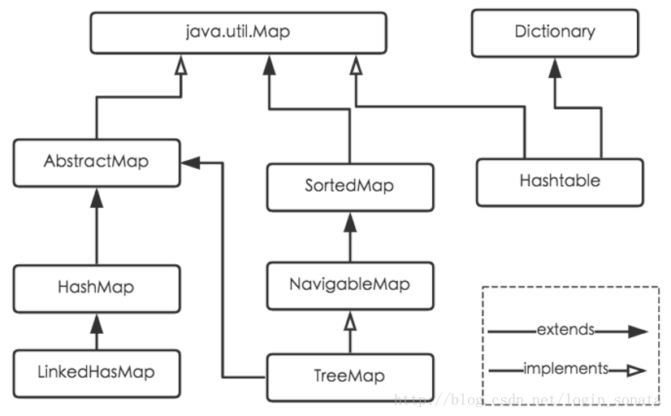

Hashmap不管是在我们日常的编程过程之中经常用于降低复杂度，在面试之中也经常被考察。

我在最近的学习过程之中也看到了一些很好的资料，包括源码解析或者宏观层面的讲解。在这里写下来自己的一些心得体会。

附上资料地址：

https://blog.csdn.net/login_sonata/article/details/76598675

https://blog.csdn.net/v123411739/article/details/78996181

# Java8的HashMap详细解读

## 0.简介

HashMap是Java之中的java.util.map 接口的一种实现，其继承关系如下所示：

> 

##### 对于几个实现类的特点的一点说明：

****

**HashMap**

1. 根据键的hashCode存储数据，但是其遍历数据不确定
2. HashMap最多只允许一条记录的键值为null，其实其处理方式为将null的hash值处理为0，不会调用其本身的hashCode方法。而当多条键值的记录都为null的时候，会产生冲突，所以不可以。
3. Hashmap是线程不安全的，统一时刻可以有几个线程一起读写HashMap，可能会导致数据的不一致。要满足线程安全，可以使用CurrentHashmap

**HashTable**

1. HashTable继承于Dictionary类，其键和值都不可以为null
2. HashTable是遗留类，不建议使用，建议用HashMap代替
3. 其是线程安全的，原理为使用了Synchronized实现线程安全，但是其效率很低，并发性不如ConcurrnetHashMap

> 其并发性不如ConcurrentHashMap的原因在于ConcurrentHashMap引入了分段锁，**分段锁**可以理解为其将整个Map分成了N个Segment，在put() 和 get() 的时候，根据key.hashCode() 先找到在哪个Segment， 再在内部操作，相当于用到哪部分就锁哪部分，**ConcurrentHashMap**键和值都不可为null

