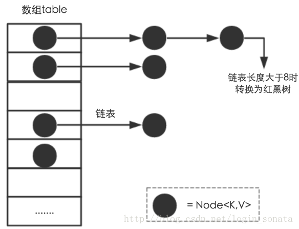

Hashmap不管是在我们日常的编程过程之中经常用于降低复杂度，在面试之中也经常被考察。

我在最近的学习过程之中也看到了一些很好的资料，包括源码解析或者宏观层面的讲解。在这里写下来自己的一些心得体会。

附上资料地址：

https://blog.csdn.net/login_sonata/article/details/76598675

https://blog.csdn.net/v123411739/article/details/78996181

# Java8的HashMap详细解读

## 0.简介

HashMap是Java之中的java.util.map 接口的一种实现，其继承关系如下所示：


##### 对于几个实现类的特点的一点说明：

****

**HashMap**

1. 根据键的hashCode存储数据，但是其遍历数据不确定
2. HashMap最多只允许一条记录的键值为null，其实其处理方式为将null的hash值处理为0，不会调用其本身的hashCode方法。而当多条键值的记录都为null的时候，会产生冲突，所以不可以。
3. Hashmap是线程不安全的，统一时刻可以有几个线程一起读写HashMap，可能会导致数据的不一致。要满足线程安全，可以使用CurrentHashmap

**HashTable**

1. HashTable继承于Dictionary类，其键和值都不可以为null
2. HashTable是遗留类，不建议使用，建议用HashMap代替
3. 其是线程安全的，原理为使用了Synchronized实现线程安全，但是其效率很低，并发性不如ConcurrnetHashMap

> 其并发性不如ConcurrentHashMap的原因在于ConcurrentHashMap引入了分段锁，**分段锁**可以理解为其将整个Map分成了N个Segment，在put() 和 get() 的时候，根据key.hashCode() 先找到在哪个Segment， 再在内部操作，相当于用到哪部分就锁哪部分，**ConcurrentHashMap**键和值都不可为null

**LinkedHashMap**

LinkedHashMap是HashMap的一个子类，其保存了记录的插入顺序，在使用Iterator来遍历LinkedHashMap的时候，先得到的记录是先插入的。其也可以在构造的时候加入参数，按照访问次数排序等等

**TreeMap**

1. TreeMap底层是使用二叉树实现，其实现SortedMap 接口，可以将其保存的记录按照键的大小来排序，默认是按照键值的升序排序，也可以实现指定排序的比较器。
2. 在使用TreeMap的时候，key必须实现Comparable的接口或在其中给出Comoarator,不然会抛出java.lang.ClassCastException 的异常。


对于以上这四种Map的类型，均要求映射之中的key是不可变对象，其意味着对象在创建之后其hash值不可变。如果对象的hash值可变，那么map就无法定位到映射位置了。


下面从：

1. 存储结构
2. 常用方法分析
3. 扩容
4. 安全性

讲解HashMap的工作原理。

# 1. 存储结构

从实现结构来看，HashMap是数组+链表+红黑树(从JDK 1.8开始)实现的，如下图所示：




其中每一个黑点是一个最基本的存储单位，是其内部的底层类。而对于数组的每一个单元，其都有一个链表来保存hash之后相同的值的元素，且当 size>8 的时候其会转化成红黑树。

两个问题：

1. 数据底层，也就是上图之中的黑点，到底存储的是什么？
2. 这样的存储方式优势在哪？

下面是上面两个问题的回答：

HashMap之中有一个非常重要的字段，其为`Node[] table`，就是哈希桶数组。那么这个`Node` 类就是我们上面提到过的“ 黑点 ” 的本质。

```java
static class Node<K,V> implements Map.Entry<K,V> {
    final int hash;    //用来定位数组索引位置
    final K key;
    V value;
    Node<K,V> next;   //链表的下一个node

    Node(int hash, K key, V value, Node<K,V> next) { ... }
    public final K getKey(){ ... }
    public final V getValue() { ... }
    public final String toString() { ... }
    public final int hashCode() { ... }
    public final V setValue(V newValue) { ... }
    public final boolean equals(Object o) { ... }
}
```

其中 Node 是HashMap 的一个内部类，可见例如 `getKey()` ，`getValue()`等等，其实现了 Map.Entry 的接口。

其中`final int hash`和`final K key` 都是`final`修饰，其不可以再进一步的修改，这也和我们之前说的一旦key 产生，那么其值不可以变动相呼应。

HashMap 使用的是哈希表来存储值，哈希表为了解决冲突问题，可以采用链地址法(separate chaining) 或者是开地址法(open addressing) 来处理问题，Java 之中采用的方法是链地址法(separate chaining) 来解决这个问题。

其简而言之，就是上面的示意图之中所说的，整个数据结构是数组加链表的组合，在数组的每个元素之中都加上一个链表结构。

 	段首缩进试用

当数据被Hash之后，得到数组下标，将数据放在对应下标元素的联表上。比如

```java
map.put("Google","Haiming");
```

系统会首先调用"Google"这个key的hashCode() 方法得到其 hashCode() 的值，然后通过 Hash 算法的后两步运算（高位运算和取模运算）来定位该键值对的存储位置。 若是几个 key 定位到了相同的位置，那么表示发生了 Hash 碰撞。

为了在空间成本和时间成本之中均衡，Hash 算法之中引入了扩容机制。 

下面是 HashMap 之中的默认构造函数， 其即对下面这些字段进行初始化：

```java
int threshold;             // 扩容阈值 
final float loadFactor;    // 负载因子
transient int modCount;  // 出现线程问题时，负责及时抛异常
transient int size;     // HashMap中实际存在的Node数量
```

