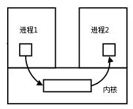
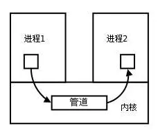
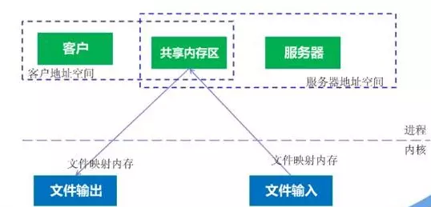

针对一些问题做一下梳理。

# 1. 操作系统和网络

## 1.1 进程和线程有什么区别？

进程(process) 和线程(thread) 之间的区别为：

一个程序下至少有一个进程，一个进程下至少有一个线程。

一个 process 也可以有多个 thread 来加快程序的执行速度

## 1.2 进程(process) 之间有哪些通信方式？

参考：https://www.jianshu.com/p/c1015f5ffa74

每个进程都有各自不同的用户地址空间，任何一个进程的全局变量在另一个进程之中都看不到，因此进程之间的交换数据必须通过内核，在内核之中开辟一块缓冲区，进程1将数据放入缓冲区之中，进程2将数据从内核缓冲区之中读走。

内核提供的这种机制叫做**进程间通信**，(IPC, Inter Process Communication)

### 1.2.1 管道/匿名管道(pipe)

1. pipe 是半双工的，数据只可以往一个方向流动。

   需要双方通信的时候，要建立起两个管道。

2. 只可以用于父子进程或者兄弟进程之间（需要进程之间具有亲缘关系）

3. 单独构成一种独立的文件系统：管道对于管道两端的进程而言，就是一个文件。但其不是普通文件，也不属于某种文件系统，而是自立门户，单独构成一种文件系统，且只存在于内存中。

4. 数据的读取和写入：一个进程向管道之中写的内容被管道另一端的进程读出，写入的内容每次都添加在管道缓冲区的末尾，而且每次都从缓冲区的头部读数据（FIFO）

**管道的实质**

管道的实质是一个内核缓冲区(Kernel buffer)，进程使用先进先出的方式从缓冲区之中读取数据。

这个 Kernel Buffer 可以看作是一个循环队列，读和写的位置都是自动增长的，不可以随意改变。一个数据只可以被读一次，之后此数据便不会在缓冲区之中存在。

当缓冲区读空或者写满的时候，有一定的规则控制读进程或者写进程进入等待队列。

### 1.2.2 有名管道(FIFO)

在 1.2.1 节之中所提到的是匿名管道，匿名管道由于没有名字，只可以用于亲缘关系的进程之间通信。

为了客服这个缺点，提出了有名管道。

有名管道和匿名管道之间的区别在于：

有名管道提出了一个路径名与之关联，以有名管道的文件形式存在于文件系统之中。

**即使有名管道的创建进程不存在亲缘关系，只要可以访问此路径，就能够彼此通过有名管道进行相互通信。**

有名管道的名字存在于文件系统之中，内容存放在内存之中。

### 1.2.3 信号(Signal)

- 信号是 Linux 系统之中用于进程之间相互通信或者操作的一种机制。信号可以在任何时候发送给某一个进程，而无需知道对方进程的状态
- 若该进程当前未处于执行状态，则该信号就由内核（kernel）先保存起来，直到该进程回复执行并且传递给他为止。
- 如果一个信号被进程设置为阻塞，则该信号的传递被延迟，直至该阻塞(Block) 被取消才被传递给进程。

> **Linux系统中常用信号：**
> （1）**SIGHUP：**用户从终端注销，所有已启动进程都将收到该进程。系统缺省状态下对该信号的处理是终止进程。
> （2）**SIGINT：**程序终止信号。程序运行过程中，按`Ctrl+C`键将产生该信号。
> （3）**SIGQUIT：**程序退出信号。程序运行过程中，按`Ctrl+\\`键将产生该信号。
> （4）**SIGBUS和SIGSEGV：**进程访问非法地址。
> （5）**SIGFPE：**运算中出现致命错误，如除零操作、数据溢出等。
> （6）**SIGKILL：**用户终止进程执行信号。shell下执行`kill -9`发送该信号。
> （7）**SIGTERM：**结束进程信号。shell下执行`kill 进程pid`发送该信号。
> （8）**SIGALRM：**定时器信号。
> （9）**SIGCLD：**子进程退出信号。如果其父进程没有忽略该信号也没有处理该信号，则子进程退出后将形成僵尸进程。

**信号来源**

信号是软件层次上面对中断机制的一种模拟，是一种异步通信的模式。

信号可以在用户空间进程(process)和内核(Kernel)之间直接交互，内核可以利用信号来通知用户空间的进程发生了哪些系统事件，信号事件主要有两个来源：

- 硬件来源：用户按键输入`ctrl+c` 退出，硬件异常，如无效的存储访问等。
- 软件终止：终止进程信号，其他进程调用 kill 函数，软件异常产生信号

**信号生命周期和处理流程**

1. 信号被某个进程产生，并设置此信号传递的对象（一般为对应进程的 pid ），然后传递给操作系统。
2. 操作系统根据接收进程的设置（是否阻塞）选择性的发送给接收者
3. 接收者接受信号后，根据当前进程对此信号设置的预处理方式，暂时终止当前代码的执行，保护上下文，执行中断服务程序。

### 1.2.4 消息(Message) 队列

- 消息队列是存放在内核之中的消息链表，每个消息队列由消息队列标识符表示。
- 和管道（pipe）不同的是（无名管道：只存在内核之中的文件；命名管道：存在于实际的磁盘介质或者文件系统），消息队列存放在内核之中，只有当内核重启（OS 重启）或者显式的删除一个消息队列的时候，该消息队列才会被真正的删除。
- 与管道不同，消息队列在某一个进程往队列写入消息之前，并不需要某个进程在该队列上等待消息的到达。

> 消息队列特点总结：
>
> 1. 消息队列是消息的链表，具有特定的格式，存放在内核之中并且由消息队列标识符标识
>
> 2. 消息队列允许一个或多个进程向其写入或者读取消息。
>
> 3. 消息队列可以实现消息的随机查询，消息不一定要按照FIFO的次序，也可以按照消息的类型读取。
>
> 4. 目前有两种主要的消息队列：POSIX 消息队列和 System V 消息队列。
>
>    被广泛使用的是 System V 消息队列，其为随内核持续的，只有当内核重启或者人工删除的时候，消息队列才会被删除。

### 1.2.5 共享内存（shared memory)

- 多个内存可以直接读写同一块内存空间，是最快的 IPC 形式。

  针对其他通信机制运行效率较低设计的。

- 为了多个进程之间交换信息，内核专门留出了一块内存区，可以由需要访问的进程将其映射到自己的私有地址空间，进程可以直接读写这一块内存而不需要进行数据的拷贝，提高效率。

- 由于多个进程共享一块内存，需要依靠某种同步机制（如信号量）来达到进程之间的同步或者互斥。

  

### 1.2.6 信号量

信号量是一个计数器，用于多进程之间对于共享数据的访问。

信号量的意图在于进程之间的同步。

待填

### 1.2.7 套接字（socket）

## 1.3 TCP和UDP的区别

TCP 和 UDP 是 OSI 模型之中的传输层的协议。 TCP 提供可靠的通信传输，而 UDP 常常用于**广播**或者**细节控制**交给应用的通信传输。

二者的区别如下：

1. TCP 面向连接（三次握手四次挥手），UDP 面向非连接，即发送之前不需要建立连接（随缘）
2. TCP 提供可靠的服务（使用滑动窗口等进行流量控制和拥塞控制），UDP 不保证（一股脑发过去就完事了）
3. TCP 面向字节流，UDP 面向报文

> 面向字节流和面向报文的区别：
>
> UDP 是面向报文的传输方式：
>
> 应用层交给 UDP 多长的报文， UDP 就直接发送，一次发送一个报文。因此应用程序必须选择合适的报文长度，报文太长的话 IP 层需要分片，降低效率。
>
> TCP 是面向字节流的传输方式：
>
> 虽然应用程序和 TCP 的交互是一次一个数据块（大小不等），但是 TCP 将其看作是一连串的无结构字节流，TCP 有一个缓冲或者其他方式作为处理。

## 1.4 Post 和 Get 有什么区别？

（待填）

Get是将请求放在 URL 之中，Post 是将请求放在 request body 之中

其本质都是 TCP 链接

# 2. Java

## 2.1 Java 内存管理由哪些组成？

填坑

https://blog.csdn.net/suifeng3051/article/details/48292193

JVM 之中将内存分为了如下几个区域：

1. 方法区
2. 堆（heap）
3. 本地方法栈
4. 虚拟机栈
5. 程序计数器

其中，**方法区** 和 **堆** 是所有线程共享的。

### 2.1.1方法区（Method Area）

方法区之中有：运行时常量池

方法区之中存放了：

1. 要加载的类的信息：类名，修饰符等等
2. 类中的静态变量（static）
3. final 之中定义的常量
4. 类之中的 field
5. 方法信息

方法区是全局共享的

### 2.1.2 堆（Heap）

在 JVM 管理的内存之中，堆是最大的一块，也是 JavaGC 机制所管理的主要内存区域。

堆由所有线程共享，在虚拟机启动时创建。

堆之中使用了分代管理方式：

**年轻代（young generation)**

对象在被创建时，内存首先是在年轻代进行分配（但是大对象可以直接在老年代分配）。年轻代需要回收的时候会触发 Minor GC

**老年代（Old generation）**

老年代的垃圾回收称作 Major GC

## 2.1.3 本地方法栈（Native Method Stack）

本地方法栈用于支持 native 方法的执行，存储了每个 native 方法调用的状态。

本地方法栈和 虚拟机方法栈 的运行机制一致，其唯一区别在于， 虚拟机是执行 Java 方法的，而本地方法栈 是用来执行 native 方法的。

## 2.1.4 程序计数器（Program Counter Register）

程序计数器是一个比较小的内存区域，可能是CPU寄存器或者 操作系统内存。

其用于指示当前线程的字节码执行到了第几行。

## 2.1.5 虚拟机栈（JVM Stack）

