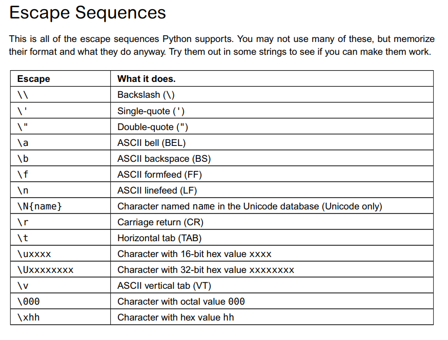

Yes.

Learn Python the hard way.

So this blog is a studying note for me to record things I think important or difficult :) And also a place for me to write down my own thinking.

Let's Go!

# The Hard way is easier

3 essential skills of coding:

1. Reading and writing
2. Attention to detail:such as corner case
3. Spotting differences

# Ex3. Numbers and Math

The order of operations:

1. Parentheses(圆括号)
2. Exponents（指数）
3. Multiplication
4. Devision
5. Addition
6. Subtraction

# Ex5. More variables and printing

This exercise taught how to make format in strings.

Just put format like:

`print(f"This is for formatting string like {this.variable}")`

And also there is format like:

```python
filling_in=False
joke_blank="Here is a blank for people to {}"
print(joke_blank.format(filling_in))
```

So the method`.format()` can join 2 strings or variables to one.

And if you put more blanks in a sentence, can just fill the blanks one by one like this:

```python
filling_in=False
joke_blank="Here is a blank for people to {},{}"
print(joke_blank.format(filling_in,filling_in))
```

Output like this:

`Here is a blank for people to False,False`

# Ex7. More printing

In this section, author gave us a method of print things in one line:

```python
end1="C"
end2="h"
end3="e"
end4="e"
end5="s"
end6="e"

print(end1+end2,end=' ')
print(end3+end4)

```

The output of this section is:

`Ch ee`

So we can see all things in one line and be split by " "
Also can change a little:

```python
print(end1+end2,end=',')
print(end3+end4)
```

Output:

`Ch,ee`

# Ex10. Escape cases



The mainly thing use is to put a `\` before a symbol to input the symbol itself

# Ex13. Parameters,Unpacking,Variables

In Python we also can do a "script", I mean that we can take the `.py` file like a 'method' ,and then give it parameters. Then in the command line, we can just give *arguments* to a file, then output it.

To achieve this, we first do:

`from sys import argv`

Here the 'argv' is a abbr. of *argument variable*.

**And here is something we need to concern: after the `python` command, the first argument always the name of file. Here is example.**

```python
from sys import argv

script1, first, second, third = argv

print("The script1 is called:", script1)
print("Your first variable is:", first)
print("Your second variable is:", second)
print("Your third variable is:", third)

```

My input in the command line is:

`python ex13.py first 2nd 3rd\`

And output always like this:

```The script1 is called: ex13.py
The script1 is called: ex13.py
Your first variable is: first
Your second variable is: 2nd
Your third variable is: 3rd\
```

Can see that the first argument always going to the name of the file.


