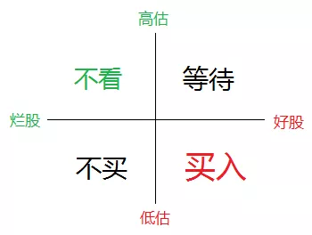

来自“白马投研” 的公众号的文章：[“经济牛”距离我们还有多远？「下」](https://mp.weixin.qq.com/s/7DxGJRnHhGGVVVye4lU4iQ)

梳理之后，发现本文主要是做国产芯片的分析。国产芯片，在贸易战之后被提上了公众的关注台面。与互联网股票不同，国产芯片股大多都在 A股上市，也受到A股涨跌停的限制。

看白马投研的话，觉得很有趣：第一步是选出好的个股，第二步才是估值。其理由是“估值很耗时间和精力，只用在好股票身上。好的个股，高估也值得等待。不好的个股，即使低估4，也不值得买入”。

想到不知道什么时候，也在一篇文章上面看到过：你以为仙股已经不能再跌了，人家可以再给你跌掉90%……所以烂股票就是烂股票，不要对没有业绩支撑的股票进行幻想，人家就是来骗你钱的。

# 国产芯片

面对一个中长线肯定要大涨的板块，最需要的是能挖掘出跟着板块中长线上涨的个股，涨幅起码要跑过板块指数。

而且文中点出了一个很有趣的点，那就是如果你跟着韭菜集团去买入“韭菜大股票”，在这一波行情里面就是**士兰微、紫光国微**， 那么往往连

# 后记

本文开始于9月29日，在12月底才将将总结完毕。这几个月里面，文中的各个点有所印正。由于笔者并未在此期间买入相应的股票，因此眼睁睁看着自己错过了最佳的涨幅阶段。这也是一个警醒，对于投资这种具有时效性的东西，最不能做的就是拖。一拖再拖，最后错过了赚钱的时间窗口，也只能说是悔之晚矣。