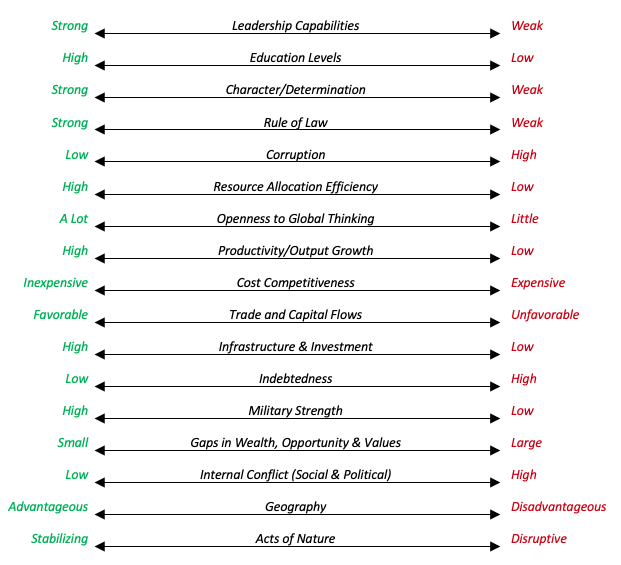

Ray Dalio的这一系列文章的意义在其[intro](linkedin.com/pulse/changing-world-order-ray-dalio-1f/)部分就已经讲明：快速变革的社会。

至笔者撰写这章笔记，Ray Dalio系列文章已经载至第三篇。

注：作者：Ray Dalio，笔者：我

# 0. Introduction

[Original website](https://www.linkedin.com/pulse/changing-world-order-ray-dalio-1f/)

开篇作者就讲到了目前他看到的三种趋势的聚合效应：

1. 联邦政府的高负债和低利率，束缚住了央行刺激经济的手脚
2. 在国家内部的巨大的财富差距和政治分歧，引发了更多的社会和政治冲突
3. 一个正在崛起的力量（中国）正在挑战过度扩张的美国力量，导致外在的冲突。

在历史上，有一段时间和此相似，那就是1930-1945年。

在作者看来，这些现象的发生，是典型的在50-100年之间的大的经济和政治循环改变之间发生的大概在10-20年的过度阶段。而在持续50-100年的大循环之中，通常有两个阶段：

1. 开心又和谐的阶段，大家齐力创造财富
2. 痛苦又斗争的阶段，大家为了财富互相争夺

而痛苦的阶段可以清除社会当今的缺点，比如过多负债，并且回归到建设基础上面来，这个阶段非常痛苦。

这最后会导致让社会更加强大的变革，尽管会彻底的改变世界秩序和统治阶级。

> 笔者：社会上总有增量阶段和存量阶段，增量阶段你好我好大家好，存量阶段就得你死我活。“历史是螺旋之中前进”，大部分人只看到了最后这个前进，但是没看到中间这个“螺旋”。
>
> 另外，作者在文章之中讲述了很多“我没见过，但是历史上已经发生了很多次”这样的话。难道真的是太阳底下无新事，哪怕生产力已经空前发展，人类历史也还是一次又一次的循环么……

作者下面会比较相似的历史阶段：1930-1945，英国，荷兰和某些中国朝代的崛起与衰落，来推测到底什么正在发生，与什么即将发生。在撰写期间，COVID爆发，又是“我没见过，但是历史上已经发生了很多次”。

## 0.1 My approach

作者认为，虽然对于一个日常生活都是在短时间内尽快得到答案的投资经理而言，关注长期的变化是很奇怪的，但是对于他来说，他需要这种全局的视野来让自己更好的工作。其事业的最大失误几乎都来自于在其生活中未出现的，但是在之前的历史之中反复出现过的大的市场变化。那么，只有拥有在历史层面的全局视野，才能够找出不随时间变化的，普适性的规则，并且应用它们。

作者使用1971年的美元宣布和黄金脱钩为例，当时他认为这个是一个巨大的利空，那么股市应该应声而落。但是实际上一开盘就是跳涨，这完全超出了作者的预期。作者后来将其归因为其并没有货币贬值的经验。

作者对于这些大事件，大变化的研究方法， 是对于一件特别的事情，找到尽可能多的重要的相关case，基于他们来总结出一幅典型画面，作者称之为“原型(archetype)”。原型，可以帮助我们清楚各个事件的因果关系，和这些因果关系会如何驱动整个事件发生。在此之后，作者会比较某个case和原型之间的差别，并且理解是什么引起了某个具体的case和原型之间的差别。

这个过程，帮助作者精炼了对于这些事件之间因果关系的理解，并且可以帮助作者形成一套"if/then"的逻辑——如果X发生，那么就赌Y也会发生。然后作者会对比实际事情和原型事件之间的演化过程的差别，没有按照模型的走向去发展的事情，会导致作者的重新思考和模型修改。

在这么多年的实践之中，作者发现：

1. 一个人的预测和处理未来事务的能力，和其对于事物变化的因果关系的理解密切相关
2. 一个人对于因果关系的理解能力，和其对于过去的研究成果息息相关

## 0.2 This Approach Affects How I See Everything

在作者研究产出大量的不随时间变化的普适的规则之中，其知道了，大部分事情——繁荣期，衰退期，战争，革命，牛市，熊市等等，都在不断的重复发生。这些事件都基于一样的原因，基于循环的形式，并且总是在比我们的生命更长的时间周期之内发生。这个观点，让作者学到了，很多东西其实就是“一些事情的翻版”，就像一个生物学家进入了丛林之中，会去思考这一种生物是属于哪个物种，可能会有怎样的生活习惯，并且试图去找到有效的普适性的法则。

以这种方式去看待事物，帮助作者从无尽的事务之中抽离出来，并且去关注他们的主要特征。以这种方式理解的事务越多，就越能理解事务之间是如何相互影响的——比如经济循环如何影响政治循环，并且可以看到各个事务之间在很长的一段时间之内是如何互动的。并且作者不得不承认，不能同时具有整体的理解和细节的把控。

为了理解这些特征和其之间的因果关系，作者需要从一个更高的层次去观察事物，同时还不能丧失低层次的细节把控。大部分事务的发展路径都如下图所示：

（图没了，是一个螺旋上升的箭头）

比如，随着时间的流逝，我们的生活水平上升，这个会导致更高的生产力。但是同时在经济之中也有涨有落，因为我们有债务周期来在不断上升的趋势之中驱动经济上涨或者下降。

作者还认为，是因为人们在生活之中经历的只是大循环之中的某些小片段，所以人们会错过或者忽视变革来临的巨变时刻。在这个视角之下，作者相信有限的人类特质种类会走向有限的路径，产生有限的情况，最终导致有限的结果不断重复。而唯一变化的，只是舞台上的人物穿着不同，使用技术不同而已。

## 0.3 This Study & How I Came to Do It

作者认为，自从川普上台之后，目前的民粹主义愈演愈烈。这提醒了作者人们在财富和价值上面的鸿沟会导致深刻的社会和政治冲突，正像1930年代那样。作者也观察到了，在政治和经济之中的左派和右派会有多深刻的冲突，并且这种冲突会严重的影响经济，市场，财富和权力。

之外，作者观察到，相对于平均值的美好，美国的贫富差距正在逐渐拉大。所以其将人们按照五等分来调查。

### 0.3.1 **THE LONG-TERM MONEY AND DEBT CYCLE**

作者对于目前的情况感到担忧。2020年初，超过十万亿的负利息的债务就会到期，并且还有一大笔新的债务要售给市场。作者对于这一现状很迷茫：谁会去买负利息的债券呢？债券的利息又可以到多低呢？在这之后，央行又怎么去应对下一轮必然发生的危机？

这些问题让作者想到，如果投资者逃离以世界储备货币计价的债务，央行会怎么做?如果这些货币的还本付息同时贬值，而且利率又如此之低，那么这些货币就会贬值。

印制世界的储备货币是一个有利且有力的位置，而失去这一特权的国家往往会痛苦的倒下。

### 0.3.2  **THE DOMESTIC WEALTH AND POWER CYCLE** 

在贫富差距非常巨大，并且经济下行的途中，社会冲突，尤其是对于资本蛋糕的划分冲突会愈发严重。下一轮经济下行的时候，人们和政策制定者的做法是作者非常好奇的一点，因为前述讲过，央行的能力被限制以至于很难进一步刺激经济。如果传统的方式无法进一步的刺激经济，直接印钱和央行直接购买金融资产（所谓量化宽松）更会加深贫富差距，因为富人所拥有的金融资产比穷人的多得多。

### 0.3.3 **THE INTERNATIONAL WEALTH AND POWER CYCLE** 

作者老生常谈，又是“中国正在崛起，美国马上就要被超过”（这哥们说了好多次），非常好奇这些冲突会给世界带来何种改变。

作者认为，每次贫富差距增加，民粹主义就会增长（都吃不起饭了肯定造反啊）。为了研究究竟接下来会发生什么，作者先是研究了最近500年的帝国：美国和美元，英国和英镑，荷兰和荷兰盾。

除此之外，作者还研究了德国，法国，俄罗斯，日本，中国和印度。在这六者之间，作者对于中国研究最多，因为中国在历史上面的份量极重，且有许多王朝更替变换来帮助作者更好的了解这些特征和特征背后的因素。通过研究这些案例，作者对于科技和自然艺术如何影响这个改变进程有了更多的理解。

在这些案例之中，作者发现一个重要的帝国往往延续250年，或者150年，在这个进程之中会有很多延续大概50-100年的的重大经济，债务和政治周期变化。

## 0.4 **Remember That What I Don’t Know Is Much Greater Than What I Know**

这一节主旨就是“求轻喷”

# 1. Chapter 1: The Big Picture in a Tiny Nutshell1

## 1.1 Throughout History Wealth Was Gained by Either Making It, Taking It from Others, or Finding It in the Ground 

财富只能通过三种方式获得：赚钱，从其他人手里收钱或者从地面获得财富（笔者认为是创造财富的意思）。

> **名义GDP**是指以现行市场价格计算的既定时期国内总产品和服务的价格总和。 **实际GDP**是指在相同的价格或货币值保持不变的条件下，不同时期所生产的全部产出的实际值。 **名义GDP是包含价格**水平考虑的，如果我们所有价格水平上升1倍，则名义GDP也要上升一倍。 所以**名义GDP**有很大的不确定性，尤其在通货膨胀时期。

>  笔者：信贷崩溃导致资产缩水，资产缩水导致人们入不敷出，导致两个结果：一个是逼着政府印钱投放到市场之中救济，一个是民粹主义思潮更加兴盛，相应的也会逼迫政府去让利民众。
>
> 当市场上面的钱变多的时候，虽然我认为消费者其实不太会去增加巨量的消费，但是手里有钱的投资者的钱是会比较明显的贬值的，那么相对而言就应该投入更多的资金到资产之中，比如房子或者股票。我认为这也是作者开头说的“为什么宣布美元和黄金脱钩之后股市会大涨”的原因。

> 之前看到一个轮回，觉得很有意思，和作者的表述差不多：
>
> 1. 衰落的时代诞生强大的人
> 2. 强大的人造就兴盛的时代
> 3. 兴盛的时代产生软弱的人
> 4. 软弱的人导致衰落的时代
>
> 对应起来，就是任何经济都有经济周期，兴衰轮回。

作者在文章之中附了国家国力对比图，其是在这八个方面进行的估算和衡量：

1. 教育
2. 竞争力
3. 技术
4. 经济产出
5. 世界贸易之中占比
6. 军事力量
7. 财务中心的实力
8. 储备货币

## 1.2 The Big Cycle

作者认为，帝国的兴盛和消逝一般发生于三个阶段：

1. 上升期：标志为获得竞争优势
2. 顶峰期：标识为力量还很强大，但是在上升背后已经播下了失去竞争优势的种子
3. 衰落期：标识为自我强化的对于以上所有优势（那八种）的衰退

作者将兴盛期的因素总结为：

1. **足够有能力的领袖**，提供成功所必须的原料。

> 在兴盛期必须有一个领袖，比如新加坡的李光耀，这个领袖要富有远见卓识，且可以凝聚并团结力量。

2. **强大的教育**，作者认为强大的教育不只是教授知识和技能，还教授……是的，他打了省略号，那就让我猜一猜：

> 还教授如何取胜，如何成长为更强壮更有力量的人？

3. 强大的性格，礼貌和职业道德。
4. 低腐败率和对于规则的尊重，比如对于法律的尊重
5. 人们协同工作，在同样的目标感召之下团结一心
6. 一个可以聚集资源的好的系统
7. 对于全球思维表示开放
8. 在全球市场之中有竞争力
9. 强大的收入增长
10. 对于基础设施，教育系统和研究系统的增加的投资
11. 高产出——每小时的产出更有价值
12. 新技术：新技术在商业和军事方面都非常珍贵
13. 世界贸易之中的可观份额
14. 一个强大的军事力量，来保护贸易路线并且影响国界意外的重要的人
15. 金融中心：吸引和分配资本，比如荷兰时期的阿姆斯特丹，英国时期的伦敦，美国时期的纽约和中国的上海
16. 强大的股票，货币和信用市场。这也是其货币成为世界储备货币的一环，因为人们会使用这种货币进行金融交易。比如荷兰帝国时期的荷兰盾，英国帝国时期的英镑和美国帝国时期的美元。

> 笔者认为，这些总结起来，可以归为几个方面：
>
> 1. 个人生产力的提高：受教育，有职业道德，凝聚在一个目标下等等
> 2. 全球的资本汇集：金融中心，金融市场
> 3. 军事力量保证：强大的军力来保证贸易路线和震慑敌国

作者认为，一个国家崛起过程之中，各种力量是互相配合且不动摇的上升的。想要建立一个帝国，就要将经济，政治和军事力量结合统一放入一个可以获利的经济/政治/军事系统。比如荷兰的荷兰东印度公司，英国的英国东印度公司，美国的军工情节和中国的国家资本主义。

为什么作者认为在繁荣时期往往会播下衰退的种子呢？

1. 繁荣时期让人们收入更多，这导致了人会更贵，相对于人力成本比较便宜的国家就会失去竞争力。

2. 最成功的方式往往会被其他国家所模仿，比如英国的船业工人，比荷兰的船业工人便宜很多，但是可以雇佣荷兰的船只架构师来设计舰船，这就让英国的舰船更有竞争力。复制总是比发明需要更少的时间和金钱。

3. 变得更富有的人天然有工作不努力的倾向，最终生产效率就会下降。这在努力赚钱的第一代和继承财产的第二代之中对比尤为明显，年轻一代没有经历过挫折的考验，所以相对而言更加脆弱。相对而言人们需要更多的娱乐和放松，这会让经济体更加脆弱

   > 个人认为这段的意思是，人们会需要更多的娱乐而不是再生产，那么相对而言，整个社会的效率就会降低。另一方面，娱乐产业的收入和估值都会更高。

4. 帝国的货币会变成全球的储备货币，这就给了他们“过度的特权”去借更多的钱，从而导致他们陷入更深的债务。这短期加速了帝国的扩展能力，但是长期来看的话，会削弱帝国的能力。这种借入，通过过度的消费和军力扩张让其权力和本身具有的实力不符，但是消费和军事力量又是维持一个帝国的重要因素。

   过度贷款，甚至是一种自我强化的可持续行为，因为其增强了储备货币的地位，提高了外国借贷者借出资产的回报率。当最富裕的国家向其他穷国接待，这往往是相关的财富转移的早期信号。比如在1980年代，美国的平均资本收益是中国的40倍的时候，就已经向想要在美国储蓄美元的中国人借贷了，因为美元是世界的储备货币，这就是演化开始的信号。相似的，英国，特别是在二战期间，向其他穷国借取了大量财富，荷兰也在其登顶之前就开始这样。

   > 金融的本质就是时间魔术，将未来的钱挪到现在花。那么短期膨胀，必然是提前透支未来的资产得来的。
   >
   > 而为什么富国和穷国借贷的时候就是富国衰落的开始呢？个人尝试从两个点来切入：
   >
   > 1. 富国和穷国借贷，意味着其借贷总数已经超过了平常的幅度，也标志着其在做自己本不该或者不能做的事
   > 2. 富国和穷国借贷，本质上是要维持自己储备货币的地位不动摇，那么就要“让利”穷国，相当于花钱买信誉，那么必然是对自己的经济有所负担
   >
   > 当然具体原因也不清楚……

5. 领先国家会扩张帝国范围到维持和保护地位已经不划算的地步。当维持的成本已经高过收入的利润，那么就会削弱这个国家，比如当今的美国。
6. 经济成功天然导致更大的贫富差距，因为产生大量财富的人会获得“不相称”的利润。拥有财富和权力的人（比如从商业活动之中获利的人，或者掌控政府的人）天生的就会支持让他们获利的既有系统，直到贫富差距过大导致不能忍受的非公平。

相对而言，下降阶段也是一组因素相辅相成造成的，

1. 债务过于巨大的时候，央行就失去刺激经济的能力，并且的那个经济下行的时候，这就会导致债务和经济问题，并且会引向因更多的钱，最终导致货币贬值。
2. 当财富和价值的鸿沟过于巨大，且有很多的经济压力的时候，富人和穷人就会有更多的逐渐明显的冲突，这最终导致极端化的政治倾向：偏左的民粹主义（想要重新分配财富的人，比如社会主义和共产主义）和偏右的资本主义（想要将财富更多的聚集在富人手里。这发生于民主和独裁的国家。比如在1930年代，左翼的增加变成了共产主义，右翼的增强变成了法西斯主义。
3. 当富人觉得自己的财产不够安全，他们会想方设法将资本流去其认为安全的地方，这就会进一步的削弱国家的资本力量
4. 当这些干扰因素存在的时候，生产力就会下降，这反而进一步的导致了经济蛋糕的缩小，并且造成更多的关于如何分蛋糕的冲突。
5. 当一个国家有足够的经济，地理和军事力量以至于可以挑战其他力量的时候，就会在这些世界的多极方面有很多潜在的冲突。而且由于没有一个平和的调整系统，这些冲突所释放的方式也只能是武力冲突
6. 当领先的国家的维持帝国的成本高于帝国收回的利润，这就会在经济层面上削弱整个国家。尤其是当还有其他国家兴起的时候，帝国不得不维持更大的军力来维持整个帝国，折优惠导致国内的经济形势更差，更难收到税收和更需要投入维稳。
7. 当其他的外部干扰因素发生的时候，比如瘟疫，干旱等等，这会加速帝国衰落。
8. 当国家的领导人过于虚弱，以至于没法提供这个国家所需要的成功的因素，也会造成很大的问题。当然，由于每届领导都只有一小段时间，他们只能去接受从前面一任领导那里“继承”而来的国家。这也就意味着更多的是“命运”而非'领导力'在起作用。

下面是作者所总结的“兴衰图”（个人命名）：

在图中，拥有左边的品质越多，意味着其越强盛，右边的越多，意味着其越衰落。

下面这张图描绘了当帝国交替时候的情况。阴影部分是交替期，往往伴随着大萧条和战争等等。交替期会撕裂原有的秩序，并且为新系统的崛起设置舞台，这往往会持续10-20年。然后就是和平和繁荣时期，这时候人们努力工作，并且没有国家想要挑战过于强大的帝国。和平时期通常会持续40-80年。在这些大周期之中也有小的债务周期，大概在7到10年左右。

# 2. Money, Credit, Debt and Economic Activity

作者认为，对于民众和国家而言，最想要的是财富和权力，而金钱和信用对于财富和权力增长和消退是最大的单一影响变量，因此如果你不知道金钱和信用如何起作用，就不知道不同国家的政治的最大推动力。如果不知道世界秩序如何发展，你就不知道什么将会到来。

> 之前看到一本《中央帝国的财政密码》，是饭爷推荐的，在里面就详细说明了政治的基础是经济，王朝到了最后衰落的原因都是因为入不敷出。和Dalio这一段有共同之处。

之后作者用上世纪举例：如果不知道上世纪20年代的Roaring导致的债务泡沫和巨大的贫富差距，和泡沫破裂之后如何导致的1930年-1933年的大萧条，和其导致的全球冲突，那么就没法理解为什么在罗斯福当选之后就要联邦财政局提供大量的金钱和信贷（笔者认为不就是大放水嘛），和现在这个阶段的事情非常近似。不理解金钱和信贷，你就也不会理解为什么这些事情改变了世界秩序，或者接下来即将发生什么。

先从永恒的金钱和信贷规律开始吧。

## 2.1 **The Timeless and Universal Fundamentals of Money and Credit**

作者在这一小节之中，主要讲述了对于各种实体，比如政府，公司，NGO等等的收入和支出以及其差净值。很简单但是经常被人忽视的道理是，借了钱就得还，现金流跟不上利息，或者所需要归还的钱就会破产。即使有些实体看着很有钱，花费很大，甚至还有很多现金，但是他们已经入不敷出了，最后也一定会破产。

这个游戏有一个漏洞：如果这样的实体多了，那么相应而言社会的总收入就会减少——因为一个人的花费就是另一个的收入。这样久了，社会就会陷入一个负向循环。这是社会所不能接受的。所以漏洞就被人使用了——借款需要利息，但是如果央行的利息为0呢（就像当前美国一样）。这样只需要不断的展期，在账本上还是合法的（因为还是借款未收回），但是我们都知道这种不断展期的无利息的贷款是无法收回的，那么自然，这些钱就是“白送出去了”。

*debt eats equity, money feeds the hunger of debt, and central banks can produce money*

这就是如何维持现有泡沫的手段。而有储备货币能力的国家自然就会拥有更多的能力去印钱。

可是，很有趣的是，一旦这种具有储备货币能力的国家开始印钱，那么其货币就会不断贬值，直到最后其失去作为储备货币的意义，而这时候整个国家的借贷已经积重难返，没有这种猛料刺激很快就会完蛋。

也就是说，一旦一个帝国开始利用“我的货币是储备货币”这件事情，就会开始走向完蛋的下坡路。

作者的灵魂拷问：

**什么是钱？**

**货币是一种交换媒介，也可以用来存储财富。**

人们生产多余的东西，是为了和他人去交换他们想要的物品。但是传统的以物易物太麻烦，所以出现了货币。

那么，作为一种存储购买能力的媒介，人们存了钱就是存了他们的购买能力。当然，人们也可以去买资产，比如黄金，不动产等等，但是大部分人还是选择以货币作为其存储媒介。在这种情况下，有些人不真正的存储货币，而是觉得可以去用货币交换一些其他的更好的事物，但是总是可以很方便的将这个存储的事物转换成货币。这就是信贷产生的背景。

借款人借出货币，并且收取利息，而贷款人拿到(利润-利息)的钱，大家岁月静好。贷款对于借出方是资产，而对于借入方是负债(liability)。当贷款收回的时候，资产和负债一起消失。

**The Fundamentals**

货币和信贷只是和财富有关，而非财富本身。创造财富和创造货币的难度是不同的。

> 宏观调控对于小周期是很有效的，因为小周期之中经济过热，人们的需求过多的时候可以加息，在经济有些萎靡的时候可以放水，这样就做到了一个平滑过渡的过程。

超发的货币的去处是很重要的。如果超发的货币没有进入到真的需要它的地方，没有真的给实体经济滋养，而是兑换成了外汇流失或者涌入通胀资产之中，那么水就白放了。在这种情况下，货币的真实价值在贬值，同时这些金融泡沫还在进一步的增大。那么这种金融泡沫带来的通胀可以和实际人们的需求变少，卖不出去货物造成的通缩一起发生。

作者接下来用物品的价格和价值之间的区别来举例了，一般情况下，这两种指标都会一起上升，因为当人们有更多的货币和信贷的时候，人们会倾向于消费更多。在消费增加经济生产和提高价格的方面来看，可以说是财富增加了，因为拥有这些资产的人们“看起来"更富有了。但是，这种财富的增加只是一种幻象，可以从两个方面看到这个结论：

1. 增加的信贷只是将价格推上去了，并且长远来看这种推动是要偿还的，且在”pay back“的时候就会造成一样的伤害。
2. 物品内在的价值并不会因为价格的增高而增加。比如你有一栋房子，此时政府印了很多钱，并且你的房子的价格上涨了，可是你还是有一样的房子——你的实际财富没有增加，只是你的纸面财富增加了。这个效应在其他的资产上面也是存在的。

在长远来看，货币和信贷在生产的时候有多大程度的刺激，那么在需要偿还的时候就会造成多少的衰退。这就是为什么货币，信贷和经济增长是循环的原因。

**The Long-Term Debt Cycle**

**1) It Begins with No or Low Debt and “Hard Money”**

一开始，没有信贷，并且市面存在的是'硬通货'。相比于谷子，麦子等等，人们更偏好贵金属，因为贵金属有内在的价值，并且容易被塑造成各种形状。内在价值保证其不需要合约就能够被市场所承认，甚至敌对的国家也可以使用黄金来做贸易。

**2) Then Come Claims on “Hard Money” (aka, “Notes” or “Paper Money”)**

接下来就是喜闻乐见的“硬通货兑换券”环节，就像宋代的交子。因为“硬通货”本身具有不容易携带的弊端，人们就将黄金等存放在某一处，并且开出等量的兑换券。

**3) Then Comes Increased Debt** 

人们发现了借贷的好处，借款人借出货币——财产凭证来获得利息，而贷款人可以拿到更多的钱，从而去获得更多的购买力。整个社会对于这一点非常开心，因为其拉高了资产价格，并且让整个社会的产品增加。随着债务的飞速增长，信贷的规模和社会之中的物品总规模一起增长，直到：

1. 收入跟不上还款的速度
2. 人们发现资产的增长速度比实际的增长速度快：当索偿金额(即人们持有这些资产，期望他们能够出售这些资产以获得购买商品和服务的钱，这些资产的增长速度比商品和服务的增长速度快，这使得这种债务资产(例如债券)难以转换。那么人们就会抛售这些信贷。

现在来看第一类问题：债务是一种负资产，其会侵占你的收入和其他的资产——因为一个人需要去变卖资产才能获得现金。那么当一个人的收入或者资产缩水的时候，他就不得不收紧开支并且出售部分资产，因为其需要现金。当这些还无法满足的时候，只有两种解决办法：

> 1. 将债务重组，但是会伤害借款人，因为贷款人的负债是借款人的资产
> 2. 央行直接大撒币，来填补收入和负债表（当下正在发生）

那么来看第二种问题：当借款人不相信他们的借款可以获得一个可观的回报率的时候，借款人就会选择兑现债券换成现金。当多数人都这样认为的时候，市场就会发生挤兑现象，利率会突然大幅度的升高，并且会让经济情况变得更糟。要么就会选择大量印钞吃下这些债券，避免利率答复升高的同时希望可以避免市场挤兑。但是如果应兑付的本息相对于要收购或者兑换的物品相差太大，那么银行也没有足够的钱来兑付这些债券，银行就会选择违约。但是如果对于央行而言，在违约和印钱救市场之间选择，其只会选择印钱——即使这样货币会贬值。

始终记住——市场上面的物品和服务总是有限度的（受制于整个社会的生产力）。而相应的：

1. 有限数量的"hard money"
2. 始终增长的"paper money"——"claims of hard money"
3. 始终增长的债务——"claims of paper money"

**4) Then Come Debt Crises, Defaults, and Devaluations** 

贪欲熏心，银行最终向外部借的钱会比其自身的净资产更多，而越来越临近这一点的过程，就是银行逐步迈向破产的过程。不管是私人银行还是央行，其都会遇到这样的情况，只是私人银行无法印钱还贷，而央行可以出台相应的法律来减少自己的债务，或者只还部分钱。当然，如果央行需要还的货币也是其无法印制的，那么其就会和私人银行得到一样的下场。

**5) Then Comes Fiat Money** 

最终银行或者政府会放弃自家的货币和实物资产挂钩，那么没有了限制，人们可以更肆无忌惮的印钱了。这会导致资产价格飞涨。

实际上，如果大量印钱之后钱可以到productive的地方去，那么印钱并没有任何问题。主要的风险在于，市场的参与者会没那么认真的分析钱真的应该去哪，或者是偿付这笔钱的代价过大。在这种情况下，货币贬值常常发生。

甚至我们不应该将希望寄托在政府身上，而是假设他们一定会滥用自己的权力——如果是你你也这么干。原因之一是没有任何一个政策制定者可以掌握全流程。每个人都只掌握一个部分的流程，并且在其所处的当下环境之中做出最有利其个人的选择。

我们通常还会忽视额外的一点是，政府也需要很多钱，甚至其会成为最大的借款人之一。

> 笔者之前一直好奇，每次政府超发的货币都去哪了？如果按照本文，那么政府超发的货币会收购被挤兑的资产，比如股票等等（这次三月份时候也是，纳指现在已经新高了）。这样就满足的债权人的权益，但是代价就是货币的购买力被稀释。贫富差距在这个过程之中也被拉大，因为有资产的人的财富会进一步增加（政府收购/兜底），没有资产的人财富会进一步的被稀释。

另外一点需要注意的是，随着货币的超发，钱变得”便宜“了，那么人们就会倾向出售现有的资产或者借钱——因为它们可以用更便宜的钱来还贷。或者人们可以将财富的载体换成黄金，或者其他没有这种通货膨胀的国家之中。

**6) Then Comes the Flight Back into Hard Money**

轮回。随着大量货币的超发，人们又会回到最初的"hard money" 阶段，即使用黄金等等有内在价值的物品来进行交换。都到了债务循环的终结，当然社会问题又会进一步出现：税收巨高，贫富差距很大，这也导致了财富向那些拥有硬资产的人聚集。这个环节之中，政府会出台很多的法律试图去减缓这个趋势，比如禁止人们拥有黄金，外汇管制等等。

在最后，这个窟窿实在太大以至于补不上的时候，政府会试图使用新的和某些’hard asset"挂钩的货币，甚至有些国家会挂钩其他国家的货币，比如一些弱国就会使本国货币挂钩美元，甚至直接在自己的国家使用美元。

持有债务就像拿着一个定时炸弹，越往后定时炸弹滴滴的越凶，你要利润，他要本金。另外一个有趣的事情就是，可以把债务当做一个50-75年左右为周期清零的游戏，一笔勾销重新来过。

当有了保底之后，人们就会更加变本加厉的炒作，让联邦政府，也就是所有老百姓一起买单。所有的泡沫最后都会破裂。

作者将经济刺激分成了三个阶段：

MP1：政府降低利率刺激经济

MP2：政府开始印钞购买市场上面的资产来兜底

MP3：政府开始定向直接拨款，比如今年4月9日的直接每个人发钱这种”直升机撒钱“

下面是经济周期的概略图：

