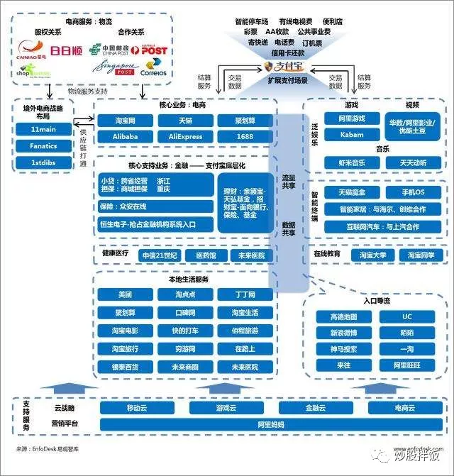

# 炒股拌饭

# 1. 流量江湖-互联网掘金热里的卖水人

1. 经济不好的时候人们会减少消费，而越是经济不好，商家需要购买流量和广告费用的钱就越多，所以不论经济好坏，“卖水”的生意都有很好的增长。

2. 因为购物是低频次的要求，相对于社交（腾讯），搜索（百度），娱乐（腾讯，新浪微博）等等，相对比较少的会被用户所使用。如果一个平台不能被用户高频次的打开，那么就会被遗忘。作为一个实质上的广告公司，阿里对于流量是具有天生的危机感的。所以阿里不论什么平台，只要是或者有可能是流量入口，都会买买买

   

   > 本文是18年写作，那个时候实际上移动互联网正是斗的如火如荼的时候，正是移动互联网带来的数据爆炸，后面的推荐性质的平台才会全部兴起，比如头条就挤占了很多百度搜索的份额（直接推荐新闻而非是让用户自己手动去搜索新闻）。

3. 另一个例子是比特币，赚的最多的不是矿工，而是做矿机的——比特大陆。

# 2. 宏观调控之殇

1. 主要就是“一放就乱，一抓就死”。
2. **个人命运，不过是时代的缩影，每一个发家的企业家，获得的不过是顺应时代和跟随政策的奖励，红利逝去，很多东西也就散了。**
3. 

# 饭爷的江湖