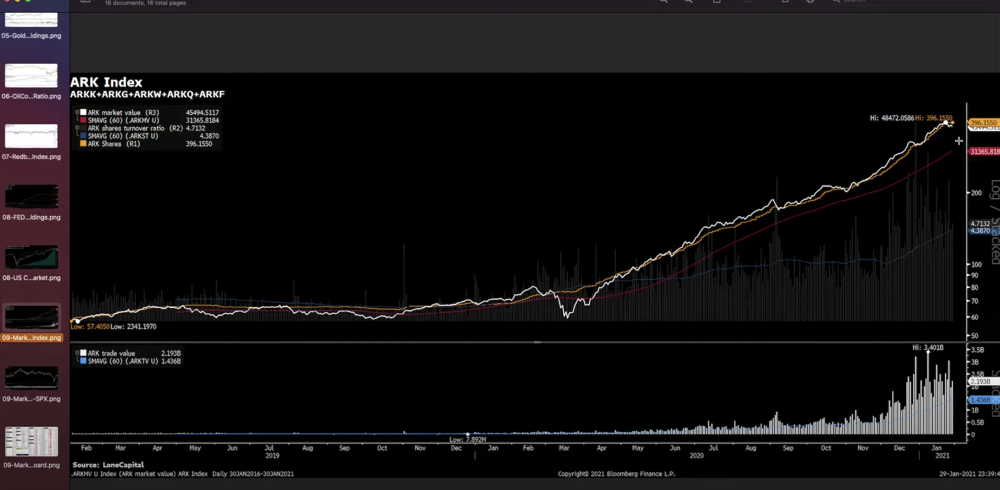
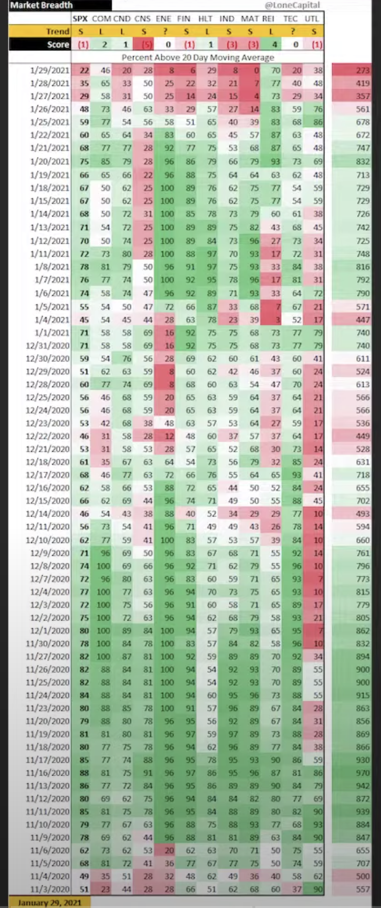
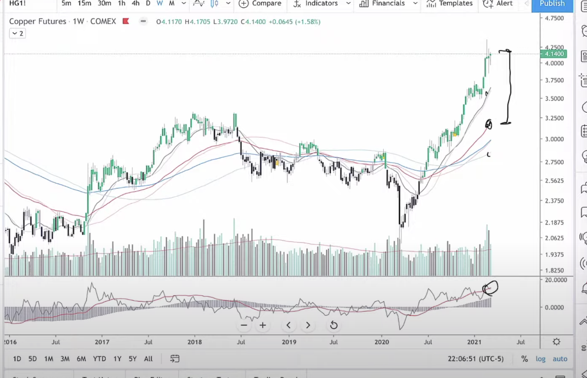
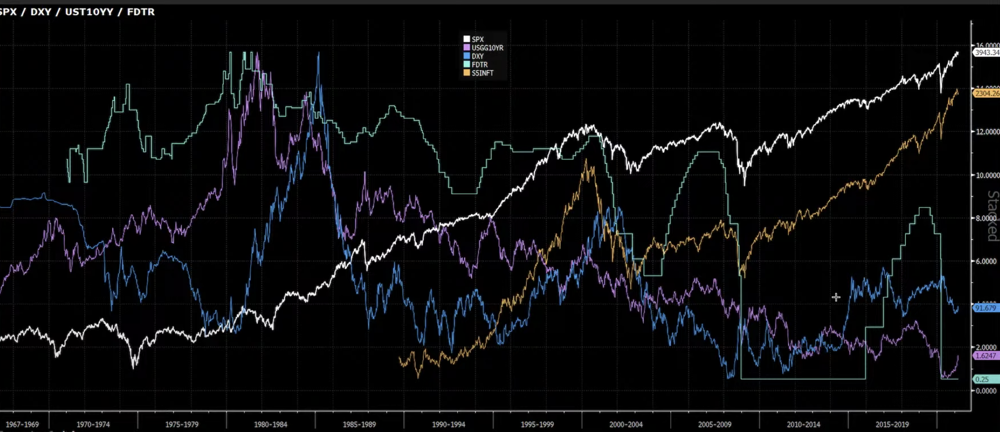
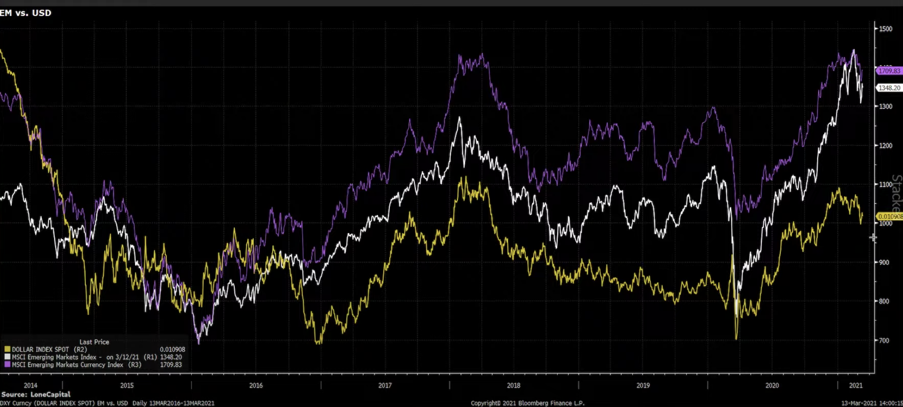

# 致新投資者

## 投资 不一定有回报

金融市场是最聪明的人彼此竞争的地方，而且不像一般的工作，这个市场是10%的人收割90%的人，所以不仅不一定有回报，亏钱还是常态。

## 投资 是一门生意

1. 要有足够的资金进入，不然会激发赌性。
2. 要有一种独特的盈利模式。

但是很多新手恰好相反，投入资金过少，投入的精力和时间也过少。更像是一种“嫖娼”心态（至少我还爽了）。

而且金融市场，也有自己独特的生态圈。绝大部分人都在金融市场不会有收获。

## 金融生态圈

对于投资者而言，有意义的信息是客观数据和市场规律，当然还有客观的态度和独立思考的能力。

## 两条建议

1. **不闻不问**。新手喜欢“主力，庄家”这种层面的信息，也希望在股市之中得到安慰。对于所有预测类型的信息，不闻不问。想知道明天的信息？好啊，后天就知道了。没有人能够精准的预测未来。

   而且很多类型的信息，看起来是“干货满满”，实际上夹杂着很多的私货和预设立场。每个人都在带着自己的偏见去看世界，自己的财富之路，也只能自己做主。

2. **精闻精问。**利用自己的专业优势来做投资。比如那个华南电力集团的动力煤期货赚钱的。*煤炭缺货--钢铁不减产--电力需求还在，煤还要涨*

# 趋势分析的四大关键要素

博文地址：https://lonecapital.com/investment/2856/

# 美股市场观察EP34：逼空

## 为什么每期都是分析铜，原油和黄金？

1. 铜是最大的工业金属
2. 原油是所有商品的成本
3. 黄金反应的是投资者的避险情绪。

当油金比和铜金比在增强的时候，就意味着**经济热度在增强**。

## 美元价格和股市的走向关系

1. 美债十年期收益率如果上行，是对股市有压制作用的，因为相对而言投资美债更为划算
2. 美元本身上涨也是对股市有压制作用，因为美元走强说明市场对于美元的需求在走强，这种情况下就会有一定的“抽水”效应。

## 对ARK本身的剖析

这张图的白颜色的线是市值加总的指数，黄颜色的线是基金的总份额，上半部分图之中的灰色柱状是换手率。下半部分图是五只基金加总的成交额。可以看到虽然换手率在升高，但是黄颜色的总份额也是在增强，这就意味着还是有大量的人涌入，基金的赚钱效应很强。目前还是处在一个正反馈的状态：基金价格走高——散户拼命涌入——基金价格走高。那么什么时候黄颜色的线开始下行了，就是应该准备离场的时候了。

能够吸引散户的唯一效应就是**涨！股价狠狠的涨！**

## 市场宽度图剖析

其中红色是意味着趋势在变坏，1分最低5分最高，所以本周的SPX(1)只是最低程度的变坏。

200以下和900-1000是需要强烈看的区域，第一个是狩猎区，可以开始进入，而第二个是变现区，如果需要变现，就在这个区间变现。

但是不要着急，200以下和900-1000不是意味着遍地捡钱，而是也需要去甄别猎物。

孙子兵法：

1. 知可以战与不可以战胜者胜：我们要在大环境适合战斗的时候再去战斗，如果大环境不适合战斗，就直接不战。
2. 战易胜之战：要打容易打赢的战斗，而不是需要百步穿杨才能够成功的场景。等待猎物来到身边就可以轻松拿下。

## 轧空

一般来说，逼空需要满足以下几点：

1. 股票本身不纳入指数，暴涨暴跌不会引起监管层的注意，可以局部过热
2. 流通性一定要差，要没多少人来炒（另外一方面也是好收集筹码）
3. 做空的比例特别高

## 碎碎念

1. 价格是由买家决定，如果最大的买家美联储没有停手，那么资产价格就还会继续上扬。
2. “大量”一定意味着分歧，意味着在某条价格线附近产生不同看法，从而导致抛售和接盘。
3. ETF和基金（stock ETF flow & Bond ETF flow）如果在持续上涨，说明场外资金在一直涌入。

# 美股市場觀察 EP.35｜樸素價值觀

1. 如果要投资，就要选择那些市值天花板会越来越高的公司。从十亿到百亿千亿，这样的公司才能给股东带来回报。
2. 要尽量投资那些弱周期性的行业，这样不容易随着经济周期的波动忽涨忽跌。

## 如何选股

1. 选择一个好行业：好的行业天花板高，相应的才能够给这个赛道上面的企业进行相关的增速。人赚的是趋势的钱，企业赚的也是趋势的钱。
2. 大牛股在起飞之前一般都是营收十亿美金左右一年
3. 一般大牛企业都是在20-30亿美金左右起步，然后利用某个大牛市或者行业牛市，迅速站上百亿市值，属于一种起跳式的增长。

**牛市最重要，牛市之中大家才愿意听故事，愿意炒高估值，愿意冒风险。**

> 经过我个人的一些研究，所谓的**“十倍股”存在以下共性：**
>
> 1. **大多处在未来5~10年景气度较高的行业，或具备细分行业垄断特性的企业。**只有高景气的行业才有可能实现行业内绝大多数企业高速增长。行业景气度的判断需要靠常识。
> 2. **大概率不会是那些曾经爆炒过的牛股****。**也就是说，如果某企业的市值自上市以来已经实现了5~10倍的增长，那么这些股票大概率失去了再次炒作的价值。
> 3. **大概率从次新股（上市3年以内）中诞生。**次新股如果没有被爆炒过，符合上述1、2、3条件者大概率会出大牛。
> 4. **大多是从50~60亿左右市值起步**，在优秀的基本面支撑下，利用一次牛市（或局部牛市）的机会迅速站上120~150亿市值平台。站上这个平台之后，要么有稳定的业绩增长、要么通过增发或资产注入的方式扩表，再利用一次局部牛市的机会站上300亿市值。此后，500亿以上市值通常需要通过并购等外部扩张的方式来完成，当然还是需要一次牛市（或局部）机会，实现十倍股的终极目标。
> 5. **要有超级大牛市或局部牛市配合**。牛市意味着市场风险偏好较强，投资者追逐风险资产，原本只值30亿的企业可以炒到100亿，原本只值100亿的企业可以炒到500亿，这就是牛市的魅力。不过要知道，短期内跨越多个市值平台，这对企业来说是不符合经济规律的，也是不符合常识的。2015年6月中旬A股牛市结束，这波牛市中出了多少五倍十倍股，又有多少打回了原形？
> 6. **熊市中上市的新股要多关注**。熊市与牛市刚好相反，投资者回避风险资产，许多优秀的企业在熊市中得不到资金追捧，往往会打折出售。在2015年6月至今上市的这些新股中，符合上述1、2、3条件者，大概率会在下一个牛市（或局部牛市）中崭露头角。
>
> 
>
> 原文網址：https://kknews.cc/finance/o8mmmp.html

# 美股市場觀察 EP.36｜牛氣衝天

## 期货套利

Contango: 期货溢价，指的是远期的价格比当前的价格更高

Backwardation: 现货溢价，指的是当前的价格比远期的价格高

那么，对于期货溢价，可以当前买入再卖出远期合约，到时候将库存交割，即可得到这部分溢价。这个反应的是库存增加，所以当前的价格低于以后的价格。那么现货溢价，当然就是反过来。

现货溢价有助于去库存，说明目前需求强劲

# 美股市場觀察 EP.37｜最重要的事

推荐：《投资最重要的事》霍华德 马克思

人要学会独立思考，而独立思考的前提就是独立人格，“我和别人不同”

重要的不是波动风险，而是本金永久损失的风险。

而本金永久损失，主要有三个方面的可能：

1. 期货
2. 期权
3. 杠杆交易

期货和期权都要在指定时间之内判断出方向甚至是具体点位，这种情况太难，哪怕方向对了但是时间不对，都会导致本金的全部丧失。而杠杆交易，会直接放大“正常性波动”到“关键性波动”，一个20%的正常波动，加杠杆之后直接出局。

在人人乐观的时候，反而要注意风险。一不小心就几倍几倍的赚，这种情况反而更要当心过热。

牛市不要频繁操作。多动多错。 

投资，不追求伟大成功，而要避免重大错误。要在长跑之中赢得比赛。

# 美股市場觀察 EP.38｜自知者明

## 为什么利率升高会导致股市下跌

实际上是一个非常清晰的逻辑，但是如果我们把利率看做市盈率，就更显而易见了。如果存款的无风险利率是2%，那么就意味着其市盈率是50——50年收益收回成本。那么市盈率在50以上的股票就比较危险，毕竟无风险利率都比你高。相对而言，如果提高到3%，那么其市盈率就是33，33以上的都有风险了。

ETF 的盈利模式就是拿佣金，ARK 当然也不例外。ARK 是不拿业绩提成的，所以抱着不动对 ark 是最大的伤害

为什么市场宽度只是标普的500只股票？因为这些大市值的股票才会有可能产生”系统性风险“。小盘股无论多妖，都不会影响整个系统。而这些大市值的股票之中有太多的养老金，机构资金等等，这些撤出，才是问题放大的信号。

均线交叉就是成本交叉，就是市场共识。

趋势变化一定会有迹象，这个迹象就是“大量”。 破线，拐头，交叉，说明趋势已经转变好了，再去等就太傻了

# 美股市場觀察 EP.40｜波瀾不驚

铜大概率要在新高附近有一番折腾，因为已经和中期均线相差太远了。

美元指数上涨，和美债收益率上涨本身会对新兴市场造成比较大的影响，但是对美国股市本身没有任何影响。下面是美国的股市，SPY 这些和美元及美债的收益率关系。

再下面这一张是美元指数和新兴市场之间的关系，黄线是美元指数：

# 美股市場觀察 EP.41｜因你而精彩！

**比特币会不会取代黄金**

在桥水的研究报告之中指出，目前比特币的三个方面的问题还没有确定：

1. 价格变化太大，是投机而非投资
2. 没有相关的法律法规来保护投资者的利益
3. 有没有充足的流动性（这一点是机构重视但是散户无所谓的）

金融市场往往有钟摆效应，不会在某一个中间点进行停止，而是会冲过去再回头。

美债是美元的成本，而美元是全世界所有国家货币的资金成本。

涨幅巨大然后放大量，一般意味着已经到顶了。跌幅巨大然后放大量，一般认为已经见底。**大量一般是人性至极**。

# 社群Q&A 2021-03-17

**财报怎么看？**

财务报表不是用来选股的，而是用来避雷的。财务好和公司股价上涨完全没关系。这个是用来避免某些公司股价上涨很多但是财务不好的”雷“

1. 收入表

   收入表之中最重要的是收入和支出。收入减去支出所剩下的就是毛利，毛利再减去其他的成本，比如运营等等最后剩下的就是收入。

   一个企业，最重要的三样东西：

   1. 你的商业模式：靠什么来挣钱，挣谁的钱，怎样把钱拿到
   2. 你的成本和费用。费用主要是工资支出
   3. 你的现金流。

   如果一个企业的应收账款小于应付账款，那么就意味着其可以通过上下游企业的配合获得**无风险的无利率贷款**。

   借债能力，是一个公司撬动杠杆的能力。并不是说一个公司足够大，那么他就不需要借贷。相反，这种方式可以提高资金的周转率。

2.  如果喜欢追高，那么20/60日线就是生命线，如果交叉，请立刻出局

3. “用人”的生意，都不是好生意。