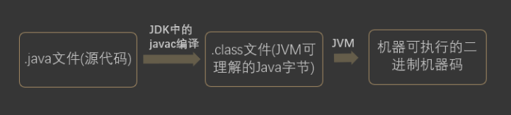
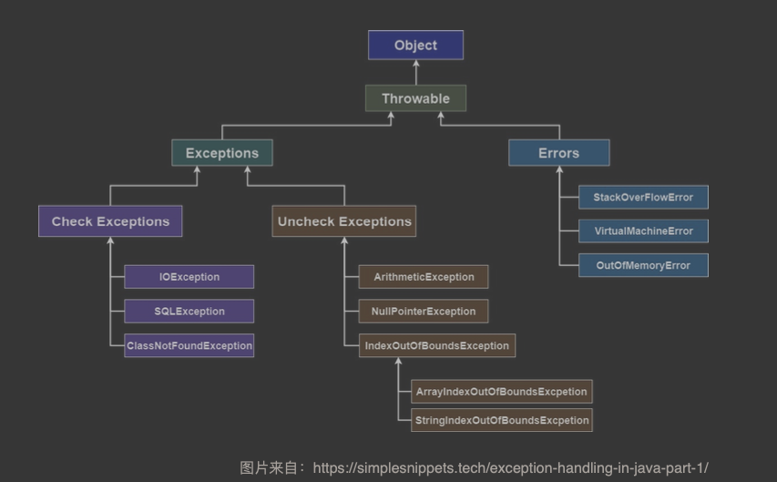

# 二 Java 基础+集合+多线程+JVM

## 2.1. Java 基础

### 2.1.1 面向对象和面向过程的区别

面向过程就一定比面向对象性能高？

不对。面向过程本身也要分配内存，计算偏移量等等，java 相对C 性能低一些是为了可以执行，所以是先变成字节码再去由 JVM 解释执行，其产出并不是真正的机械码。然而C 或者 C++其生成的是可以直接执行的机械码，那么少了中间一环，性能相对就要好一些。

一些面向过程的脚本语言，其性能也不一定有 java 好。

### 2.1.3. 关于 JVM JDK 和 JRE 最详细通俗的解答

Java 程序从源码到运行一般有下面三步：



按照图中来看，`.java`在 javac 编译之后变成`.class` 文件，然后`.class`文件由 JVM 进行**解释变成机器可执行的二进制机器码后执行**。

这种逐行执行的方法，相对而言效率较低。而且软件也是符合“二八定律”，有少部分的热点代码会被执行多次。

那么是不是可以“空间换时间”呢？后面 HotSpot 之中引入了 JIT 编译器，JIT 属于运行时编译，将热热点部分的代码的字节码对应的机器码保存下来，用来下次使用。

JDK9之中引入了一种新的编译模式，AOT(ahead of time compliation)，其直接将字节码编译成机器码，避免了 JIT 预热等等开销。AOT 的编译质量是肯定比不上 JIT 编译器的。

### 2.1.5. Java 和 C++的区别?

相同点：都是面向对象的语言，那么都支持面向对象的基本特征：继承，封装和多态

不同点：

1. Java 之中不提供指针来对内存进行访问，因此程序内存更安全
2. Java 的类是单继承的，而C++支持多重继承。Java 之中的 interface 支持多重继承

> Java 不支持**类**的多重继承，主要是因为类的多重继承有可能会产生菱形继承的问题：
>
> 有一个root class, class A 和  class B 都继承这个 root class, 并且对同一个方法有不同的实现，现在一个 class C 继承 class A 和 class B，那么对于这个方法应该怎么处理？
>
> 要是不合并，那么会在子类之中包含两份祖父类之中的内容，产生歧义。但是合并的话， 那么如何指定呢？
>
> 但是在接口层面就没这些问题：人家根本就没实现，反正都是在最后这个继承类之中进行实现，那么又担心什么呢？
>
> **参考**
>
> 为什么Java可以多继承interface，而不可以多继承class？ - 徐辰的回答 - 知乎 https://www.zhihu.com/question/20306381/answer/16895493
>
> Java 为什么不支持多继承？ - RednaxelaFX的回答 - 知乎 https://www.zhihu.com/question/24317891/answer/65097560

3. Java 之中有自动内存管理机制，不需要手动的去 malloc 内存
4. 在 C 语言之中，字符串或者字符数组的最后都有一个额外的`\0`表示结束，但是 Java 之中没有结束符这个概念。
   这个是因为 C 是面向过程的语言，那么相对的其对于各种字符串需要用一个标识符来作为标识。而 java 是面向对象的语言，所有的东西都是类，比如 String 或者 List之中都有专门的一个属性来做对应的长度标识：`length` 或者`size`，自然就不需要一个标志位来做这些处理了。

### 2.1.6. 字符型常量和字符串常量的区别?

1. 含义上：char 相当于一个整型值，可以参与相应的表达式运算。但是字符串常量代表的是该字符串在内存之中存放的位置

2. 占内存大小：字符常量只占两个字节，16bits，但是字符串常量占若干个字节。

   > Java 之中，各种**基本类型**所占的存储空间的大小并不随着机器的不同而不同，比如 char 就是两个字节，这种存储空间不跟着机器硬件架构的变化而变化的不变性，就是 Java 程序更具有可移植性的原因之一。

### 2.1.7. 构造器 Constructor 是否可被 override?

override: 重写

Overload: 重载

那么分析可得，constuctor 不可能被 override。 首先 override 需要：

1. 继承相关的类
2. 重写**相同名称的方法**

constructor 之中必须和对应的类名字相同，那么子类一定和父类名字不同，那么子类的 constuctor 就不可能**重写**父类的构造函数。

### 2.1.8. 重载和重写的区别

**重载：**

发生在编译期。发生在一个类之中，方法名相同，参数类型不同，个数不同，顺序不同，方法的**返回值**和**访问修饰符**可以不同。

也就是说，除了名字相同之外，什么都可以不同。

**重写：**

重写发生在运行期，是子类对于父类的**允许访问的方法**的实现过程的重新编写。

1. 对于**基本类型和 void**, 返回值的类型不可以修改。 对于**引用类型**，返回值的类型可以使用其子类型。方法名，参数列表必须相同，抛出的异常范围**小于等于**父类。**访问修饰符范围**大于等于父类。

   > 抛出的异常范围小于父类，才能够保证该异常被父类抓住。访问修饰符的范围大于等于父类，才能让父类调用出的方法被子类替换之后仍然成立。

2. 父类访问修饰符是`private/final/static`，那么子类不能重写该方法。但是被 static 修饰的方法能够被再次声明。

### 2.1.10. String StringBuffer 和 StringBuilder 的区别是什么? String 为什么是不可变的?

主要区别是**可变性**。

**String**，在 java 9 之前，其内部保存字符串的实现是用`final`关键字来修饰保存的。`private final char value[]`。所以 String 对象是不可变的。

在 java 9之后，其内部的实现是用 byte 数组来存储的，`private final byte[] value`。

> https://www.baeldung.com/java-9-compact-string#java
>
> Java 9 has brought the concept of compact *Strings* ba*ck.*
>
> This means that **whenever we create a \*String\* if all the characters of the \*String\* can be represented using a byte — LATIN-1 representation, a byte array will be used** internally, such that one byte is given for one character.
>
> In other cases, if any character requires more than 8-bits to represent it, all the characters are stored using two bytes for each — UTF-16 representation.
>
> So basically, whenever possible, it’ll just use a single byte for each character.
>
> Now, the question is – how will all the *String* operations work? How will it distinguish between the LATIN-1 and UTF-16 representations?
>
> **Well, to tackle this issue, another change is made to the internal implementation of the \*String\*. We have a final field \*coder\*, that preserves this information.**
>
> 也就是说，能用单个字节表示的时候，都用单个字节，latin-1 的方式进行表示。不能的时候，全部的字符都用两个字节来标识，utf-16.
>
>
> https://www.baeldung.com/java-9-compact-string#compressed-1
>
> 相对而言，全英文的句子更多，那么意味着大部分的 String 都可以用 latin-1格式来编码，用 byte 显然会对内存的压力更小，而且的确 String 的值占用大部分的内存池容量，对 String 做一些优化是很值得的。

**StringBuilder**,**StringBuffer**都是继承自`AbstractStringBuilder`,其中也是用字符数组保存字符串`char[] value`，但是没有用 final 修饰，所以这两种对象都是可变的。

但是 StringBuilder 是单线程，而 StringBuffer 是多线程安全的，方式是加上了同步锁。

### 2.1.11. 自动装箱与拆箱

https://www.cnblogs.com/dolphin0520/p/3780005.html

1. 装箱是用`.valueOf()`方法来做的，拆箱是对应的`xxxValue()`,比如 int 就是`intValue()`。

2. 拆装箱和缓存池一般都有关系，比如 Int 在[-128,127]之间的话，新建对象就返回已经存在的缓存池之中的对象的引用。否则创建一个新的对象。

3. > 下面程序的输出结果是什么？
   >
   > ```java
   > public class Main {
   >     public static void main(String[] args) {
   >          
   >         Integer a = 1;
   >         Integer b = 2;
   >         Integer c = 3;
   >         Integer d = 3;
   >         Integer e = 321;
   >         Integer f = 321;
   >         Long g = 3L;
   >         Long h = 2L;
   >          
   >         System.out.println(c==d);
   >         System.out.println(e==f);
   >         System.out.println(c==(a+b));
   >         System.out.println(c.equals(a+b));
   >         System.out.println(g==(a+b));
   >         System.out.println(g.equals(a+b));
   >         System.out.println(g.equals(a+h));
   >     }
   > }
   > ```
   >
   > 　　先别看输出结果，读者自己想一下这段代码的输出结果是什么。这里面需要注意的是：当 "=="运算符的两个操作数**都是 包装器类型的引用**，则是比较指向的是否是同一个对象，而如果其中有一个操作数是**表达式（即包含算术运算）**则比较的是数值（即会触发自动拆箱的过程）。另外，对于包装器类型，**equals方法并不会进行类型转换**。明白了这2点之后，上面的输出结果便一目了然：
   >
   > ```java
   > true
   > false
   > true
   > true
   > true
   > false
   > true
   > ```
   >
   > 　　第一个和第二个输出结果没有什么疑问。第三句由于 a+b包含了算术运算，因此会触发自动拆箱过程（会调用intValue方法），因此它们比较的是数值是否相等。而对于c.equals(a+b)会先触发自动拆箱过程，再触发自动装箱过程，也就是说a+b，会先各自调用intValue方法，得到了加法运算后的数值之后，便调用Integer.valueOf方法，再进行equals比较。同理对于后面的也是这样，不过要注意倒数第二个和最后一个输出的结果（如果数值是int类型的，装箱过程调用的是Integer.valueOf；如果是long类型的，装箱调用的Long.valueOf方法）。

   - 两边均是仅仅包装器类型：比较是否指向同一个对象——直接调用对象的时候，值传递的是其对应的指针。
   - 具有相关的运算：比较的是数值，触发自动拆箱的过程——已经有一边不止一个对象了，那肯定没法直接比地址啊，看值做操作吧
   - 包装器类型，`equals()`并不会做类型转换——类型转换，只是针对于使用基本类型的常量的时候做的转换，都上不同的类了，自然就不做相应的转换了

### 2.1.14. 接口和抽象类的区别是什么?

1. 抽象类之中可以有非抽象的方法， 但是接口之中的方法不可以有实现（在 java8开始接口可以有默认实现，这也导致了菱形继承的问题。而处理方式是在语言层面限定，对于菱形继承，必须显式的使用@ovverride 并且重写方法，否则报错）
2. 一个类可以实现多个接口，但是只能实现一个抽象类

### 2.1.16. 创建一个对象用什么运算符?对象实体与对象引用有何不同?

1. 内存位置不同：对象实例在堆内存中，对象引用在栈内存之中，指向堆内存之中的对象实例
2. 一个引用可以指向0或者1个对象，一个对象实例可以有多个引用指向他

### 2.1.23. == 与 equals(重要)

`==`: 其作用是看两个对象的地址是否相等。结合之前说的，Java 是值传递，对于基本类型比较的就是值，而对于引用类型比较的则是其引用（内存地址）是否为同一个。

`equals()`: 在默认情况，即没有被覆盖的情况下，其等价`==`来比较两个对象。要是类之中覆盖了`equals()`方法，那么就用覆盖之后的逻辑来判断二者是否相等。

### 2.1.24. hashCode 与 equals (重要)

hashCode() 介绍：

hashCode() 的作用是获取散列码，实际上返回的是一个 int 整数。`Object`类之中的 hashCode() 方法是本地方法，其通常将对象的内存地址转换整数之后返回。

**为什么重写 equals 时必须重写 hashCode 方法?**

不然用默认的实现，就可以得出其所有的对象，在不散列碰撞的情况`hashCode()` 都不同。可是此时判断对象是否相等的`equals()`方法已经被重写。在 Hash 相关的集合里面，比如 hashMap,首先判断的都是 `hashCode()`，那`hashCode()`永远都不一样，自然就没有比较`equals()`方法的地方了，就会造成可能两个对象在`equals()`判断是一样的，应该只存在一个但是`hashCode()` 不同所以均存在的情况。

### 2.1.25. 为什么 Java 中只有值传递?

Java 程序设计语言总是采用按值调用。也就是说，**方法得到的是所有参数值的一个拷⻉**，也就 是说，方法不能修改传递给它的任何参数变量的内容。

### 2.1.27. 线程有哪些基本状态?

首先肯定要有出生和死亡：new，terminated。之外要可以运行：runnable。再就是抢不到锁所以被 blocked, 等待其他线程给动作的 waiting 和 超时等待 time_waiting

### 2.1.28. 关于 final 关键字的一些总结

final 可以用在三个地方：变量，方法，类

在 java 之中，可以定义的部分也就是这三个：变量，方法，类。

1. 对于一个 final 形式的变量，如果其是基本类型，那么数值在初始化之后不可以更改。如果是引用类型，那么初始化之后不可以指向其他对象。
2. final 修饰一个类的时候，其不可以被继承。其中所有方法都会隐式的定义成 final
3. final 的方法不可以修改。

### 2.1.29. Java 中的异常处理

#### 2.1.29.1. Java 异常类层次结构图



主要分为两大类：Errors 和 Exceptions。Errors 本身一旦发生了，是无法处理的，一般都是直接 kill 掉所属的线程。

Exceptions 里面还可以分为两类：Check Exceptions 和 Uncheck Exceptions。

其中 Check Exceptions 之中包含了除 RuntimeExceptions 之外的所有 Exceptions, 这些 Exceptions 不可以不 check，也就是必须用 catch/ throw 来写对应的逻辑，不然就无法通过编译。

而 Uncheck Exceptions 之中则有所有其他的 Exceptions。这些哪怕没有被 catch/ throw 也可以正常运行。

Finally 之中如果有对应的 return 语句，那么 finally 之中的语句的内容会被执行，并且 finally 之中的返回值会覆盖原始的返回值。

### 2.1.30. Java 序列化中如果有些字段不想进行序列化，怎么办?

用 transient 修饰。但是 transient 只能修饰变量，无法修饰类和方法。

> 在我看来，只有某些变量在序列化和反序列化的时候可以忽略， 方法则没有这个必要。

#### 2.1.32.2. 既然有了字节流,为什么还要有字符流?

问题本质想问: 不管是文件读写还是网络发送接收，信息的最小存储单元都是**字节**，那为什么
I/O 流操作要分为字节流操作和字符流操作呢?

可以只给字节流操作，但：

1. 字节转换成字符的过程还是比较耗时的
2. 如果不知道字节流的编码方式，就很容易出问题。

**为了方便起见**，IO 流提供了一个直接操作字符的接口，方便对字符进行流操作

