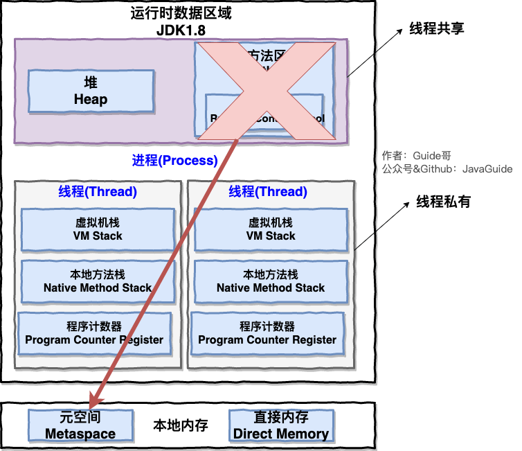
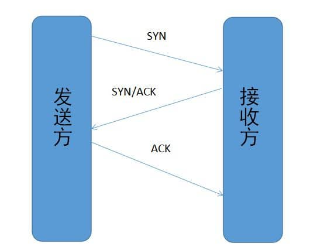
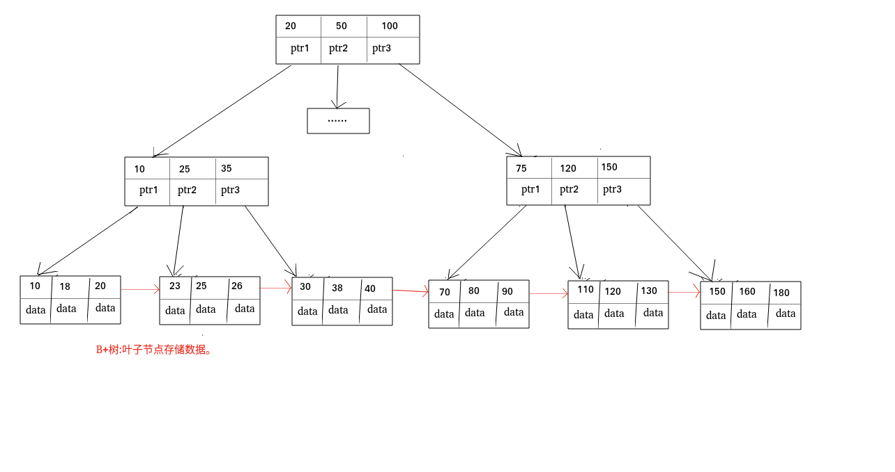
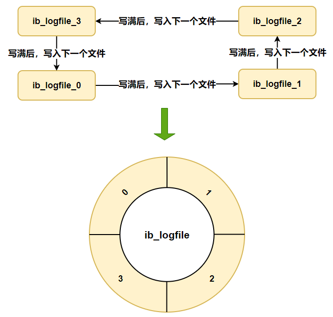

# 二 Java 基础+集合+多线程+JVM

## 2.1. Java 基础

### 2.1.1 面向对象和面向过程的区别

面向过程就一定比面向对象性能高？

不对。面向过程本身也要分配内存，计算偏移量等等，java 相对C 性能低一些是为了可以执行，所以是先变成字节码再去由 JVM 解释执行，其产出并不是真正的机械码。然而C 或者 C++其生成的是可以直接执行的机械码，那么少了中间一环，性能相对就要好一些。

一些面向过程的脚本语言，其性能也不一定有 java 好。

### 2.1.3. 关于 JVM JDK 和 JRE 最详细通俗的解答

Java 程序从源码到运行一般有下面三步：


按照图中来看，`.java`在 javac 编译之后变成`.class` 文件，然后`.class`文件由 JVM 进行**解释变成机器可执行的二进制机器码后执行**。

这种逐行执行的方法，相对而言效率较低。而且软件也是符合“二八定律”，有少部分的热点代码会被执行多次。

那么是不是可以“空间换时间”呢？后面 HotSpot 之中引入了 JIT 编译器，JIT 属于运行时编译，将热热点部分的代码的字节码对应的机器码保存下来，用来下次使用。

JDK9之中引入了一种新的编译模式，AOT(ahead of time compliation)，其直接将字节码编译成机器码，避免了 JIT 预热等等开销。AOT 的编译质量是肯定比不上 JIT 编译器的。

### 2.1.5. Java 和 C++的区别?

相同点：都是面向对象的语言，那么都支持面向对象的基本特征：继承，封装和多态

不同点：

1. Java 之中不提供指针来对内存进行访问，因此程序内存更安全
2. Java 的类是单继承的，而C++支持多重继承。Java 之中的 interface 支持多重继承

> Java 不支持**类**的多重继承，主要是因为类的多重继承有可能会产生菱形继承的问题：
>
> 有一个root class, class A 和  class B 都继承这个 root class, 并且对同一个方法有不同的实现，现在一个 class C 继承 class A 和 class B，那么对于这个方法应该怎么处理？
>
> 要是不合并，那么会在子类之中包含两份祖父类之中的内容，产生歧义。但是合并的话， 那么如何指定呢？
>
> 但是在接口层面就没这些问题：人家根本就没实现，反正都是在最后这个继承类之中进行实现，那么又担心什么呢？
>
> **参考**
>
> 为什么Java可以多继承interface，而不可以多继承class？ - 徐辰的回答 - 知乎 https://www.zhihu.com/question/20306381/answer/16895493
>
> Java 为什么不支持多继承？ - RednaxelaFX的回答 - 知乎 https://www.zhihu.com/question/24317891/answer/65097560

3. Java 之中有自动内存管理机制，不需要手动的去 malloc 内存
4. 在 C 语言之中，字符串或者字符数组的最后都有一个额外的`\0`表示结束，但是 Java 之中没有结束符这个概念。
   这个是因为 C 是面向过程的语言，那么相对的其对于各种字符串需要用一个标识符来作为标识。而 java 是面向对象的语言，所有的东西都是类，比如 String 或者 List之中都有专门的一个属性来做对应的长度标识：`length` 或者`size`，自然就不需要一个标志位来做这些处理了。

### 2.1.6. 字符型常量和字符串常量的区别?

1. 含义上：char 相当于一个整型值，可以参与相应的表达式运算。但是字符串常量代表的是该字符串在内存之中存放的位置

2. 占内存大小：字符常量只占两个字节，16bits，但是字符串常量占若干个字节。

   > Java 之中，各种**基本类型**所占的存储空间的大小并不随着机器的不同而不同，比如 char 就是两个字节，这种存储空间不跟着机器硬件架构的变化而变化的不变性，就是 Java 程序更具有可移植性的原因之一。

### 2.1.7. 构造器 Constructor 是否可被 override?

override: 重写

Overload: 重载

那么分析可得，constuctor 不可能被 override。 首先 override 需要：

1. 继承相关的类
2. 重写**相同名称的方法**

constructor 之中必须和对应的类名字相同，那么子类一定和父类名字不同，那么子类的 constuctor 就不可能**重写**父类的构造函数。

### 2.1.8. 重载和重写的区别

**重载：**

发生在编译期。发生在一个类之中，方法名相同，参数类型不同，个数不同，顺序不同，方法的**返回值**和**访问修饰符**可以不同。

也就是说，除了名字相同之外，什么都可以不同。

**重写：**

重写发生在运行期，是子类对于父类的**允许访问的方法**的实现过程的重新编写。

1. 对于**基本类型和 void**, 返回值的类型不可以修改。 对于**引用类型**，返回值的类型可以使用其子类型。方法名，参数列表必须相同，抛出的异常范围**小于等于**父类。**访问修饰符范围**大于等于父类。

   > 抛出的异常范围小于父类，才能够保证该异常被父类抓住。访问修饰符的范围大于等于父类，才能让父类调用出的方法被子类替换之后仍然成立。

2. 父类访问修饰符是`private/final/static`，那么子类不能重写该方法。但是被 static 修饰的方法能够被再次声明。

### 2.1.10. String StringBuffer 和 StringBuilder 的区别是什么? String 为什么是不可变的?

主要区别是**可变性**。

**String**，在 java 9 之前，其内部保存字符串的实现是用`final`关键字来修饰保存的。`private final char value[]`。所以 String 对象是不可变的。

在 java 9之后，其内部的实现是用 byte 数组来存储的，`private final byte[] value`。

> https://www.baeldung.com/java-9-compact-string#java
>
> Java 9 has brought the concept of compact *Strings* ba*ck.*
>
> This means that **whenever we create a \*String\* if all the characters of the \*String\* can be represented using a byte — LATIN-1 representation, a byte array will be used** internally, such that one byte is given for one character.
>
> In other cases, if any character requires more than 8-bits to represent it, all the characters are stored using two bytes for each — UTF-16 representation.
>
> So basically, whenever possible, it’ll just use a single byte for each character.
>
> Now, the question is – how will all the *String* operations work? How will it distinguish between the LATIN-1 and UTF-16 representations?
>
> **Well, to tackle this issue, another change is made to the internal implementation of the \*String\*. We have a final field \*coder\*, that preserves this information.**
>
> 也就是说，能用单个字节表示的时候，都用单个字节，latin-1 的方式进行表示。不能的时候，全部的字符都用两个字节来标识，utf-16.
>
>
> https://www.baeldung.com/java-9-compact-string#compressed-1
>
> 相对而言，全英文的句子更多，那么意味着大部分的 String 都可以用 latin-1格式来编码，用 byte 显然会对内存的压力更小，而且的确 String 的值占用大部分的内存池容量，对 String 做一些优化是很值得的。

**StringBuilder**,**StringBuffer**都是继承自`AbstractStringBuilder`,其中也是用字符数组保存字符串`char[] value`，但是没有用 final 修饰，所以这两种对象都是可变的。

但是 StringBuilder 是单线程，而 StringBuffer 是多线程安全的，方式是加上了同步锁。

### 2.1.11. 自动装箱与拆箱

https://www.cnblogs.com/dolphin0520/p/3780005.html

1. 装箱是用`.valueOf()`方法来做的，拆箱是对应的`xxxValue()`,比如 int 就是`intValue()`。

2. 拆装箱和缓存池一般都有关系，比如 Int 在[-128,127]之间的话，新建对象就返回已经存在的缓存池之中的对象的引用。否则创建一个新的对象。

3. > 下面程序的输出结果是什么？
   >
   > ```java
   > public class Main {
   >     public static void main(String[] args) {
   >          
   >         Integer a = 1;
   >         Integer b = 2;
   >         Integer c = 3;
   >         Integer d = 3;
   >         Integer e = 321;
   >         Integer f = 321;
   >         Long g = 3L;
   >         Long h = 2L;
   >          
   >         System.out.println(c==d);
   >         System.out.println(e==f);
   >         System.out.println(c==(a+b));
   >         System.out.println(c.equals(a+b));
   >         System.out.println(g==(a+b));
   >         System.out.println(g.equals(a+b));
   >         System.out.println(g.equals(a+h));
   >     }
   > }
   > ```
   >
   > 　　先别看输出结果，读者自己想一下这段代码的输出结果是什么。这里面需要注意的是：当 "=="运算符的两个操作数**都是 包装器类型的引用**，则是比较指向的是否是同一个对象，而如果其中有一个操作数是**表达式（即包含算术运算）**则比较的是数值（即会触发自动拆箱的过程）。另外，对于包装器类型，**equals方法并不会进行类型转换**。明白了这2点之后，上面的输出结果便一目了然：
   >
   > ```java
   > true
   > false
   > true
   > true
   > true
   > false
   > true
   > ```
   >
   > 　　第一个和第二个输出结果没有什么疑问。第三句由于 a+b包含了算术运算，因此会触发自动拆箱过程（会调用intValue方法），因此它们比较的是数值是否相等。而对于c.equals(a+b)会先触发自动拆箱过程，再触发自动装箱过程，也就是说a+b，会先各自调用intValue方法，得到了加法运算后的数值之后，便调用Integer.valueOf方法，再进行equals比较。同理对于后面的也是这样，不过要注意倒数第二个和最后一个输出的结果（如果数值是int类型的，装箱过程调用的是Integer.valueOf；如果是long类型的，装箱调用的Long.valueOf方法）。

   - 两边均是仅仅包装器类型：比较是否指向同一个对象——直接调用对象的时候，值传递的是其对应的指针。
   - 具有相关的运算：比较的是数值，触发自动拆箱的过程——已经有一边不止一个对象了，那肯定没法直接比地址啊，看值做操作吧
   - 包装器类型，`equals()`并不会做类型转换——类型转换，只是针对于使用基本类型的常量的时候做的转换，都上不同的类了，自然就不做相应的转换了

### 2.1.14. 接口和抽象类的区别是什么?

1. 抽象类之中可以有非抽象的方法， 但是接口之中的方法不可以有实现（在 java8开始接口可以有默认实现，这也导致了菱形继承的问题。而处理方式是在语言层面限定，对于菱形继承，必须显式的使用@ovverride 并且重写方法，否则报错）
2. 一个类可以实现多个接口，但是只能实现一个抽象类

### 2.1.16. 创建一个对象用什么运算符?对象实体与对象引用有何不同?

1. 内存位置不同：对象实例在堆内存中，对象引用在栈内存之中，指向堆内存之中的对象实例
2. 一个引用可以指向0或者1个对象，一个对象实例可以有多个引用指向他

### 2.1.23. == 与 equals(重要)

`==`: 其作用是看两个对象的地址是否相等。结合之前说的，Java 是值传递，对于基本类型比较的就是值，而对于引用类型比较的则是其引用（内存地址）是否为同一个。

`equals()`: 在默认情况，即没有被覆盖的情况下，其等价`==`来比较两个对象。要是类之中覆盖了`equals()`方法，那么就用覆盖之后的逻辑来判断二者是否相等。

### 2.1.24. hashCode 与 equals (重要)

hashCode() 介绍：

hashCode() 的作用是获取散列码，实际上返回的是一个 int 整数。`Object`类之中的 hashCode() 方法是本地方法，其通常将对象的内存地址转换整数之后返回。

**为什么重写 equals 时必须重写 hashCode 方法?**

不然用默认的实现，就可以得出其所有的对象，在不散列碰撞的情况`hashCode()` 都不同。可是此时判断对象是否相等的`equals()`方法已经被重写。在 Hash 相关的集合里面，比如 hashMap,首先判断的都是 `hashCode()`，那`hashCode()`永远都不一样，自然就没有比较`equals()`方法的地方了，就会造成可能两个对象在`equals()`判断是一样的，应该只存在一个但是`hashCode()` 不同所以均存在的情况。

### 2.1.25. 为什么 Java 中只有值传递?

Java 程序设计语言总是采用按值调用。也就是说，**方法得到的是所有参数值的一个拷⻉**，也就 是说，方法不能修改传递给它的任何参数变量的内容。

### 2.1.27. 线程有哪些基本状态?

首先肯定要有出生和死亡：new，terminated。之外要可以运行：runnable。再就是抢不到锁所以被 blocked, 等待其他线程给动作的 waiting 和 超时等待 time_waiting

### 2.1.28. 关于 final 关键字的一些总结

final 可以用在三个地方：变量，方法，类

在 java 之中，可以定义的部分也就是这三个：变量，方法，类。

1. 对于一个 final 形式的变量，如果其是基本类型，那么数值在初始化之后不可以更改。如果是引用类型，那么初始化之后不可以指向其他对象。
2. final 修饰一个类的时候，其不可以被继承。其中所有方法都会隐式的定义成 final
3. final 的方法不可以修改。

### 2.1.29. Java 中的异常处理

#### 2.1.29.1. Java 异常类层次结构图


主要分为两大类：Errors 和 Exceptions。Errors 本身一旦发生了，是无法处理的，一般都是直接 kill 掉所属的线程。

Exceptions 里面还可以分为两类：Check Exceptions 和 Uncheck Exceptions。

其中 Check Exceptions 之中包含了除 RuntimeExceptions 之外的所有 Exceptions, 这些 Exceptions 不可以不 check，也就是必须用 catch/ throw 来写对应的逻辑，不然就无法通过编译。

而 Uncheck Exceptions 之中则有所有其他的 Exceptions。这些哪怕没有被 catch/ throw 也可以正常运行。

Finally 之中如果有对应的 return 语句，那么 finally 之中的语句的内容会被执行，并且 finally 之中的返回值会覆盖原始的返回值。

### 2.1.30. Java 序列化中如果有些字段不想进行序列化，怎么办?

用 transient 修饰。但是 transient 只能修饰变量，无法修饰类和方法。

> 在我看来，只有某些变量在序列化和反序列化的时候可以忽略， 方法则没有这个必要。

#### 2.1.32.2. 既然有了字节流,为什么还要有字符流?

问题本质想问: 不管是文件读写还是网络发送接收，信息的最小存储单元都是**字节**，那为什么
I/O 流操作要分为字节流操作和字符流操作呢?

可以只给字节流操作，但：

1. 字节转换成字符的过程还是比较耗时的
2. 如果不知道字节流的编码方式，就很容易出问题。

**为了方便起见**，IO 流提供了一个直接操作字符的接口，方便对字符进行流操作

## 2.2 代理详解

### 2.2.1 静态代理和动态代理的对比

1. 静态代理：
   - 对每个目标类都**实现一个代理类**
   - 静态代理之中如果接口新增方法， 目标对象和代理对象都要进行修改。这是非常麻烦的。
   - 在编译的时候就将接口，实现类，代理类等等变成一个个**真正的 class 文件**
2. 动态代理：
   - 更灵活，不必须实现接口（cglib), 可以直接代理实现类（实现接口的 jdk 代理或者全部的 cglib)。
   - 在**运行时**动态生成类字节码，加载到 JVM 之中

### 2.2.2 JDK 动态代理和 CGLIB 动态代理对比

1. 从范围看，jdk 动态代理只能代理实现了接口的类，或者直接代理接口。但是 cglib 可以代理未实现任何接口的类
2. 从效率看，大部分情况都是 jdk 动态代理更优秀（因为其只是生成对应的方法然后再拦截，肯定比 cglib 直接生成一个代理类的子类效率更高）

## 2.3 IO 模型详解

本部分包含各种 IO 模型和 select, poll, epoll 等等。

IO 主要分为三中：BIO， NIO 和 AIO。

BIO： 同步阻塞 IO 模型，线程发起 IO 之后一直阻塞，直到缓冲区的数据就绪之后才进行下一步操作。每一个请求都得一个**新的线程**来进行处理。

NIO：同步非阻塞 IO。这里面的同步，指的是线程自己来看是否有请求进来，而异步指的是操作系统来通知对应的线程其是否有数据。那么这个**非阻塞**指的是线程发起请求之后，立刻返回，但是要**主动的**定期轮询是否缓冲区数据就绪。
NIO 是 new IO 的意思，就是 NIO+多路复用技术，而这个多路复用部分， 本身就是一个线程轮询去查看**一堆 IO 缓冲区**之中哪些就绪，检查IO 数据是否就绪的任务是交给操作系统级别的 select 或者 epoll 模型。

AIO：异步非阻塞模型，是直接让操作系统来返回其是否就绪。

### 2.3.3 select, poll, epoll 之间区别

参考： https://zhuanlan.zhihu.com/p/272891398

先说前提：select, poll 和 epoll 本质上都是**同步 IO**。因为都需要在读写事件就绪之后**自己负责**读写！异步 IO 的话不需要自己负责读写！

Select: 在轮询的时候需要将所有的 FD 从用户态拷贝到内核态，而且只知道有请求进来但是不知道是哪个具体请求，所以要**轮询**全部的请求，摘出谁有请求进入再一起处理。有最大1024的限制。

Poll：和 select 区别不大，但是基于链表存储，没有**最大连接数限制**

Epoll：是被动接受通知，有 callback 函数，每次醒来的时候只需要去看对应区域的 FD。而且其内存是通过文件映射，内核和用户空间共享一块内存来实现的，这就避免了数据拷来拷去所带来的消耗。

对于 epoll，还有触发模式的不同：水平触发和边缘触发。他们对于socket 内存之中没有读完的数据处理方式不同：

	- 水平触发：只要该 fd 还有数据可读，每次 epoll_wait 都会返回其事件来让用户操作
	- 边缘触发：只提示一次，直到下次有数据流入之前都不会再提示。所以 ET(edge trigger) 之中，读一个 fd 的时候一定要把 buffer 全部读完。

## 三 Java集合

## 3.1 Collection 子接口之 List

### 3.1.1 Arraylist 与 LinkedList 区别?

1. 是否线程安全？均非同步，所以都不是线程安全
2. 底层数据结构：ArrayList之中是`Object[]`，LinkedList 底层是**双向链表**
3. 插入和删除是否受元素位置影响？
   - `ArrayList`：受。当整个 List 的长度为 n，要在指定位置 i 插入和删除元素的时候，时间复杂度为 O(n-i)。因为在将位置 i 处增加一个元素之后，需要将后面 (n-i) 个元素全部都往后挪一位
   - `LinkedList`: 其在寻找插入位置的时候也是会受到影响：假设在位置 i 处增加一个元素，那么需要遍历到位置 i 才能够进行插入或者删除操作。但是在找到这个节点之后，就只需要对其前面后面的指针做修改，不需要将后面的元素再挪位置。
4. 是否支持快速随机访问：`ArrayList`  接受，但是`LinkedList`不接受
5. 内存空间占用：`ArrayList`之中要在 list 的末尾预留一部分空间，`LinkedList` 不用预留空间，但是其中每个节点的空间都要更多，因为要保存前驱和后驱节点

### 3.1.2 ArrayList 扩容机制分析

如果没有传入数组容量，新创建的数组默认是一个空数组，在第一次使用时候才会按照默认容量10来创建。

扩容之中采用的位运算：`        int newCapacity = oldCapacity + (oldCapacity >> 1); `。每次增加之后的容量是愿容量的1.5倍。

增加的逻辑是新建一个容量为 `newCapacity` 的数组，用`Arrays.copyOf()`方式将老数组之中内容拷贝过去且指向内部用来保存数据的`Object[]` elementData。

## 3.2  Collection 子接口之 Set

### 3.2.1 比较 HashSet、LinkedHashSet 和 TreeSet 三者的异同

相同点：三者都线程不安全

不同点：底层实现各不相同：

- `hashSet `的底层实现是`HashMap`。
- `LinkedHashSet` 的底层实现是`HashMap` 和链表
- `TreeSet` 的底层实现是红黑树

底层数据结构的不同，导致三者的应用场景也不同。

- `HashSet`：元素不需要有序，最基本的 Set 实现
- `LinkedHashSet`：元素有序插入和取出，符合 FIFO
- `TreeSet`:红黑树天然排序，需要对元素自定义排序规则场景

## 3.3 Collection 子接口之 Queue

### 3.3.1 Queue 与 Deque 的区别

**不同：**

queue 是单端队列，实现 FIFO。

Deque 是双端队列，队列两端均可以插入或者删除元素。


事实上，`Deque` 还提供有 `push()` 和 `pop()` 等其他方法，可用于模拟栈。

**相同：**

`Deque` 和 queue 在**因为容量问题而导致操作失败后处理方式不同**方面都有两套方法，一套抛出异常，一套返回特殊值。

| `Queue` 接口 | 抛出异常  | 返回特殊值 |
| ------------ | --------- | ---------- |
| 插入队尾     | add(E e)  | offer(E e) |
| 删除队首     | remove()  | poll()     |
| 查询队首元素 | element() | peek()     |

| `Deque` 接口 | 抛出异常      | 返回特殊值      |
| ------------ | ------------- | --------------- |
| 插入队首     | addFirst(E e) | offerFirst(E e) |
| 插入队尾     | addLast(E e)  | offerLast(E e)  |
| 删除队首     | removeFirst() | pollFirst()     |
| 删除队尾     | removeLast()  | pollLast()      |
| 查询队首元素 | getFirst()    | peekFirst()     |
| 查询队尾元素 | getLast()     | peekLast()      |

### 3.3.2 说一说 PriorityQueue

`PriorityQueue` 和`Queue` 的区别是元素的出队顺序和**优先级**是相关的。

1. `PriorityQueue` 利用了二叉堆的数据结构实现，底层是可变长的数组来存储数据
2. 在**插入元素** 和**删除堆顶元素（出队）**的过程之中，时间复杂度是`O(logn)` =》 单个元素快排的时间复杂度， 通过堆元素的上浮和下沉来达到的。
3. `PriorityQueue` 是非线程安全的，且不支持存储`NULL` 和`non-comparable` 的对象 =》如果不能够被比较，就无法得到 priority,也就没有在这个 queue之中存在的意义
4. `PriorityQueue` 默认是小顶堆，但可以通过接收一个`Comparator` 作为构造参数，来自定义元素优先级的先后

## 3.4 Map 接口

### 3.4.1 HashMap 和 HashTable 的区别

1. 线程是否安全：HashMap 是非线程安全的，HashTable 是线程安全的，因为`HashTable` 内部一般都经过`syncronized`修饰

2. 效率：`HashMap` 不考虑线程安全，效率因此比`HashTable` 高一些。HashTable 本身基本被淘汰，需要线程安全的时候可以用 ConcurrentHashMap

3. 对 Null key 和 Null Value 的支持
   **在 HashMap 之中：**

   ```java
   
       /**
        * Computes key.hashCode() and spreads (XORs) higher bits of hash
        * to lower.  Because the table uses power-of-two masking, sets of
        * hashes that vary only in bits above the current mask will
        * always collide. (Among known examples are sets of Float keys
        * holding consecutive whole numbers in small tables.)  So we
        * apply a transform that spreads the impact of higher bits
        * downward. There is a tradeoff between speed, utility, and
        * quality of bit-spreading. Because many common sets of hashes
        * are already reasonably distributed (so don't benefit from
        * spreading), and because we use trees to handle large sets of
        * collisions in bins, we just XOR some shifted bits in the
        * cheapest possible way to reduce systematic lossage, as well as
        * to incorporate impact of the highest bits that would otherwise
        * never be used in index calculations because of table bounds.
        */
       static final int hash(Object key) {
           int h;
           return (key == null) ? 0 : (h = key.hashCode()) ^ (h >>> 16);
       }
   
   ```

   可以看出来如果 key 是Null，其 hash 值为0. 这也是 HashMap 可以存储 null 键的原因。HashMap 之中的null 值可以有很多

   **在 HashTable 之中**

   不允许有 Null  键和 Null 值。抛 NullPointerException

4. 初始容量大小和每次扩充容量大小的不同
   如果没有指定初始值，那么 Hashtable 的默认大小是11，每次扩充之后容量都变为之前的2n+1. 如果给定了初始值，那么 Hashtable 会用给定的大小。

   HashMap 的初始值是16，每次扩充都是之前的2倍。如果给定了初始值，而 HashMap 会将其扩充到2的幂次方大小。

5. 底层数据结构
   此处主要是 HashMap 的巧妙设计，为了解决哈希冲突，当链表长度大于阈值的时候，将链表转换成红黑树来减少搜索时间。

### 3.4.2 HashMap 和 HashSet 区别

HashSet 就是基于 HashMap 实现的，其是使用了 HashMap 的 key 半边，在 value 半边全部放置的是 new Object()。

|               `HashMap`                |                          `HashSet`                           |
| :------------------------------------: | :----------------------------------------------------------: |
|           实现了 `Map` 接口            |                       实现 `Set` 接口                        |
|               存储键值对               |                          仅存储对象                          |
|     调用 `put()`向 map 中添加元素      |             调用 `add()`方法向 `Set` 中添加元素              |
| `HashMap` 使用键（Key）计算 `hashcode` | `HashSet` 使用成员对象来计算 `hashcode` 值，对于两个对象来说 `hashcode` 可能相同，所以`equals()`方法用来判断对象的相等性 |

### 3.4.3 HashMap 和 TreeMap 区别

TreeMap 和 HashMap 都继承自 AbstractMap。但是需要注意的是，TreeMap 还实现了 Navigable 接口和 SortedMap 接口。

Navigable 接口是对 TreeMap 有了搜索集合之内元素的能力。SortedMap 接口让 TreeMap 有了对集合之内的元素根据键排序的能力。

> 个人认为，TreeMap 之中的天然顺序性是 Navigable 和 SortedMap 接口实现的根源。有序是让搜索性能更高的根本。

### 3.4.4 HashSet 如何检查重复

先看 HashSet 之中的add()方法：

```java
    private transient HashMap<E,Object> map;
    
  // Dummy value to associate with an Object in the backing Map
    private static final Object PRESENT = new Object();

/**
     * Adds the specified element to this set if it is not already present.
     * More formally, adds the specified element <tt>e</tt> to this set if
     * this set contains no element <tt>e2</tt> such that
     * <tt>(e==null&nbsp;?&nbsp;e2==null&nbsp;:&nbsp;e.equals(e2))</tt>.
     * If this set already contains the element, the call leaves the set
     * unchanged and returns <tt>false</tt>.
     *
     * @param e element to be added to this set
     * @return <tt>true</tt> if this set did not already contain the specified
     * element
     */
    public boolean add(E e) {
        return map.put(e, PRESENT)==null;
    }
```

可见是直接调用 HashMap 之中的 put()，将要存储的值放在 HashMap 的 key 之中。

再看 HashMap 之中的 put():

```java

    /**
     * Associates the specified value with the specified key in this map.
     * If the map previously contained a mapping for the key, the old
     * value is replaced.
     *
     * @param key key with which the specified value is to be associated
     * @param value value to be associated with the specified key
     * @return the previous value associated with <tt>key</tt>, or
     *         <tt>null</tt> if there was no mapping for <tt>key</tt>.
     *         (A <tt>null</tt> return can also indicate that the map
     *         previously associated <tt>null</tt> with <tt>key</tt>.)
     */
    public V put(K key, V value) {
        return putVal(hash(key), key, value, false, true);
    }
```

 将之前这个 key 所捆绑的 value 返回，如果是 null，那么说明之前对应的 key 并没有什么对应的 value，也就是这个 key 不存在。

### 3.4.5 HashMap 的底层实现

**JDK 1.8之前**

JDK1.8之前，是数组和链表结合在一起使用。

HashMap 通过key 的hashCode 扰动处理之后，得到相应的 hash 值，然后通过(n-1)&hash 判断当前元素存放的位置。再看当前位置是否存在元素，是的话就将该元素和要存入的元素的 hash 值和 key 值都进行比较，相同则覆盖，不同就用拉链法来解决冲突。

因为 hashCode()方法多半会被覆写，怕一些实现的比较差的 hashCode 实现方法，因此会进行一定的扰动，也就是将其右移之后在进行按位异或。

JDK1.8的hash方法：

```java
    static final int hash(Object key) {
      int h;
      // key.hashCode()：返回散列值也就是hashcode
      // ^ ：按位异或
      // >>>:无符号右移，忽略符号位，空位都以0补齐
      return (key == null) ? 0 : (h = key.hashCode()) ^ (h >>> 16);
  }

```

而 JDK1.7的 hash 方法扰动了4次，相对性能就会差一些。

**JDK1.8 之后**

相比于之前的版本， JDK1.8 之后在解决哈希冲突时有了较大的变化，当链表长度大于阈值（默认为 8）（将链表转换成红黑树前会判断，如果当前数组的长度小于 64，那么会选择先进行数组扩容，而不是转换为红黑树）时，将链表转化为红黑树，以减少搜索时间。

### 3.4.6 HashMap 的长度为什么是 2 的幂次方

为了**加快哈希计算**和**减少哈希冲突**

为了找到 key 的位置在 hashMap 的哪个槽中，我们要计算 `hash(KEY) % 数组长度`

但是%的效率太低了，我们可以用&来代替%。为了保证&的计算结果等于%的结果，要将 length-1

也就是` hash(KEY) & (length-1)`

而且为2的幂次方，在扩容的时候永远乘2，也能够保证所有的元素要么在原位，要么在扩容之后的+n 的位置，不会有其他的情况，这样方便扩容。

### 3.4.7 HashMap 多线程操作导致死循环问题

因为 jdk1.7之前是头插，jdk1.8及之后改成尾插，在数组容量不够的情况下，发生 rehash 的过程之中，多线程操作有可能会出现循环链表——两个元素相互指向。

详情请查看：[https://coolshell.cn/articles/9606.html(opens new window)](https://coolshell.cn/articles/9606.html)

### 3.4.8 ConcurrentHashMap 和 Hashtable 的区别

二者虽然都是线程安全，但是实现线程安全的方式并不相同。

1. 底层数据结构

   - JDK1.7 的 ConcurrentHashMap 底层采用 分段的数组+链表 的方式实现。其中分段的数组指的是分成很多个 Segment 的 HashEntry 数组。而 JDK1.8之中采用的数据结构和 HashMap1.8一样，数组+链表+红黑树。
   - HashTable 之中采用的还是和 HashMap在 JDK1.8之前的 HashMap 底层数据结构一样的方式，数组+链表；数组是 HashMap 的主体，链表是使用拉链法来解决哈希冲突的方式。

2. 实现线程安全的方式

   - 在 JDK1.7之中，ConcurrentHashMap 对整个桶数组进行了分割分段(Segment)，且 Segment 之中实现了 ReentrantLock 这个可重入锁。

     ```java
     static class Segment<K,V> extends ReentrantLock implements Serializable {
     }
     ```

     多线程访问容器之中不同数据端的数据，就不会存在锁竞争。而在 JDK1.8之中，其实现是 Node 数组+链表/红黑树。冲突的解决是使用 CAS 和 syncronized 方法。syncronized 只锁定当前链表或者红黑二叉树的首节点，只要 hash 不冲突，就不会并发。链表是正常情况下，使用拉链法解决哈希冲突的办法，而红黑树是当链表的长度过长的时候，自动转换成红黑树以增加查找效率，此时对应的 Node 会变成 TreeNode。

   - HashTable 之中，就是把会冲突的方法加上了 syncronize 锁而已，那么一锁锁的是全局，一定会有问题。

## 3.5 HashMap 底层数据结构分析

### 3.5.1 底层数据结构分析

JDK 1.8之前，HashMap 底层是数组+链表结合在一起使用，也就是 **链表散列**。

JDK 1.8之后，底层是 数组+链表+红黑树，其中红黑树是当其链表长度过长的时候，增加查询效率的。默认的时候，链表长度为8，在大于8的时候看entry 数组的长度是否大于64，如果已经大于，说明内部数据量很大，这个时候就会将对应的转换成红黑树了。

`capacity`的用法：

理论上，用拉链法解决哈希冲突的值是无限的，那么就是说节点数组可以不必再增长。但是如果链表的数量很长，哪怕转换成红黑树，其查询效率也不会很高，这个时候就需要扩容。这个 capacity 就是决定当数组占用率到什么时候就去选择扩容。默认值是0.75.

## 3.6 ConcurrentHashMap源码&底层数据结构分析

比较的时候肯定要比1.7和1.8的源码差别

### 3.6.1 ConcurrentHashMap 1.7

**1. 存储结构**

其中主要是用 Segment 来做，Segment 数组本身不可以扩容，默认是16个，也就是同时可以16并发。而在 Segment 里面，有很多 HashEntry<K,V> 数组，这部分可以扩容。

其初始化部分是在 put 第一个数据的时候完成的。 所以其是懒加载。内部也有机制保证创建数组的时候是2的 n 次方。

**2. put 流程**

1. 首先计算要 put 的 key 的位置，获取指定位置的 Segment。如果为空，那么初始化这个位置的 Segment。Segment 的默认大小是2，负载因子0.75，所以当 put 到第二个值的时候才会触发扩容。

2. Segment 本身继承了 ReentrantLock，所以 Segment 内部可以很方便的获取锁，put 就用到了这个锁。其原理是先 tryLock()获取锁，如果获取不到，就用`scanAndLockForPut` 方法来继续获取。

3. 计算 put 的数据要放入的 index 位置，获取这个位置上面的 HashEntry。再遍历 put 新元素。遍历的原因是其有可能是一个空元素，也有可能是一个链表，需要分情况来对待。

   - 如果这个地方的 hashEntry 不存在：
     要是当前容量大于扩容阈值，小于最大容量，那么进行扩容。在扩容之后使用头插法来插入。

   - 如果这个地方的 hashEntry 存在：

     首先遍历链表，看当前元素的 key 和 hash 是否和要 put 的 key 和 hash 一致，一致就替换，不一致再看是否要扩容，再用链表头插法来进行插入。要是替换操作，在最后替换结束后返回旧值，不然就返回 null。

   第一步之中的 scanAndLockForPut 操作，就是先 tryLock()来自旋获取锁，要是自旋次数大于指定次数时候直接锁升级，用 lock()阻塞获取锁。

   **3. rehash 流程**

   rehash之后，数据要不在原位，要不就在 n+k 的位置，k 是原位，n 是之前的长度。后面有两个 for 循环，是为了寻找一个节点，这个节点后面所有的 next 节点的新位置都相同，这样直接转移整个链表到新位置就行。

#### **存储一个元素的时候，需要几次 hash?**

需要两次，一次是计算获取指定位置的 segment，一次是再计算在 segment 之中要放入的 index 的位置。

### 3.6.2 ConcurrentHashMap 1.8

**1. 存储结构**

其是 Node 数组+链表/红黑树。粒度相对而言更细。

初始化部分也是，在创建的时候并没有直接弄出一个数组，而是在第一次 put 数据的时候才初始化。

*SizeCtl 的作用：*

1. 当为-1时，说明正在初始化
2. 当为-N 时，说明其正在扩容，有 N-1个线程正在做扩容操作
3. 当为正数时，代表下一次扩容的**阈值**！！也就是 size*threshold 的值！

**可以看出来这个 sizeCtl 全程都是和扩容相关的做文章！和 size 本身关系不大！**

**2. put 操作**

1. 首先根据 key 算出其 hashcode
2. 看是否已经初始化，因为 ConcurrentHashmap本身是懒加载，要在第一次 Put 的时候进行初始化
3. 查看对应节点的情况，然后进行下面操作：
   - 如果是空，那么用自旋+CAS 来将其尝试写入
   - 如果是` (hash== MOVED ==-1)`，意味着这个节点目前正在扩容，需要当前线程帮助扩容
   - 其他情况，意味着这个位置已经有了元素，那么就先用 syncronized 加锁，再根据其是链表或者红黑树来执行对应的方法。
4. 查看长度是否已经大于`TREEIFY_THRESHOLD`，是的话就进行红黑树的转换

**3. get 操作**

1. 根据其 hash 值计算位置
2. 查找到相应的位置，先比较头结点的 hash 是否相同，再比较其 key 是否一致，如果都一致，返回对应的 value
3. 头结点 hash 小于0，意味着正在扩容或者红黑树，用 find()查找
4. 其他情况意味着是链表，遍历查找即可

# 四、Java 并发编程（基础）

## 4.1 简要描述进程和线程的关系，区别和优缺点

**1. 进程和线程的关系**

一个进程之中可以包含多个线程，多个线程共享进程的堆和方法区（JDK1.8之后的元空间 metaspace）资源。

每个线程有自己的：

- 程序计数器
- 虚拟机栈
- 本地方法栈

线程是进程划分成的更小的运行单位，最大的区别是，各个进程基本上是独立的，但是各个线程之间不一定。线程的执行开销小，但是不利于资源的管理和保护。进程相反，其执行开销比较大，但是资源独占，相对更不会收到其他进程的影响。

**2. 为什么程序计数器，虚拟机栈和本地方法栈是线程私有的呢？**

1. 程序计数器本身的作用，是用于**字节码解释器** 来依次读取指令，从而实现代码的流程控制。
2. 多线程的情况下，用来记录当前线程执行的位置，在线程切换和恢复的时候使用。

所以程序计数器私有，是为了**线程切换之后能恢复到正确的执行位置。**

对于**虚拟机栈**和**本地方法栈**，虚拟机栈主要是用来保存 java 方法的局部变量，操作数栈等等信息，而本地方法栈之中是记录虚拟机之中使用到的 native 方法服务，所以为了**保证线程之中的局部变量不被别的线程访问到**，虚拟机栈和本地方法栈是线程私有的。

**3. 简单说一下堆和方法区**

堆和方法区（JDK1.8之后的 metaspace）是用来所有线程共享的资源，其中堆是进程之中最大的一块内存，用来存放新创建的对象。方法区之中则主要是元数据，比如已经被加载的类信息，常量，静态变量等等。

## 4.2 为什么使用多线程

分成两部分：

1. 为什么是多**线程**，不是多**进程？**
2. 为什么**多线程**

线程相比于进程，其调度成本更低。

单核时代，多线程用于在某一个线程等待 IO 的时候增加效率，多核时代则主要是提高进程使用 CPU 的能力。同时调用多个 CPU

**多线程可能问题？**

死锁，线程不安全

## 4.3 什么是上下文切换

线程在执行过程之中，有自己的运行条件和状态（比如上下文）。

当下面情况的时候，线程会从占用 CPU 状态之中退出：

1. 其时间片用完了：防止一个线程或进程长时间占用 CPU
2. 自己让出来了时间片：sleep(), wait()
3. 调用了阻塞类型的系统中断：请求 IO 或者线程被阻塞
4. 被终止或者结束运行

## 4.4 什么是线程死锁？如何避免？

死锁：多个线程被同时阻塞，他们之中的一个或者多个全部在等待某个资源被释放，因为线程被无限期的阻塞，因此程序不可能被正常终止。

**死锁的形成条件：**

1. 互斥条件：资源在任一时刻只能被一个线程占用
2. 请求与保持条件：一个进程因为请求资源阻塞的时候，对已经获得的资源保持不放
3. 不剥夺条件：线程已获得的资源在未使用完之前不能被其他线程强行剥夺，自己用完才能释放
4. 循环等待：若干进程之间的一种头尾相接的循环等待资源关系

**如何预防和避免线程死锁**

1. 破坏请求与保持/循环等待条件：一次性申请所有资源，或者按序申请资源来预防
2. 破坏不剥夺条件：占用部分线程的资源进一步申请其他资源时候，如果申请不到，主动释放其占有的资源

## 4.5 sleep()和 wait()区别与共同点

**相同点：**

二者都可以用来暂停线程的执行。

**不同点：**

1. Sleep()没有释放锁，wait()释放锁了。
2. Wait(),顾名思义，用来等待线程之间的交互或者通信，但是 sleep()通常用于暂停执行
3. Wait()有需要其他线程唤醒的`notify()`或者`notifyAll()`，也有超时自动苏醒的`wait(long timeout)`来做超时自动苏醒，但是`sleep()`执行之后，线程会自动苏醒。

## 4.6 为什么不能直接调用 run(), 而是调用 start()执行 run()

在调用 start()之后，线程本身会被启动然会进入就绪状态，当分配到时间片之后就可以运行了。start()会执行线程之中的相应准备工作，然后自动执行 run() 内容。但是如果直接调用 run()，其没有经历新建线程相关的动作，那么会把 run()当成一个普通方法去在 main()线程下面执行，并不会在某个线程之中执行它，也就不是用多任务的方式去执行。

# 五、Java 并发编程（进阶篇）

## 5.1 Synchonized关键字

### 5.1.1 什么是 synchonized

syncronized 关键字解决的是多个线程之间访问资源的同步性。

### 5.1.2 为什么早期 syncronized 效率很低？

早期版本之中，监视器锁是依赖于底层的操作系统的互斥锁(mutex lock) 实现的，直接就是重量级锁，将锁放到队列里面等待操作系统操作。那么要挂起或者唤醒线程，就是实现线程之间的切换的时候需要从用户态转到内核态，这个状态的转换需要相对比较长的时间，时间成本相对高一点。

jaa6之后 syncronized 的效率才会提高不少，将锁的粒度进行细化，有些初步的锁和锁升级本身并不需要进行从用户态到内核态的切换。

### 5.1.3 如何使用 syncronized 关键字

最主要的三种使用方式：

1. 修饰实例方法，作用于当前对象实例加锁。进入同步代码之前要获得当前实例的锁。
2. 修饰静态方法：作用于当前类的锁。
3. 修饰代码块：作用于 syncronized()这个括号之中的对象。对给定对象或者类加锁。

**注意：不要用 syncronized(String s), 因为 JVM 之中字符串常量池经常具有缓存功能。**

### 5.1.4 使用双重校验实现单例模式

```java
public class Singleton {
		//这里面的 volatile 是用来阻止重排序
    private volatile static Singleton uniqueInstance;

    private Singleton() {
    }

    public  static Singleton getUniqueInstance() {
       //先判断对象是否已经实例过，没有实例化过才进入加锁代码
        if (uniqueInstance == null) {
           //下面的第二次判断是否为 null，是避免下面情况出现：
           //当线程 A 进入到此处，被挂起，线程 B 也进入到此处。如果 B 在自己的时间片之内创建完了新的对象，先拿到锁再释放锁，A 在下面如果没有确认这个对象是否已经创建，那么就会再次进入锁来创建这个对象。那么就会 new 两个对象出来。
            synchronized (Singleton.class) {
                if (uniqueInstance == null) {
                    uniqueInstance = new Singleton();
                }
            }
        }
        return uniqueInstance;
    }
}

```

#### volatile 的必要性？

在上面的创建对象的过程之中，` uniqueInstance = new Singleton();` 这句话里面，创建对象这个步骤分为三步：

1. 在堆上分配空间
2. 进行对象的初始化
3. 将uniqueInstance指向分配的内存地址

如果没有 volatile，JVM 可能会进行指令重排。如果变成 1-->3-->2，假设第一个线程拿到锁且完成1，3两步再被挂起，这时候第二个线程没拿到锁，但是看到对象已经存在（完成3之后就是一个对象，但是还没初始化），就会将这个对象返回，造成使用空对象的错误。

### 5.1.5 构造方法可以使用 syncronized修饰吗？

不能，也不需要。构造方法本身线程安全。

### 5.1.6 syncronized 关键字的底层原理

syncronized 底层原理属于 JVM 层面。

1. syncronized 同步语句快，会在其前面生成 monitorenter ，后面生成 monitorexit。当执行 monitorenter 指令时候，线程试图获取锁，也就是对象监视器 monitor 的所有权。
2. syncronized 修饰方法的时候，会在其方法的 flag 部分生成一个 ACC_SYNCRONIZED 的 flag。**JVM** 通过识别这个flag 来辨别一个方法是否为同步方法。

**二者的本质都是对 对象监视器 monitor 的获取。**

### 5.1.7 JDK1.6之后对于 syncronized 关键字做了哪些优化？

参考：https://www.cnblogs.com/wuqinglong/p/9945618.html

https://tech.youzan.com/javasuo-yu-xian-cheng-de-na-xie-shi/

jdk 内部对于轻量级锁的实现，主要是通过对象头部的`mark word`

64位JVM的Mark Word组成如下：


在 jdk1.6之后，主要是对于锁的粒度进行细化。

`无锁-->偏向锁-->轻量锁-->重量锁`。

重量级锁之前，都是使用 CAS 这种乐观锁进行 markword 的修改，而且都是用户态，不涉及内核态。

#### 偏向锁 

为什么有偏向锁？

大部分的情况下，都是同一线程来回进出一个代码块。就是大部分情况下根本不需要实质性的锁。

偏向锁的加锁过程：

查看偏向锁的标志位，如果未偏向，尝试 CAS 加偏向锁，失败直接锁升级成轻量锁。如果已偏向，查看其 markword 之中的 ID 是否为自己的 ID，是就重复进入并且计数器+1，不是直接升级

#### 轻量级锁

为什么有轻量级锁？

相比于偏向锁，其的**锁标志位**真的改变了。从01变成00. 拿到轻量级锁的对象，会将 markword 的头部变成指向持有锁线程的指针。另外本身加锁是用 CAS。

轻量级锁的加锁过程：

线程本身在执行栈之中有一个 lock record，加锁的过程就是尝试将对象头部的 mark word 替换成指向锁记录的指针，成功就获得轻量级锁。不然，先检查当前对象头之中 markword 是否指向当前线程的栈帧，指向自己说明自己已经获得锁，那么就可以进入代码块。不然就先**自旋等待**一会之后升级。

#### 重量级锁

为什么有重量级？

其他锁都不够，意味着靠自旋+CAS 已经没法比较好的拿到锁了，这个时候就需要进行锁的升级了。

重量级锁的加锁过程：

是使用操作系统互斥量 mutex 实现的传统锁。当所有的锁优化都失效的时候，退回重量级锁。不需要自旋，不阻塞 CPU，直接等 OS 来唤醒。

### 5.1.8 谈谈 syncronized 和 ReenteantLock 区别

相同点：

均是可重入锁，意味着自己可以再次获取自己，**同一个线程每次获取锁，锁计数器都+1**，所以要等到锁的计数器下降为0才能释放锁。

不同点：

1. syncronized 是 JVM 层面，native 的，但是 ReentrantLock 本身是JDK 层面提供的锁，需要手动 lock()和 unlock()来完成，那么就可以通过源代码来看如何实现的。
2. ReentrantLock 比 syncronized 增加了一些高级功能：
   1. 等待可中断：线程可以选择放弃等待，处理其他部分
   2. 可以选择公平锁：syncronized 非公平锁，其效率更高，但是 ReentrantLock 可以选择其是公平锁还是非公平锁。
   3. ReentrantLock 可以给线程来选择要注册在哪个 Condition 之中，从而有选择性的实现线程通知，在线程调度上面更灵活。synchronized 相当于只有一个 Condition 实例，所有线程注册在其身上，要 notifyAll()就会通知所有处在等待状态的线程。

## 5.2 volatile 关键字

### 5.2.1. CPU 缓存模型

CPU有缓存，是为了解决 CPU 的计算速度和内存的读取速度不匹配的问题。先复制一份数据到 cpu cache之中，再当 CPU 需要的时候，直接从 CPU cache 之中读取数据，运算完成之后写回到 memory。但是这样可能会造成数据不一致，这也是要引入 volatile 的原因。

### 5.2.2 JMM（Java 内存模型）

JDK1.2之前，Java 的内存模型总是从主存，也就是共享内存读取变量，而现在的架构之中，可以先将变量保存在**本地内存**，比如机器的寄存器之中，这就可能造成了一个线程在驻村之中修改了一个变量的值，但是另外的线程还在用变量在其中的拷贝，造成不一致。

**如何解决？**

使用 volatile,那么每次使用这个变量，都要从主存之中进行读取。

volatile 的作用？

1. 防止指令重排序
2. 让变量每次都从主存之中读取，可见性。

### 5.2.3 并发编程的三个特性

1. 原子性：syncronized 可以保证
2. 可见性：其更改可以及时的被其他线程看到。可以用 volatile 实现
3. 有序性：代码执行的前后顺序要有保证（上面的双重校验单例模式就有），可以用 volatile 实现。

### 5.2.4 synchonized 和 volatile 区别

相同：其都是在多线程编程之中使用

不同：

1. volatile 用于变量，syncronized 范围要大很多
2. volatile 可以保证数据的可见性，但是不保证原子性。但是 syncronized 都可以保证
3. 其本身作用范围就不同，volatile 是多个线程的**可见性**，但是 syncronized 是多个线程之间访问资源的**同步性**。

### 5.2.5 volatile 的实现原理

https://juejin.cn/post/6844903933211574286

1. 可见性：

   > 总结下：volatile可见性的实现就是借助了CPU的lock指令，通过在写volatile的机器指令前加上lock前缀，使写volatile具有以下两个原则：
   >
   > 1. 写volatile时处理器会将缓存写回到主内存。
   > 2. 一个处理器的缓存写回到内存会导致其他处理器的缓存失效。

2. 有序性

   > volatile有序性的保证就是通过禁止指令重排序来实现的。指令重排序包括编译器和处理器重排序，JMM会分别限制这两种指令重排序。
   >
   > 那么禁止指令重排序又是如何实现的呢？答案是加内存屏障。

## 5.3 ThreadLocal

### 5.3.1 ThreadLocal 简介

用来给每个线程有自己的版本的变量。其变量的指针会在这个线程所处的栈上。

### 5.3.2 ThreadLocal 示例

在使用的时候，一般都是 ThreadLocal\<Class> ，ThreadLocal 可以作为这 class 的容器。

### 5.3.3 ThreadLocal 原理

总结：Thread 类之中有两个关于 `ThreadLocal.ThreadLocalMap`的变量，可看出其本身是和 ThreadLocalMap 相关，而非和 ThreadLocal 直接关联。

```java
public class Thread implements Runnable {
    //......
    //与此线程有关的ThreadLocal值。由ThreadLocal类维护
    ThreadLocal.ThreadLocalMap threadLocals = null;

    //与此线程有关的InheritableThreadLocal值。由InheritableThreadLocal类维护
    ThreadLocal.ThreadLocalMap inheritableThreadLocals = null;
    //......
}

```

**ThreadLocal 可以当成 ThreadLocalMap 的封装类而已，最后操作的时候都是操作 ThreadLocalMap**。

 ThreadLocal 之中的 get()和 set()都是操作 ThreadLocalMap 之中的 get()和 set()。首先通过 Thread.currentThread()得到当前的线程，然后再进行设置操作。

```java
public void set(T value) {
    Thread t = Thread.currentThread();
    ThreadLocalMap map = getMap(t);
    if (map != null)
        map.set(this, value);
    else
        createMap(t, value);
}
ThreadLocalMap getMap(Thread t) {
    return t.threadLocals;
}

```

ThreadLocalMap 之中，key 是对应的 threadLocal,value 是对应要放的值。

### 5.3.4 ThreadLocal内存泄露问题

threadLocalMap 之中使用的 key，是 threadLocal 的弱引用，但是 value 是强引用。这样，如果 threadLocal 没被外部强引用的情况下，GC 的时候，key 就会被清理掉，但是 value 不会，那么 threadLocalMap 之中就会出现 key 是 null 的 entry。不做任何措施的情况下，value()就永远无法被 GC 回收。可能产生内存泄露。

**如何解决？**

threadLocalMap之中，在调用 set()，get()，remove()之后，会自动清理掉 key 是 null 的记录。

> 为什么？
>
> 参考：https://zhuanlan.zhihu.com/p/304240519
>
> https://blog.csdn.net/tmr1016/article/details/100141446
>
> 
>
> 我们想要的，是 threadLocal所在的对象被 GC 之后，对应的 entry 也失效。但是假设threadLocalMap 的 key 是强引用，那么当前线程失效之前，这个 threadLocal 永远不会被 GC 触及到，也就是 threadLocal 和持有其线程的生命周期相关，而非和对象的销毁相关。
>
> 为什么要和对象的销毁相关？
>
> threadLocalMap本身是 threadLocal 的内部类，其只能通过 threadLocal 的 get 和 set 来取得。而 threadLocal 依附于某个对象和某个线程。当对象已经被 GC 之后，这个 threadLocalMap 的 entry 就已经没有办法拿到了，那自然就没意义了，不需要等到 thread 被销毁时候才销毁

## 5.4 线程池

### 5.4.1 为什么要用线程池

1. 降低资源消耗：重复利用已经创建了的线程来降低线程创建和销毁造成的消耗
2. 提高响应速度：任务到达的时候，不需要等待线程的创建和销毁就能执行
3. 便于管理：相比于独立的去创建和销毁线程，使用线程池可以做到统一的分配，调优和监控

### 5.4.2 实现 Runnable 和 Callable 接口区别

Runnable.java:

```java
@FunctionalInterface
public interface Runnable {
   /**
    * 被线程执行，没有返回值也无法抛出异常
    */
    public abstract void run();
}

```

Callable.java:

```java
@FunctionalInterface
public interface Callable<V> {
    /**
     * 计算结果，或在无法这样做时抛出异常。
     * @return 计算得出的结果
     * @throws 如果无法计算结果，则抛出异常
     */
    V call() throws Exception;
}

```

Callable 相比于 runnable,可以用来返回结果或者抛出异常。--> call 本身也有这个含义

用文中的一个例子进行讲解（我们以 **`AbstractExecutorService` 接口** 中的一个 `submit` 方法为例子来看看源代码）：

```java
public Future<?> submit(Runnable task) {
    if (task == null) throw new NullPointerException();
  
    RunnableFuture<Void> ftask = newTaskFor(task, null);
    execute(ftask);
    return ftask;
}

   /**
     * Returns a {@code RunnableFuture} for the given runnable and default
     * value.
     *
     * @param runnable the runnable task being wrapped
     * @param value the default value for the returned future
     * @param <T> the type of the given value
     * @return a {@code RunnableFuture} which, when run, will run the
     * underlying runnable and which, as a {@code Future}, will yield
     * the given value as its result and provide for cancellation of
     * the underlying task
     * @since 1.6
     */
protected <T> RunnableFuture<T> newTaskFor(Runnable runnable, T value) {
  //这个地方的 value，可以从下面看出来就是成功执行之后用来返回的 value
    return new FutureTask<T>(runnable, value);
}

public void execute(Runnable command) {
  ...
}


    /**
     * Creates a {@code FutureTask} that will, upon running, execute the
     * given {@code Runnable}, and arrange that {@code get} will return the
     * given result on successful completion.
     *
     * @param runnable the runnable task
     * @param result the result to return on successful completion. If
     * you don't need a particular result, consider using
     * constructions of the form:
     * {@code Future<?> f = new FutureTask<Void>(runnable, null)}
     * @throws NullPointerException if the runnable is null
     */
public FutureTask(Runnable runnable, V result) {
        this.callable = Executors.callable(runnable, result);
        this.state = NEW;       // ensure visibility of callable
    }

```

### 5.4.3 执行 execute()和 submit()方法之间的区别是什么？

1. Execute() 用于提交不需要返回值的任务，所以**无法判断**任务是否被线程池执行成功。
2. submit() 用于提交需要返回值的任务，线程池会返回一个`Future` 的对象，可以通过判断 Future 来判断任务是否成功，也可以通过 Future 的 get()获取返回值。对于 Future 对象：
   - Get() 会阻塞当前的线程，直到任务完成。
   - `Get(long timeout, TimeUnit unit)` 会阻塞当前线程一段时间之后返回

实际在实现上，submit()就是在 execute()外面包上了一个一层`FutureTask<T>`来做到有返回值。

### 5.4.4 如何创建线程池

#### 绝对不允许的方式

绝对不可以采用 Executors 来自动创建线程池，必须通过 ThreadPoolExecutors 的方式，理由是默认的线程池要么允许队列的长度为 Integer.MAX_VALUE,要么允许的创建线程数量是 Integer.MAX_VALUE。都可能会造成 OOM 风险。

>
> Executors 返回线程池对象的弊端如下： 
> - FixedThreadPool 和 SingleThreadExecutor ： 允许请求的队列长度为 Integer.MAX_VALUE ，可能堆积大量的请求，从而导致 OOM。 
> - CachedThreadPool 和 ScheduledThreadPool ： 允许创建的线程数量为 Integer.MAX_VALUE ，可能会创建大量线程，从而导致 OOM。
>

建议采用ThreadPoolExecutor 的方式来创建线程池。

### 5.4.5 ThreadPoolExecutor 类分析

直接上最长的：

```java
/**
 * 用给定的初始参数创建一个新的ThreadPoolExecutor。
 */
public ThreadPoolExecutor(int corePoolSize,
                      int maximumPoolSize,
                      long keepAliveTime,
                      TimeUnit unit,
                      BlockingQueue<Runnable> workQueue,
                      ThreadFactory threadFactory,
                      RejectedExecutionHandler handler) {
    if (corePoolSize < 0 ||
        maximumPoolSize <= 0 ||
        maximumPoolSize < corePoolSize ||
        keepAliveTime < 0)
            throw new IllegalArgumentException();
    if (workQueue == null || threadFactory == null || handler == null)
        throw new NullPointerException();
    this.corePoolSize = corePoolSize;
    this.maximumPoolSize = maximumPoolSize;
    this.workQueue = workQueue;
    this.keepAliveTime = unit.toNanos(keepAliveTime);
    this.threadFactory = threadFactory;
    this.handler = handler;
}

```

1. corePoolSize：核心线程数，定义了最小可以同时运行的线程数量
2. maximumPoolSize：当**队列**之中存放的任务达到队列数量时候，当前**可以同时运行的线程数量**变为最大线程数。
3. workQueue：当新任务来的时候，会先判断**当前运行的线程数量**是否达到核心线程数，达到的话，新任务会被存放在队列中
4. KeepAliveTime：当线程池之中的线程数量大于 corePoolSize 的时候，没有新的任务提交，核心外的线程会先等待一段时间之后再被回收销毁。
5. Unit: 超时时间的单位
6. threadFactory：前面讲到了 maximumPoolSize，那么其和 corePoolSize 的差值就是需要被 threadFactory 创建时候使用的线程创建工厂
7. Handler: 用来处理的饱和策略

#### 讲讲饱和策略？

当workQueue 饱和，且内部的 maximumPoolSize 也已经达到的时候，就需要使用拒绝策略了。

有四种拒绝策略：

1. 抛出异常。
2. 谁调用的线程池，用自己的线程去跑吧。如果*程序可以承受这种延迟，*而且*任何一个请求都要被执行*，可以使用这策略
3. 直接丢弃，不通知
4. 丢弃队列里面最早的任务请求，算是搞了一个 FIFO。

#### 原理？

![图解线程池实现原理](data:image/png;base64,iVBORw0KGgoAAAANSUhEUgAAAn8AAAETCAMAAABwTpB1AAAABGdBTUEAALGPC/xhBQAAAAFzUkdCAK7OHOkAAAIuUExURf///1qq8oS/9c/m+yOH4b3d+uDv/SaP7gu+yHzKYqPQ+O/3/pHD8O36+87m+0qi8cnx8/L4/keHwHTa4EXO1bTr7vf9/fj7/tz29/f7/vT5/vX786jG4Zjj6Mjw847F9vr8/zTJ0YfB9vP8/Oz46LXhppvXiDGV7zCP49fvz3jb4C2T7/z+/4y02Pj89vb6/oDd4vn+/hnCzNbp+eLz3TB4uHWl0Nvt/MjpvUCd8Pv9//n9+G+19PD7/Pz++8Lg+jWX7/P5/snc7F6WyF+t8ymR7mqy85HH9/b89efz/ZvM96zV+T2b8PX8/fP68BTBynu79VOn8hlpsJfVgluq8jCU78Xi+/b7/uPw+6XR+Fml6YnPccPnt+72/n3KY1Cl8WKu8/v9+oG+9Y3h5qDZjbrt8CfGz0Of8Lrb+sjh99X09tfq/D6W5Wix813V2/3+/YXf5IrQc0fP1rDfoYnC9ljT2kDN1C7I0bfa+U7Q1w+/yTmZ76TakqLm6oPNaWew84K776/q7bLX+SLFztPuy5TI977u8VTS2SWO7KDO+Eih8eDv/Feo8pjK92jX3eT03t7y13K29LvkrpTj50vP13a48uX5+prXhm3Y3jrL02is6srk+63S9Eyd5+f14rfiqZ/L8iSL57rZ9rLgoqjcl6vp7NDsx/7//5zXieLw/dnw0uD3+K/W+abn64/SecTv8jGS6Y7Rd9Hn+5rk6M7y9Or5+trw04bA9X7d4g63y3NWUXwAABP/SURBVHja7J37f1P1Gce/53x77o1LSdKGhkg30kgqAh3dqK2AoCIIRX11A4Vah9PNOZ1jzLkLMnWM6S7Ciw1xNxibl81tTn/Z/r19LycnaZJzThJyLg2f9wtocpKYp08/38/zPN9zGgkBAAAAAAAAAAAAAAAAAAAAHnu3H1rs/9XbS4eQQtAvi3svXTm3fGbV6pPVM9feXzkGCYJ+KFXOnrIGwPLcy0gm6LXwLk5bg+KTC9uRUNCT+V04bw2QGyWkFHTPoRVrsHx2fS+yCrqdW6etQbN6DAIEXcpvxRo8q9eRWNANpy9bUfAZekDQlf2dj0R/1o1F5BaEj75XrIi4gK1oEK6/qORnffIRsgtCWLwQmf6sS6eRXxAyfZyKTn/LGEFACBVf9cxNWxX+jCq/U5VfLGu6qV7PzYUI8BjyC4LtbyVQf+xLRQpvbr5+dI6/jitvOkTAlrWCAgyCN1/O+WmH1c6a639eGa1Z1ZI1bdXmpSXOz62xw3bexwQMgqff5a7qL2GKq3CnK3G9Sf2xW7WQ6fkaCjAIHn9PBenPpUr4zekaqdbmG/rjFjkXLMAzuBALBON/tXOJVORTrFq1VnFFaJVq8iBTI6nO88PE/+qFVeQX9Ol/pMLqb9WdPqzKfEXKrOF/rhBL8D/Q//wR2P+VeAcoFUjqNbep/lqlqlWtYAMQ9D9/PBugv3lSqe++kGrFrb/VKtefW4utYP2dw/wBAtl71k87NVIjcovPItL8KqTG/a9EanNENH5V3iTOB+hvGvUXBPNfK0IuIb8gxAAjlN8pXIMP+m8Ab5mzaP9AGB9Hp78KsgtCd2D+HpX8prH7AsK5HJH8zmP4BV2w+Ldo9Pch7A90NQJHMoKsQH6gyxn4WgSzLy79A8ltwqyg+QM9lODB9oDna9j5Az0NIZcHuA1z4xDcD/TI9o8HU4RPfXgMkwfopwvcWzv77HL/vw+8emb53JXrpzF4gL7LcKkU+KlBI8GvPlbCFQcgQkaQAgD9AegPAOgPQH8AQH8A+gMA+gPQHwDQH4D+AID+APQHAPQHoD8AoD8A/QEA/QHoDwDoD0B/AEB/APoDAPoD0B8A0B+A/gD0BwD0B6A/AKA/AP0BAP0B6A8A6A9AfwBAfwD6AwD6A9AfANAfgP4AgP7AOmHX6OjoCPu7C6kACTA2Itg6hlSAJBgV+htFIkByBgj7A0kaIOwPJGiAsD+QpAHC/kCCBgj7Awmy8Yl0xjWe1nzF+m5PvnSvMWiOPvjIttSkc/+3D94xkcIf854XXrkzjRKMNV+7H7/LiIS7jqQknQs/Z9F8IX0/5m3fNU1zJn1xxZqv3cbdRkR89b5UZHP34yKaz6XMAmeLPzA5n0+ZBcacr6cjk59hPPRw8umcesQLJ1UWOPt1s06qLDDmfD15vxEhd+9LOpv/+EpTOOmxwNl/fs9skB4LjD1fLxmRcjDhdNot8aTEAmd/a64lJRYYf77ujVZ/9yeazcNfawsoDRY4++6PzFbSYIFJ5MuImCQ3sf71UKeIErfA8X//2OxA4haYSL6GVn9TzkGfkJK1wPHMK2ZnkrXAhPI1rPrb8cOAXc0ELXDpgy+aviRogUnlazj1NzH5WGBUSVng+JZ3zCCSssDk8jWU+pvc95OwuBKxwC3P/cwMYeY2y9cQ6m9i4pkuAovfAsfHc2Y48VtgovkaPv3tON7lnlLMFrh08RtmV8zcTvkaNv1t3Pb9rmOL0wLHX54xuyVOC0w6X0Omv/13/LKX6GKzwC13vmr2wMxtk6/h0t+2h3sMLyYL/Gin2RsxWWDy+Rom/Y3tfrr3AGOwwD0v/N7smZnbI19DpL+F3/QVYeQW2HSlVaosMBX5Ghr9Lfzq14ZBVf6W7ltTTX5VqGFo8jYl1OZPtg2F37W16C2wfpmpaWYL7J+M3IMhplkueFLLlpuFR2KxQJGvJnTDUHVxyyaOwp/B0sazpOhRWuCw6G/qbaEvrj9Frb+34ulQs3X2r0OpYtvsiG1oRPX0F6UFjntXWuWKBUKy/JhpFnN1/bG7WTPLRVkQz2e3MnFYoMxXA5sqhko1pjVKHYUvWZsaKtE66W+Q+RoO/U0dftB9M0qIoxOpK2l6LJdE0WzDYcJTqeHqj93WVKY/O9IucPbd33liypj5QqEg7K1YNstEKI8dLeal/kx+y8wXm/QXmQW6+Vpjf7rNskOZ8AzHcPXHkqRqTH+qEpkFDoX+Jo7US67KsydtTajPFhGImsty6DBxyvrLF7Wmaux+lF3g+GvNdbUoDxaZFeZJ3vU/pr96/c1zRbboLxoL9PLVkB8hmiMaE9ajEKLK+uuIVSpzF5EFDoH+pp76qfdu1KhLTRX64wnli1mkkUmOuk9UbZ07pWbo0Q3Cs5lftM4UBbfRK+YyJMvLsZnJM7kVs24XWC636i8CC2zK19r+j/1l0jPU+ppUVL5yHd3QoxuE17/+Trzp/QYVdRze5ams1yNu9WVa1EUUuiKi0TX+GmmQvP7qkQ3CSx882iyjfOMRM0tEwS0K/2M1OcMlV85ky8V8u/4GbYFN+WpCU7kHCqPTXf8TqRH1V49uEF7v+psau6/RQ+uUdSpE5Z2z7upPVamY5HSbWSFlKGwW4Q84CtMfJTSiwW58z3c67qqUmdXlClnmfxwmPTOXzRW4L+bMPNNhB/0N1AKb89U8fohOhKosHzZ1WI+sisRQm+vPcaLbC2z9T4ppR69PkJS4PQH7WaqNKBz5OG/j6yNkQvrb8fya39+jrKVjuVS5+Lj+FK9x4ZOdovP5g79MFQJV24IPX9Ib7iFk05fCz7e90XaZqWeAzPvYwJHJSf9jXsjmDuKWZTOX6aC/Liywy7ha8tWCSsT0weYPt0gQ6X+3sBcYFldH/fGOSS4Jdpf19LxmUd6e6tyYRUcq5ySpPx6tKGtEi1d/Eyeeaasihs66GNWdP2xdDB3EcDSHqU+uauF/7A5/spzyeljSB1guN2xqO/yttea39J6f95Vlq8eEVnDrr9gXLPPbpOAOyn2cDukqrokTj73VWUhi6KA6tXnW+M9VZkpj+uN6cPo+HRIWV3sclIohkb+zzuWlK9IrbDkO6ewP6wgUKTsqLYRVNYf9Y8erv/3Hj7aGr4p9PbGIVGl03k4g72dUqsiX8q1WeVPpcUk/sGnTA+1HR0deb3zE0Z6LPpeZ5lnnV3D1x+Qm9ZcVimQlWDaFeXG4dwvsIq79z386ctPfzHSb937SAWWSxB23BPZrgSFxdfA/qrBIdP7z020eiuhIJRrXn0416vqIbdsiYqa/2P1vYuF/0bSswUv6wIYNBzrlc2TkD3JRj8/OmJEwc2txTTx1kt25mbJ8de7/5OTDm3bPQ6hiuKaiiQ6L2QdlfmNrrC/kKyRu/5v84zejmpmCl/SGDsvZ/YjzP/+JdX7/edWMiGALDInr8FVx82bK8tU+COk6Ed2AqL+O3NOt25+ovw4Tnk5sZoSK2OtV1ST8T4tyat834sco+fI99fR14MUnCmaEPNd3XLu2urdSlq+WfpSy3o7JjrugmD9c/+MTkcodUfR/ttsRiGld88yRKnHOv5PH/fyv3uL5JUtxu4yA9TwZ8MY8nz7r+cW/jJEtF/38L++Nv37dId99yeYD/G9L/3FNvu6nv0Tz1aH+8l2xlmCYEKmjEbf+2rY4i8rEpdX1Z4udGkLjnD8WfH5nUG4Y8G9Bqz9VcTtqIr4F6h3tyObgj//0zefJv8oP+Z19z0dfxfroUai/LG9m6nvSZk5enCCOdmRn8Melhsa1cNJHf0nmq2MwDt+MtFn15aMv3+yzCZ9KWADCAl39qUShIiZF7pXH6398M2vf0VD/o6RlIXlTltrPYvZjdOvJxv/ea6nzr1mu8b8sWfNYxpNoNteP+XUV1459n4b6X9z5aouFalzoClEccaZAbAFyX+PqcuoXiPH6q4s7jhs59VkiEZ97uxrof/zbIYqIyr0AkPezthKwnjf399nHu9Z+wPTSO4H+x6SYJXlhdAVvzy9bzgf4387+Piu6Ja4TV0dSlq91fv5tY6f9fNXdshKXHBCeVd0rLXxzXRGXGw1uMXc6/fZGh4/ZyPFHyuKruAyLb/UVvPqb551f0SwOzvw65WskZfla99cftJ3P9DYrZe1wv8PGeuZnEn2+980D/OD3tvO/xfojmearnAtN5zzck8JkUOa3HvK1/q9/GTvSej2H453YbXQFWmO/RqNsnFJ0w4nK/FwBvvZoi4wyuf+3d76vURxxGJ+9zf5g9xY27m1dxUUhL1KaFOVEQ4pibBMDmhIjavFFsRiMRVFDqLZafGFLa+kvEPqi0j+h9E1/QPvfdWZ2NyaibbzL7Hxn7nkg5pLcycMzn3lmdm/vrrnmPt1caPPn52vyNAnZS69/mbA3L7uu/6v2M7HcofrNpkY+WdjkKZ/ejL0ojt1YXflVx8F/bb/+r5fIq56LZhMor3du+MtFByZ5mSRpoq786OVlxfXPh7e9mMF3mf/K+cyP2eWl+Gzr9Ty7X371VTDb3ma3SFnxyv5jvbQMk5Ivy1misPzI5WXV6z+q1cRtTmRtnc/O5tMmTr2rYbHK8qsr8Nctr/9ImxN/W/uvOebNxelnSR5LVJYftbxsef3bvh+GMKmk/OoD4dWhnvCdsD0va17/Oz7z/aAeD6r8vLOTN+8Pit8RlZ8PRyQvi97/4NAitfKrF+F1auVHKC+L+GPjt64SK7+6Av98Rqz86ORlE3+Mvcab2bVUfrWvt6iVH5W87OKPnf7lW2LlV5+Jeb2rUo+09cnA2vOyjD8+pa9RK79KdzNq5UciL+v4Y4dPzRIrv0rvX18jVn4U8rKPP8b2nqdWfvW5wB+plZ/+vGzkj33gfU6s/OoKzL8kVn7a87KSP76vfkqt/OrjkDvUyk9zXpbyxw5/MUms/OoK/K1PrPz05mUrf+zQh2eolV+1CfyPz7+c0OhLU17W8sfY/miBWPnVa3D5kFj5aczLYv5e8Xne+5luvfzzzye0+9KRl8388V3NWWrlV1fgKrXy05XXrFr8buie0t9dJFZ+dQUWG8TKT1NeT9Xyd157onu/olZ+9XHIOrXy05LXlSmV+E1d1h/o+K0VYuVXqbkwlU75aclrRSF+C5+QSPSdg9TKr9L039TKT0NeM+rwu3SCSKCnfz9DrPzqCkzvESs/DXnNrKhZghfmIjqJju1jJDX2BlFfbeZ1ZX5p1+lbml+cppQnIzrO8DUSwjiDP+QJX+APvsAf8oQv8Adf4A/jDF/gD77AH8YZvsAffIE/jDN8gT/4gjDO8AX+4AvCOMMX+IMvCOMM/sAffEEYZ/BnirrwZYUvI3VBfAL8ngPwZbgvU3XsAs084Ws0tOft90jmCV8jwp8Ik+I4w9eI8PfuMZrjDF+jwR87fpzkOMPXiPDHjtEcZ/gaEf4OXDgAX4b7giAIgiAIeg3heVY7fJkqXGdihy/wB18Qxhn8gT/4gjDO4A/8wReEcQZ/4A++IIwz+EOe8AVhnMGffh3tdrtj/OsofBnty1SNj0m9OQ5fRvsyVl2ZZxe+DPdldAESnM7wNUIF2IUv430ZXIAkpzN8jUwBduHLAl/GFiDR6QxfJuvK7dlgh/pmp3dcmj87PayvP56shTvUPzu949pPq3dtzctMzaxMBko0eW4oXzfv90Ml6j+yMi9T8QumAkW6dGIY/MLlUJGW71iYl6m6qizOIFhYHNzXM2X4heHDdfvyMnXvNxco1NTlgfd+/VChlq8TzevUqPF3O1Cqa4P6ehIq1T2ieZ0ZNf5m1eZ5Y1Bfa2r56xPNa27U+AsUa1BfoWLZlhf4A3/gD/yBP/AH/sAf+AN/4A/8gb/B84xi8a8XVT95HfnNDwJH/j7o8EeL/8Jvm7+kt3kzK7f+Id32E2ubP5152cgfi6Mqx5i5kbizy0N0O4Hji6Q9P+a3+G/a5+/5zTLJN3lKwzTjt3L5+Gzb3drhT2deFvLnR4Hr+o6Yx65T3dvl09n1eIqeCDGWs7tt/iRfZYWYgLH+Fha9ir9Q3Ap7Rev8ac3LPv58j//jVHn6cl533MDlmfr8YfxvHv/W0bP+8oU2DfMavKLhr1l/e6IL2+dPb1728dfhucWBzNPlK0sTnC+/YhYFDtN0/FHwomv4K9NqN5j0OG5FWu8Cy7J9/vTmZeP66wR1nnxau6yaxVEk5jQTe2u3ns9xy/z10rDY5C/plWnVf3keJoncEqZl0dOx/urMy0r+Ir/KM/a8+niuIx/idfjc7vhxx5M76pb5K3O+w6v5S/N6B5iEWZrlOV+As7DHOdTCn8a8bOSP71+qPB3mxPLeTvUXR9zwxWmF+iivVf744UVS85cLxjLGV+AkZRn/Q/W4IguzpH3+dOZl5/orIuN5Rj7fvsjzWmITHXl8fkeuPJ7T0H9ZIVZdefybVoiVLBWwiS4sxdEIy188TdPW+qsvLwv5i+S+xWOOOGPgss2p63riR0fk6cvfRq3yl2Q9Vsr+y4oGSXlMLPeBfAmuTsz0WNEyf1rzwvNveP4Nz7+BP/AH/sAf+AN/4A/8gT/wB/7AH/gDf+AP/IE/alpSG+fsoL6ovv6cal6m6qLaPAd+R6cNtfxt2JaXqTp7SWWckx8P6mt1WWn9PbYtL1M1Pakyz/mBfd1V+v5XD6zLy1idUzihJ4d49+NHCguwf9K+vIzViQVlcQ71bnZ3HirD77qNeRmrRTXv6Dl5ccjZvK6mAfsbJ+3My1hdPn9j19Oc++izoX19/fOnu0/fg8fW5gVBEARBEARBEARBEARBEARBEARBEARBEARBEARBEARBEARBEARB/69/AUmVy3iWKLVNAAAAAElFTkSuQmCC)

#### 线程池之中的线程数量设置？

有一个简单并且适用面比较广的公式：

- **CPU 密集型任务(N+1)：** 这种任务消耗的主要是 CPU 资源，可以将线程数设置为 N（CPU 核心数）+1，比 CPU 核心数多出来的一个线程是为了防止线程偶发的缺页中断，或者其它原因导致的任务暂停而带来的影响。一旦任务暂停，CPU 就会处于空闲状态，而在这种情况下多出来的一个线程就可以充分利用 CPU 的空闲时间。
- **I/O 密集型任务(2N)：** 这种任务应用起来，系统会用大部分的时间来处理 I/O 交互，而线程在处理 I/O 的时间段内不会占用 CPU 来处理，这时就可以将 CPU 交出给其它线程使用。因此在 I/O 密集型任务的应用中，我们可以多配置一些线程，具体的计算方法是 2N。

**如何判断是 CPU 密集任务还是 IO 密集任务？**

CPU 密集型简单理解就是利用 CPU 计算能力的任务比如你在内存中对大量数据进行排序。但凡涉及到网络读取，文件读取这类都是 IO 密集型，这类任务的特点是 CPU 计算耗费时间相比于等待 IO 操作完成的时间来说很少，大部分时间都花在了等待 IO 操作完成上。

### 5.4.6 线程池的五种状态

参考：https://blog.csdn.net/weixin_28872105/article/details/113684303


#### RUNNING

1. 说明：线程池处在 running 时，能够接收新任务，以及对已经添加的任务进行处理
2. 切换：线程池的初始状态就是 running,意味着线程池一旦被创建，就在 running 状态。此时线程池的任务数为0

#### SHUTDOWN

1. 说明：不接受新任务，但是可以处理已经添加的任务
2. 切换：调用线程池的 shutdown() 

#### STOP

1. 说明：不接受新任务，不处理已经添加的任务，中断正在处理的任务
2. 切换：shutdownNow()

#### TIDYING

1. 说明：所有的任务终止，ctl 记录的任务数量为0，变成 TIDYING 状态。此时会执行钩子函数 terminated()。terminated() 的实现是空的，所以用户想在 tidying 的时候进行处理，可以通过重载 terminated()
2. 切换：SHUTDOWN 下，**阻塞队列空**且**线程池也为空**，会 SHUTDOWN --> TIDYING。STOP 下，**线程池之中执行的任务**为空时，就会 STOP--> TIDYING

#### TERMINATED

1. 说明：线程池彻底终止
2. 切换：在 TIDYING 状态，执行完 terminated()之后，变成 TERMINATED

## 5.5 Atomic 原子类

### 5.5.1 介绍一下原子类

原子类，简单讲就是具有原子特征的类。

### 5.5.4 原子类的实现原理？

用 AtomicInteger 来做例子：

```java
// setup to use Unsafe.compareAndSwapInt for updates（更新操作时提供“比较并替换”的作用）
private static final Unsafe unsafe = Unsafe.getUnsafe();
private static final long valueOffset;

static {
    try {
        valueOffset = unsafe.objectFieldOffset
            (AtomicInteger.class.getDeclaredField("value"));
    } catch (Exception ex) { throw new Error(ex); }
}

private volatile int value;

```

 可以看到， 其本身用 CAS+volatile 来保证原子操作，从而避免 syncronized 的开销

> 用 volatile 来保证值的可见性，用 CAS 来做一个乐观锁从而保证其原子更新。

## 5.6 AQS

AQS 全称是`AbstractQueuedSyncronizer`.

### 5.6.1 AQS原理分析

#### AQS 原理概览

AQS 核心思想，是如果被请求的资源空闲，就当当前请求资源的线程设置为**有效的工作线程**，然后将共享资源设置成锁定状态。如果被请求的资源被占用，那么就需要一套线程阻塞等待和唤醒时候锁分配的机制。这个机制是使用 CLH 队列锁实现的，就是将暂时获取不到锁的线程加入队列之中。


AQS 之中使用 CAS 来对该同步状态进行原子操作，实现对值的修改。

```java
private volatile int state;//共享变量，使用volatile修饰保证线程可见性

//返回同步状态的当前值
protected final int getState() {
    return state;
}
//设置同步状态的值
protected final void setState(int newState) {
    state = newState;
}
//原子地（CAS操作）将同步状态值设置为给定值update如果当前同步状态的值等于expect（期望值）
protected final boolean compareAndSetState(int expect, int update) {
    return unsafe.compareAndSwapInt(this, stateOffset, expect, update);
}

```

AQS 之中的资源共享方式分为两种，独占和共享。

独占之中只有一个线程能执行，比如`ReentrantLock`。又可以分为公平锁和非公平锁。

共享之中多个线程可以同时执行，比如`CountDownLatch`,`Semaphore`

ReentrantReadWriteLock，可以看做是组合式，因为其是读写锁，允许多个线程同时对一个资源读。

对于采用 AQS 模板实现的同步器，本身争用共享资源的方式也不同，自定义同步器在实现的时候只需要实现**共享资源 state 的获取和释放方式**即可。

#### 独占锁对于 state 的操作方式

用 ReentrantLock 为例，其 state 初始化是0，表示还没锁定。A 线程 lock()时候，调用 tryAcquire()独占，并且将其 state+1.之后其他线程再想去 tryAcquire()就会失败，直到 A 线程 unlock()到 state=0为止。在释放锁之前，A 线程自己可以重复获取此锁，state 会累加，这就是可重入的概念。

### 5.6.2 CountDownLatch 和 CyclicBarrier 的简析和使用场景

https://blog.csdn.net/heyi12345/article/details/119818851

#### CountDownLatch

CountDownLatch 是一次性的，计数器的值，只能在构造方法之后初始化一次，之后就没有任何机制再次对其设值。

1. 定义：让**一个线程**在等待**一些线程**各自完成工作之后，再继续执行。使用一个计数器实现。计数器初始值为线程的数量，每个线程完成工作之后，计数器-1. 当计数器的值为0时候，表示所有线程完成任务
2. 使用场景：某一个线程在开始运行前等待 n 个线程执行完毕，比如主线程需要等待多个组件加载完毕之后执行

#### CyclicBarrier

1. 定义：字面意思，是可循环 (cyclic) 使用的屏障(Barrier)。要做的事情是，让一组线程达到一个屏障((barrier))
2. 使用场景：多线程计算数据，最后合并计算结果的应用场景


# 6. JVM

## 6.1 Java内存区域详解

### 6.1.1 介绍一下运行时数据区

先上图：

JDK1.8之前：


jdk1.8之后：



先说公共部分：

线程私有的：

1. 虚拟机栈
2. 本地方法栈
3. 程序计数器

公共部分：

1. 堆
2. 方法区（1.8之后取消，变成元空间）

### 6.1.2 HotSpot 虚拟机如何创建对象

分五步：

1. 类加载检查：类文件能否在常量池之中被定位到，是否被加载，解析和初始化过

   > 参考：https://www.cnblogs.com/Andya/p/14067618.html
   >
   > JDK 1.8 之中，JVM 移除了永久区，取而代之的 metaspace。这个时候**字符串常量池还在堆**，但是运行时常量池在元空间。

2. 分配内存：在堆上面给对象创建内存，有两种方式：指针碰撞和空闲列表。取决于其内存是否规整（成片）

   - 规整：指针碰撞

   - 不规整：空闲列表

   - 

   - 内存分配并发问题，基础机制是 CAS+重试。还有 TLAB 是给每个线程先留出一块内存，先在其中分配，不够再 CAS+重试

     > 在创建对象的时候有一个很重要的问题，就是线程安全，因为在实际开发过程中，创建对象是很频繁的事情，作为虚拟机来说，必须要保证线程是安全的，通常来讲，虚拟机采用两种方式来保证线程安全：
     >
     > - **CAS+失败重试：** CAS 是乐观锁的一种实现方式。所谓乐观锁就是，每次不加锁而是假设没有冲突而去完成某项操作，如果因为冲突失败就重试，直到成功为止。**虚拟机采用 CAS 配上失败重试的方式保证更新操作的原子性。**
     > - **TLAB：** 为每一个线程预先在 Eden 区分配一块儿内存，JVM 在给线程中的对象分配内存时，首先在 TLAB 分配，当对象大于 TLAB 中的剩余内存或 TLAB 的内存已用尽时，再采用上述的 CAS 进行内存分配

3. 初始化0值

4. 设置对象头： 对对象头进行必要设置，之前提到的 markword 也在这个部分

5. 执行 init 方法：按照程序员的意愿来赋值或者其他操作

### 6.1.3 为什么 String 常量池在 jdk1.7之后放在堆中

参考：https://blog.csdn.net/sinlff/article/details/103845907

1. 本身永久代/元数据都是存放一些 metadata 的地方，所以不会设置一个很大的值
2. 堆内部的回收效率更高；堆外的方法区的内存回收效率不如堆内
3. 节省了当调用 String.intern() 方法时候，复制堆之中的字符串到常量池之中的成本。
   调用 intern 方法的时候，会去查看字符串常量池之中是否有等于该对象的字符串的引用，如果没有，在 JDK1.6 版本之中会复制堆中的字符串到常量池中，且返回该字符串引用，堆内存原有的字符串因为没有引用指向其，所以会被 GC 回收。但是在 JDK1.7之后，常量池已经合并到堆之中了，那么这个复制的过程就可以省略了

## 6.2 JVM 垃圾回收详解

### 6.2.1 JVM 内存分配和回收机制

下面是 Java 堆的基本结构，划分新生代和老年代的目的主要是更好的回收或者分配内存


新生代：Eden, From 和 To

老年代：Old generation

#### 堆内存常见分配策略

总结：对象**优先**在 eden 区域分配，大对象直接进入老年代，长期存活的对象也会进入老年代

一般来说，老年代的内存分配量比新生代都要多，因此大的对象会直接放入老年代，这样避免了多次复制的问题。

新建对象时，先尝试将对象在 eden 代之中分配，如果对象很大，eden 代内存不够，在 minor GC 后发现其容量还是不够，还有一个**分配担保机制**，将新生代的对象提前转移到老年代之中去，这时候如果 eden 代的内存够了，还是会首先尝试在 eden 分配内存，但是还是不够的情况下，就会在老年代分配内存给对象。

#### HotSpot 之中 GC 的实现

针对 HotSpot VM 的实现，其中 GC 准确分类只有两种：

1. 部分收集(partial GC)：
   1. 新生代收集：minor gc. 只对新生代进行垃圾收集
   2. 老年代收集: major GC,只对老年代进行垃圾收集，部分的语境之中也是指代整堆收集
   3. 混合收集: mixed GC， 对整个新生代和部分老年代进行垃圾收集
2. 整堆收集：full GC，收集整个 Java 堆和方法区。

#### 空间分配担保

之前提到过，进行 minor GC 之后，新生代区域的对象年龄+1，且年龄满足一定条件的对象会晋升到老年代，这个时候就要先去确定：老年代之中**最大可用的连续空间**大于**新生代所有对象的总空间**。如果大于，就会先尝试进行一次 minor GC,小于的话或者不允许冒险，就会将这一次 minor GC改成 full GC。

### 6.2.3 如何判断对象是否死亡

两种：引用计数法和可达性分析算法。引用计数法可能有问题，比如两个对象循环引用，那么他们永远不会被清除掉。所以 java 之中是用的是可达性分析算法。

#### 可达性分析算法之中的 GC Roots

个人理解，用来做 GC root 的对象分为两类：正在使用的对象和“永不会消失的对象”（指比如类相关的变量，不随着其对象的创建和回收而被影响）

正在使用的对象：

1. 虚拟机栈之中的对象
2. 本地方法栈之中的对象
3. 被本地锁持有的对象

“永不消逝的对象”：

1. 类之中静态属性引用的对象
2. 类之中常量引用的对象

#### 引用分类：

强引用，软引用，弱引用和虚引用。其中弱引用和虚引用二者不经常用到。软引用，弱引用和虚引用都可以在某些情况下被 JVM 回收，所以都可以和一个引用队列(referenceQueue) 联合使用。

这几种引用之间的区别，在于当内存不足的时候 JVM GC 行为对其采用的不同动作。

1. 强引用：最普遍的引用，不可以被 GC，内存不足时候 JVM 宁可抛出 OutOfMemoryError 错误让程序异常终止也不会回收

2. 软引用：内存够的时候不会回收，但是内存不够，就会回收这些对象。可以用来实现内存敏感的高速缓存

   > 将一些对象放在内存之中做高速缓存，且其一旦内存不够的情况下，就会被 JVM 回收。所以内存敏感

3. 弱引用：弱引用之中，对象具有更短暂的生命周期，一旦发现只有弱引用的对象就会回收其内存。
4. 虚引用：虚引用，根本起不到引用的效果，不会决定对象的生命周期，更像是用来跟踪对象被GC 的活动。为了发现这个活动，虚引用必须和引用队列(referenceQueue) 联合使用，会在回收对象的内容之前，将这个虚引用加入到与之关联的引用队列里面，用来告诉程序某个对象即将被回收从而要采取相关活动。

#### 不可达的对象会在扫描到的当时被立刻回收吗？

不会。java 之中也提供了相似于析构函数的 finalize方法。

> 参考：https://blog.csdn.net/chenwiehuang/article/details/80725691
>
> - finalize()其实是用来释放不是通过java的new关键字分配的内存，比如说通过本地方法调用了c程序，该c程序malloc分配了内存，那么垃圾回收器就不能通过java语言来释放内存，只能在finalize方法内通过本地方法调用c程序进行释放内存。

要真正回收一个对象，至少要经历两次标记过程：

1. 可达性分析法可以先将对象做标记并且完成首次筛选，筛选的条件是其是否覆盖了 finalize方法或者执行了 finalize 方法。这部分的对象会被放到一个队列里面进行二次标记
2. 二次标记的这个队列被称为 F-queue. 后面会被一个虚拟机自动建立的，低优先级的 finalizer 线程去执行。这里面所谓的执行是指虚拟机会触发这个方法， 但不会承诺等待其结束，避免因为 finalize()方法之中执行缓慢或者死循环来导致 f-queue 之中其他对象永久处于等待，甚至整个内存回收系统崩溃。

如果对象在 finalize 方法之中和引用链上面的任何一个对象产生了引用关系，那么就可以逃脱死亡。

个人认为，finalize 是给一个类或者对象“自尽”的机会。

#### 如何判断一个常量是废弃常量

常量池之中的常量没有引用，就是废弃常量。

#### 如何判断一个类是无用的类

“无用”，意味着任何地方都不会再使用到这个类。那么下面三点必须满足：

1. 其产生的对象都已经回收
2. 加载的 classLoader 也被回收了
3. 没有地方应用到其对应的`java.lang.Class`,无法在任何地方通过反射访问该类的方法

### 6.2.4 垃圾收集算法

分四种：标记-清除，标记-复制，标记-整理和分代收集算法。

标记这部分就不说了，分代收集，其实本身也是根据不同代之间的分别，采用不同的收集算法。

#### 标记-清除算法

直接清除所有不需要回收的对象，最基础的收集算法。有两个问题：

1. 效率问题
2. 空间碎片问题


#### 标记-复制算法

将内存分成大小相同的两部分，每次使用其中一部分，当使用完之后，将还存活的对象复制到另一块之中。


在 JVM 新生代的部分就是使用这种算法， eden 之外的 s0和s1就是这种算法的体现。坏处是必须保留一部分空间。

#### 标记-整理算法

根据**老年代**特点提出的标记算法，在标记之后，将所有存活的对象向一端移动，然后**直接清理**掉边界外面的内存。

> 为啥是根据老年代特点？老年代一般空间比较大，没有办法使用“复制”这种模式


#### 分代收集算法

不同的代，情况不同，因此算法不同。新生代之中，每次收集都有**大量对象死去**，可以选择“标记-复制”算法。但是在老年代之中，有大对象和老年对象，不仅存活几率比较高，其内部还没有那么大的多余空间，因此不得不采用“标记-整理”和“标记-清除”

### 6.2.5 垃圾收集器


垃圾收集器是内存回收的具体实现。

#### Serial 收集器

单线程收集器，只用一个线程做 GC 操作，且收集时候必须 STW。

**新生代采用标记-复制算法，老年代采用标记-整理算法。**

![ Serial 收集器 ](data:image/png;base64,/9j/4AAQSkZJRgABAQAAAQABAAD/2wCEAAoKCgoKCgsMDAsPEA4QDxYUExMUFiIYGhgaGCIzICUgICUgMy03LCksNy1RQDg4QFFeT0pPXnFlZXGPiI+7u/sBCgoKCgoKCwwMCw8QDhAPFhQTExQWIhgaGBoYIjMgJSAgJSAzLTcsKSw3LVFAODhAUV5PSk9ecWVlcY+Ij7u7+//CABEIAM8BagMBIgACEQEDEQH/xAAbAAEAAgMBAQAAAAAAAAAAAAAABQcDBAYCAf/aAAgBAQAAAAC5gAAAAAAAAA1+P7gAA4bss4AA5OX5HeY5aKzee0iKyuQ+eOc9R2z47AKbtGS47Zj9v3DdDH+83U/RxW/GetKTkOd3NKw4msrkPmPjN+DldDvwpu0dji5fQyx0ltwEli7f6AARFZXIiIzSkYqRj/WWJ7WUU3aMmAAAARFZXI52L9b3NTn3X2YrsZFTdoyYAAABEVlcgABTdoyYAAABEVlcgABTdoyYAAABEVlcgABTdoyYAAxR+QEdvo3gLkAAKZ7+WBGyDLvA8xGcEfueofh7kAAKYsGUBH7zxLfQABEVlcgABTdoyYAAxRgGpv8AjzWlyACBxTuZTPf74NKR8SnsGKM9gwZnO8Z2sNu/QPu7qbMnW1jSANbP90ej+gACIqvs9HdAYtvSkJKubRkwAB5jfQI/e2NSsrkAEPgnfSmu/lAR2/sbgGKLzAxsEBzFyAAFLWJJA+eMOl1P0ADFk+xFZXIAAU3aMmDDl+gPmECOSsXWVyAAFN2TKAjvsnkAwc9tA97kLFczcgABS3aS4Pe5DOn+gAauTNEVlcgABTdoyYNPJsAAARFZXIAAU3aMmAAAARFZXIAAU3aMmAAAARFZXIAAU3aMmAAAARFU3aAAUlbUmAAAAAAAAAD/xAAWAQEBAQAAAAAAAAAAAAAAAAAAAQL/2gAIAQIQAAAAAAAAllCUE1mgAlJQAAAAAAAAAAAAAAAAAAAAAAAAAAAAAAAAAAAAAAAf/8QAFgEBAQEAAAAAAAAAAAAAAAAAAAEC/9oACAEDEAAAAAAAAFiUACazQCxKAAAAAAAAAAAAAAAAAAAAAAAAAAAAAAAAAAAAAAAB/8QAMRAAAQQBAgIIBQUBAQAAAAAABAECAwUABhETNBIUFRYxNkBVICE1RlYQIiQwUzJQ/9oACAEBAAEMAP8A27CZa6tPOWPp5BrMx04sLqeBif3v1kZDOVEyogflcW0+rBLSPoL6A+3sWusYRYBG4AaSSpMU8QrJINQ2kzhEWaNEJvDI6unKR6MetvdIWkXD+V1fnhxnKyKCGIC6nLBlOeGnA7xluGD4Y0ikH3s7BACIXpEq29z1psaM/bl/5fvsh5ys+F8jY2Oc5dmx3k6DSFlAPjgktzhxS3k1jmTyahKeoaDCyyuLuZkMqkHmbwAbe4nIAiIb+z4Zucs8oFTu3QfpDc3RvZ8kItcxhlwW2uAKhWBFr7yyIIEjkkjVhtucPbSiwu6aVtpZzGIyZvTiJ1WbHLWufAPAht0WHWwTyjcOSW/IaY7oBypEbcHQ2so0C8RKuxsyTmwzp04PheJM4kmUmlMmWqU4cAjiVk7CWaeUZwCfzJcnoJi6mnHn6SqlIiWyF9jGKwiolmCs5JYCHkxVChhExDTFq8rTxhIzBngCumJppbKtrYp4J42JRolt1tKYxWZf+X77IecrPhlibNG9jvCHTZciPYQokeEVtySOYpD4umdp4s3oK+uiWYyolsSaowmCXerolDs3k9ilxt+GbnLPKBU7t0GGOnYKQ4eLiTPrSoBeDBTHLJIHLYNqoVEnFHDpZxyQnJETljRpPavOlimKbWVBAPX3QVE8c89BCi1cTYTXsNrC3ACDCTSyKRRkqZAa2pZ0jqNZ7NTiIJSV09ULXGTvWqJhX0F/5fvsh5ys/W0PnCQVIYYpHjWtpxUbPEAjbO9sBCy4oXxolbZFFDWbppP3i3lnPDBI2T5R3Nq0ACV4TJSKvUxx5ZIrIxp3Wmq4q67jrnOHTKi9NmhLJsWIyGfUthDEA5Sx4lqC5y64UiWRj/1m5yzygVO7dB6y/wDL99kPOVn63A8xEwjVr3FDiQFw2EMq0x/QKpZzOuESsnSYCuniZbxos4+T6XRoDRo6sh8gtO5yV0ChyjDB0LUMKnVLEZdSV1iaWOsME0sGnATguvIVDKxZNLxqLXqoWxFdXwVgrRh2ojP0m5yzygVO7dB6y/8AL99kPOVnoJucs8oFTu3Qesv/AC/fZDzlZ6CbnLPKBU7t0HrL/wAv32Q85Wegm5yzygVO7dB6GaVBx553IqpBb2c0EUkWniVa2ytWpsmnCcbZWrU2TThONsrVqbJpwnG2Vq1Nk04TjbK1amyacJxtlatTZNOE4VJdmSgwxiFVzEj1MN/xOEY1Lkkf5GU5sKW9xUGafvGDmwrLDzlZ6Al6Rk2z18KE+zZQU7G0c0rG2Vq1Nk04TjbK1amyacJxtlatTZNOE42ytWpsmnCcbZWrU2TThONsrVqbJpwnCX3hjwooQyq9iRamF/4nCMa26KG+RtObCgltUGu4UJ8Ky/EQP1oUmJHdBIBL+CBkLLYHocDUSJ9Zrs4GokT6zXZwNRIn1muzgaiRPrNdnA1EifWa7OBqJE+s12FEXdbKC+Z8JcLTLqX5j06QooF1Iz+VdcJLugqWUVsTLAs5MPOVnoCmcQi3ZvlFDerR07obQJkPA1EifWa7OBqJE+s12cDUSJ9Zrs4GokT6zXZwNRIn1muzgaiRPrNdhM95WSBSTSQlxMNu5m/xafg4oF1Iz+VdcJF05TKrZZhVLkRERERE2T0F/wCX77IecrPQTc5Z5QKndug9DNKyCCad6qjIr2F8TXsr7Nc7YZ7fZ52wz2+zzthnt9nnbDPb7PO2Ge32edsM9vs8IsjSZQoK8cmB6F6hF3SariJa2+ronIhyTh5czQEaYvZYZ45Gw85Wf13xtiBJWIG+FrodUyQIjbCtkiQE+uOgWQMuOb9SHpGTavXwo7dkVDTQqBYuzthnt9nnbDPb7PO2Ge32edsM9vs87YZ7fZ52wz2+zwuzOIeBDXDEQP65qEVNpqyIprb+uiciHIQHg84xMaSxTxys+IwdSQTB2qnTgfqYceOHqdYuITqNqbIFWYhOo2psgVZiE6jamyBVmITqNqbIFWYhOo2psgVZiE6jamyBVmF3FlWygraQAxDtuJZURAqg0hVTUk7URXggx3Oka6KqtrKZ8sxbhoySAGPV7cm0dYjqqiWU5LZ44gNkso7ELGgDPajmzlqnZ8H+xednwf7F52fB/sXnZ8H+xednwf7F52fB/sXnZ8H+xeMrxmTRzbzPfkwIhD0kfEiSxGXgfyhPQlkGqRoERbISYPJ1YWto+F7XMopb9lDUcAWudChOo2psgVZiE6jamyBVmITqNqbIFWYhOo2psgVZiE6jamyBVmITqNqbIFWYVcWNVKEtmODEM24klTYKpOJXbUcyf9AgMbo+rQhppMk8xSJsiJ6G/wDL99j5nwkAOZA+Z89nrAv5JUkhMaCXxUmlorKebez9jPzez9jPzez9jPzez9jPzez9jPzez9jPzez9jPzez9jPxSZ4p4ISa4odfDGnxTvWMOOUySOovSdlmdCBHFpmqhcj5mOMllREMskRNkoFTu3Qehe9kUb3vciMj1Jpzo/U4FxuotOp42MGN1Fp1PGxgxuotOp42MGN1Fp1PGxgxuotOp42MGN1Fp1PGxgwm/GkmBHqZICyUuSxvkdTmRNEt6Yx6QwnQrLf+X77IecrP67qpJsVrnjFRwubpavZ8zHynSRxxxMSONjWs/SdUQu0VV2Shv6OGhpoZz4Ue3UWnU8bGDG6i06njYwY3UWnU8bGDG6i06njYwY3UWnU8bGDG6i06njYwYTfjvlCgqpBjCGXJg/yOpzIkDuagtyQwnw8T4y4Xz1x0UaIrxD7YYMeF+nC8ZY2bPts3GWNmz7bNxljZs+2zcZY2bPts3GWNmz7bNxljZs+2zc7aePOIw2pnDYt/UvXYeWQx5KnWcSxrp0fg2mmChaa3JW1kjbDzlZ6AxqvmuGp40VifFQ08baImVjLGzZ9tm4yxs2fbZuMsbNn22bjLGzZ9tm4yxs2fbZuMsbNn22bj72WGcRh1VOIxL+qX9o8zzHTqdZxLGunYOENpooaZsqXMw+J8kT57/3EjCFIxkw8UzURGoiIiImX/l++yHnKz0E3OWeUCp3boPjIFFJYxk48UyIiNRERERP6FVGoqqqIjTq1U3fYjY06tVN32I2NOrVTd9iNjTq1U3fYjY06tVN32I2NOrVTd9iNjTq1U3fYjYddDjqG0bomSsvQYVTr8ZIeDlCFwpLBPFKy/wDL99kPOVnoJvkZZ5QnAJpykjeaMj2nVqpu+xGxp1aqbvsRsadWqm77EbGnVqpu+xGxp1aqbvsRsadWqm77EbDbmAbqbRUYZM2+BgVEOgKDwYoMuHjQERTM+M6J760/otVVBmqoghY36bKR/WqX8dKzrVL+OlZ1ql/HSs61S/jpWdapfx0rOtUv46Vgx1M00ZjamUaUi2qgX8Mo6FshLK+yfxRNMzyTW9XqeGntpVtkhFh5ys9AairLcoibrSkViUdU19ERK/rVL+OlZ1ql/HSs61S/jpWdapfx0rOtUv46VnWqX8dKwc6maaJG2pkGlItaoJ3QJPhZIUyusn8UXTBEs0FVqeGdJEu0FgTfZN/7jQQLGKKMqBJWwBhAx8IMWGFmX/l++yHnKz0E3OWeUCp3boPjNABsY4oi4UmbAEGEzhiCQwR+jv8Ay/fZDzlZ6CbnLPKBU7t0HrL/AMv32Q85Wegm5yzygVO7dB6y/wDL99kPOVnoJucs8oFTu3Qesv8Ay/fYKaFMfVsiKhe/+8o0KE+0ZKVCx9Aqd26D/wB3/8QARRAAAgECAQcIBggDBwUAAAAAAQIDAAQREhMVIXSz0iIxMkBBc5LTEBRRUnF1BSAwU5GToqMjM2Q0NUJQYmWxcoKDssL/2gAIAQEADT8A/wA7traSbI97NqWqe5hhLi7LEZ1wnMYh1CG5mhyzdlSc05T7o1c20U2T7ocBuowSJFnZZ2xxYI2JRI21cuoWCsIZ2lwJGOvKRKmgd/7qu3wK/B+XVzms6BaTS9P3ck8g166IymjrgHNFunnS2RUMmaF0zyNktkhsSqQvQTFDAZZHf4I8UdTSuhJtJQhIQ6lxI5nGBxIqaURyoIXuiOWEYB4DkhhXrgiyNHXAOaLdPPFsj0aLut3WkrLfp9UAkn2AV6p6zGysXyk9jagFeokUx5nOXCuZPginknpVJA8nLt2jEhQprQuwCqVq7wJAtpJiRgTyZIyUqQuJ00dcQZnk/euSv1tJXu/etHWu6HoniMmQ91IS3xIhwBFXMqrlRxy3iBSDrUIEZqlunhIFhcRakD6xI7EULWSVI/U5SS6cwLg4EGhbO5Y2M9qA4PRxmJqblpGXnfPBxqAK25p+xI5rhEHa7gIjVFFFJMJY80UUlg5LyMi6q9UkljT1OYkso1csHAiswXL+oT2uS4PRxmJ+tNNMcYng1xugiyHy3XUQoNYPLg8kTZ2Q9gKu1RWUokzV5KhMnIwCYyALVsIBJAH/ANS5RLdpUUG+7sOkD4qnlnKxQXTxgg8hMrlotSwhAsl1IRGQMOQzZeTSAFLiQrKIwnNEpdP/AIC1byxj1Z5g7FA4BdnB5wtBscTHYc4bxejRd1u60lZb9PqspU/A1o17MTRqTJJ0ch38NTiKMRR3DJGBGSWOUUbp44Hk1AQ8k+KGWb2ojOPwc1Dz24mBMXIb/HiMok0egzw2CZH5P1tJXu/etHWu6FCJjGgIGU2GoYmgkKLIskATGMZszJjIDllKhcs6iUIyZClEUGF6S/uZXZ7p2RYyXyOQXOJajbSKEUoCnRARQ5C+KpIpRE8qWSJ+xyqjZMt1vJFSIRpgMFzg/TUUofLmuSHPxcpLjVu2D5pkS4uSOaTLYkr48a9UdchCnIPJARA5C+KnJCyOlkoC/wDgwbqOi7rd1pKy36emebNjOymFQAjOSWCv2LUl20S4XMgZSOdMGiGJqKaCMA2M82qX2ujAVA4VGFlNGeiDiYXJc00kweUfRdzKAI+iAimp5pkzTCS21JlsOSVkYEhaSbWoNwhgHsONuKykUh3fEl/gpyKggWUsIQoAIyhzSyFqngS4weKNdTHoEzXEdTxLKCseb1OMRqyn9Okr3fvWjrXdDrmi7rd1pKy36elM48iAoMosubw5ZHY5pUAMkksBLS4CPOOFk92pr+ErGlw6AQxsgxIRwMcFqeT+C7ymeQAIEy8XZ6E8zgp6tINb9puagEzMC0cMmWdQI9VIFC4QqDeSMZQgHT5b4rSxNiEY9P8APgppFyRIceigH309NmkuCIbWTDsZiZkegSeiq4k85wQAenSV7v3rR1ruh1zRd1u60lZb9OoaSvd+9aOtd0OuaLut3WkrLfp1DSV7v3rR1ruh1zRd1u60lZb9OoaSvd+9aOtd0OoxRs5A5yFGNMgKkzwcdd/Bx138HHXfwcdd/Bx138HHXfwcdCcmaYPA5yBG3Zi/O1eyRWgf8Vy6C9KJBcJ+1ia0bdYxlgJP5XuVpKy36dQX6Qvj++9JY2wDiaEBgEHteu/g467+Djrv4OOu/g467+Djrv4OOhPlTTiS3c5ARuzF+dq9kitA/wCK5dAdKJRcJ+3iaw1xlwJPAfryRPGG/wCoYY0iBRjYv59bC/n1sL+fWwv59bC/n1sL+fWwv59POY5UtrKQSoMhiDqlevfu5wn6Isuvcs4VT9UmcNR2F00ctw5ncERnmL1pKy36dQa/vt+9GwtjGjWTuQM2OciYVsL+fWwv59bC/n1sL+fWwv59bC/n08+bkS2spBKgKOcdUr0R07uZU/THnK9yzhVP1SZw0vNJdO05/cJ6lou63daSst+nUNJXu/etHWu6HUYkZ2PPgFGJpwCD6nJWxyVsclbHJWxyVsclbHJTSkSy3No5jVBG59q87ACvftpQreGXCv6mJo08fRo/Rt10CGH8o1pKy36fZzSyBhKhbUqE9hFAa5YCZ04qHPkMCV9K/SF8T+e9JY2wJS2cg4RitjkrY5K2OStjkrY5K2OSnn/iS3No5jCBGPtWsOlbShW8MmFf1MLRp4+jR5jGwYfiPrzQSRoezF1IqJFX+1S+TW1S+TW1S+TW1S+TW1S+TW1S+TW1S+TU1wYi8U8jkNm2cajGK+8ePMJ+8VNewB7iQ7sUlhcOH1RDEITzQhKe+tExRirAPMoOFe5c3UyN44zWOGXJdTGL8xXIojEEXc/HW1z8dbXPx1tc/HW1z8dbXPx1tc/HW1z8dR45BknkkAxGBwDsfQOaVCUkHwdcCK+7uhifzEpeeX+bD4kqa8vTG4OKkPM+BoWFtkM9xICVzY5wIq2qXya2qXya2qXya2qXya2qXya2qXyanmzJeKeRypKO45JjHu0R03jzCfvFTR9ge5c7uvfUiDcBOpaLut3S31qwROdisykCvZCscsnidqHNLOUkYfAs9fCPjr4R8dfCPjr4R8dfCPjr4R8dfCPjr4R8dTFgjSBMklRiRyWPoBwK265YHxborX583CKHM902c8KalofSN7v3rR1ruh1FVLMTzAD7CecoUZ2QBRG7k4gGgOlCBOv7eJrtjLZD+BsDWi7rd1pKy36fZwyuxLxl8QykV258/wAP8sYLSjAADAAekfSN9v3pLC2Dj2ERj6885QozsgCCNnJxCtQHShAuF/bxNdsbNkS+FsD9g9vKij2llIFJGqn+NbeZXe23m13tt5td7bebXe23m13tt5td7bebU0hjWWWWEoGCM+vIc9iV7LWNpvxKAgV/uDof0IJKSxuSba1xSBsEOohy9aSst+nUDfX4H570thbAOJoAHAjGsYvXe23m13tt5td7bebXe23m13tt5td7bebU0pRZZZYSgYIz68lz7tey1jab8SgIr/cHT/0QSV9xZciHwymT7dHDqJEDYMARiMe2hzAejRd1u60lZb9OoaSvd+9aOtd0Pro4dc4gYBgCMRj20OYD7EDEk13qV3qV3qV3qV3qV3qV3qVPPmxFDMmXgEZyf01/UQsqeMYpXYY3DD8RWi7rd1pKy36dQ0je796FhaggyqCCIxXepXepXepXepXepXepU8+aEUM0YYchnJ1n/TXabiEhPGuK0eYxuGH4j7BrWVVHtJU0kKKRo+vlx4a+XHhr5ceGvlx4a+XHhr5ceGpHKRu9mYtYQtz190GxkP8A2DE0ea4Kepnxko9CxuC9qxN4SoT72QLWkrLfp1A31/v3oWUAaQWOWCcivlx4a+XHhr5ceGvlx4a+XHhr5ceGpZCkbyWZi1gFtTEV2RBg0h+CjE0ea4Kepnxko9dtuSb4/mShD9vHLnVBJAy8kr/w1doiQID6NF3W7rSVlv06hpK9371o613Q+vHKJQCSAHClf+Gr2RIE6pou63daSst+nUNJXu/etHWu6HXNF3W7rSVlv06hpK9371o613Q65ou63daSst+nUNJXu/etHWu6HXNF3W7o/SVlyVcE6p06gPpK95LOAdc71o613Q/z3//EACcRAAIBAgMHBQAAAAAAAAAAAAABETFBIFFSAhIhMDJAcXCBgtHS/9oACAECAQE/AO4tN90006iyLiieOp4HQcQfeHMVX5FT4s/Rl7yWXLvsjLio8xRD8+uH/8QAJBEAAgECAwkAAAAAAAAAAAAAAAExESEQIDAyQEFCYXCh0dL/2gAIAQMBAT8A3hyWFNxRcezaaZUes3L1oOnk+cFL0kKXXDgOUOV3w//Z)

#### ParNew 收集器

ParNew 就是 serial 的多线程版本，除了用多线程收集 GC 之外，其他一模一样

![ParNew 收集器 ](data:image/png;base64,/9j/4AAQSkZJRgABAQAAAQABAAD/2wCEAAoKCgoKCgsMDAsPEA4QDxYUExMUFiIYGhgaGCIzICUgICUgMy03LCksNy1RQDg4QFFeT0pPXnFlZXGPiI+7u/sBCgoKCgoKCwwMCw8QDhAPFhQTExQWIhgaGBoYIjMgJSAgJSAzLTcsKSw3LVFAODhAUV5PSk9ecWVlcY+Ij7u7+//CABEIAQUBrQMBIgACEQEDEQH/xAAcAAEAAgMBAQEAAAAAAAAAAAAABQcDBAYCAQj/2gAIAQEAAAAAuYAAAAAAAAAAAAAAAAAAAAAHJe+cy6dp/QAAAAAAAQjQ++eo9gAAAAAACO4GfjoiciOmwdoAAAAAAAaMRtafjLJa2HogAAAAfAD6pu5PkZyMpzeSb5KbwbHyxXMxPdgA+gA4KQ4zp4zzNQe1hsxQF/o+HktbzrSuDTksc05GBsvnoaMmeanIfotGH72dABzfnd9w8ltw2xp9coC/wADkYGzIuN2c8ZIZtPB4ndwAHwAfVAX+AAcjA2YAAAAACgL/AAADkYGzAAAAAAUBf4AByMDZgAAAAAKAv8AYffs5GBswAAAAAH5+tjMARupJSU3yUDZgAAAPGACMzSnugL8r/NtADzFY1iARW9IfQAETrAbW5A4artHYyAI7BlkJ/meS7wCU14KTnQAADR97agL/AABreNw5GBswCGlcgAAAa2x9UBf4AwZfRyMDZgGrtAACL8AMmOKqq2dgAitSSk5rkuWsAD160Ms6ABh0gI/c9SlA39XmfaAHyIx+O/Aj97b2gAAAH5+s7e+gI3DlkJ/mYGzAAAAaeECMk/OzRd/gDWx7pyPNWCBHSOKTyAAaOIDQ2suCmr/AGDJ7OR5ewwI/cJcAAAD8/WxmAIzVkpKb5KBswAAAHnWAjcsr7oC/K+z7QA+RHhYYEVvSHoABE4ANrYhMFV2js+wEdgyyE/zPKd4BJ6kLIzwAABoZdpQF/gDWxbxyMDZgENK5AAAACgL/AAADkYGzAAAAAAUBf4AByMDZgAAAAAKAv8AA5GBswAAAAAFAX+AAcjA2YAAAAADjOzAAIrVnwAAAAAAAAAAAf//EABUBAQEAAAAAAAAAAAAAAAAAAAAB/9oACAECEAAAAAAAAAAAAAAAEtgACUAAAAAAAAAAAAAAAAAAAAAAAAAAAAAAAAAAAAAAAAAAAAAAAAAAAAAAAAAAAAAB/8QAFQEBAQAAAAAAAAAAAAAAAAAAAAH/2gAIAQMQAAAAAAAAAABKAAAASgAAlAAlAAAAAAAAAAAAAAAAAAAAAAAAAAAAAAAAAAAAAAAAAAAAAAAAAAAAAAAAAAAf/8QAMBAAAQQCAAQFBQEAAQUBAAAABAECAwUABhESExYQFDBARhUhNkFQNCQjMTI1YHD/2gAIAQEAAQgA/wDwS4PMgLO6YRNhOo5z5ri2hBmVTzZ01cmVS5yZkekDP+yL/Rs6UezmmkfHSiQF9ZjNf5IHixpr/GulBmP115pjClZxRqc386xmkHGV8dZZlhzvQm0LPHtR0io7I2ax5ZYjpHpYxtAKdDVlOIr7iR8lK+fZDC60eI+GisDZjlhf/NNHlJGkhjHoI452EkF1SEltMZBRzjHKWyfXWuHJGHGpzBa1QYWgMiKCljPrJS5452VlORUv5If5Pc2z/S/OeNvNKNVWE8MpMkE0pGbBI4cGu56g7qngJhRcq21yIzXiJ1dYTYXcFNfUyLdnnwUohQdIeRaWw78vCy4zz2v1WaTz0sE/htJp1eIC8LW7S1Luugb7i0IIlntYHoROtZevbJYsTzSt2gpRQ62VySmOsGcuw2E8cdux9NZkk1hBKSWdmwWvhW3spPpFSVIkxbz2cvh8d8bERxwrxkfU3Eqs4uCmlnr5p2VUrHiZLRs4m9ADXpQgSg2zgyucAkVnU+dDYKPX0RYh0JUxFZCSSRLNT1ItTBwZ4bqiIBUZq/5B4XxMw8YXTAkkYXHCy9N6ViexaSZZxbhGB2LiA4Z0Qg0esrWPpLWSe0LhUuwsx7cpWUJ5hI0kUodi6cKCdKFCErIkI9RKqyY9z44qY76bOBObVSkLZLGZVjloMudvz/UvP46smaAYNDIDDIPLDkutpMN5F/0dZIBkJ7fnSx8/4/HfYbqiIBUZq/5B4GgFllDTwQ1VoOYyVFqVdASx8NanCxaWVrSlCeUQasdBME9YAXNmKkJlp3uLnMgGoGiyEx4VrSlCeUQAeUMVo7vcfHfYbqiIBUZq/wCQfxfjvsN1REAqM1f8g/i/HfYbqiIBUZq/5B/F+O+mSUMFC6Yhj2Ssa+Px3VEQCozV/wAg/iucrddTIN0p5ZFiTuUTO5RM7lEzuUTO5RM7lEzuUTO5RM7lEy2t4rEFBIWAxQPWQOC5vhOCSi7HUyuSOdFRURU3VEQCozV/yD3MkkcDHSSMsqlU5nssqlU5nssqlU5nssqlU5nssqlU5nssqlU5nssqlU5nz3fAwQUBL0SFf+eOYGfH1oM+O4aDWWEXIYclYKr0pgnmSQNcZ6TmNe1WvWQaslSMG6L2EkSuS01kgca/RxDLKpVOZ7LKpVOZ7LKpVOZ7LKpVOZ7LKpVOZ7LKpVOZ7LKpVOZ4d6VMhEkcF/SczGStVHIit9bYIOrQmpjrKgx1lQY6yoMdZUGOsqDHWVBjrKgwM+jlJYOLPYVoHBTSX0tk/qQRVm08/OO5HrrzeWTTrUv7n9tWMTUanbVrnbVrnbVrnbVrnbVrnbVrnbVrnbVrlnWWdUMwp85goqtSaGC5O/yt1pVVPqIoQNdH0gt1REAqMoZA4NkWQx1lQY6yoMdZUGOsqDHWVBjrKgx1lQYCUAUIjwZ7qgZzDyuBinXmqa0TZBJXKf7U+oBPeNLOPV1gHHyfh8d9OyrhTxHiECVlbWqqBeO6oiAVGav+Qeg7XaZZJnSRQwjsSOL2851eHJDGY1zXojm+Hx30yiRgoXTkxvjlY17PHdURAKjNX/IPQGPri55YYvYXTyIKkmeDyFnnkLPPIWeeQs88hZ55CzzyFniVDkLjILloKZvF40o1tXxLKyHbpWO6KOcrdeThBulRI90KJswKJ902YFE+6bMCifdNmBRPumzAon3TZgUT7pswKJ902YFE+6bMCife2torEFBIWgxQPWQOG5vhOCSi7JUyqkRCKioipuqIgFRmusnn2R0UPkLPPIWeeQs88hZ55CzzyFnnkLPIKGuYG+E1aGEdvEIk+0pf9NTsK2Eqwr6pYohwkopMmu0zck12mbkmu0zck12mbkmu0zck12mbkmu0zcfUFBGiFVLq60m/1soqZjkkxERE4J8dw8GtsYuU05KsVVSlCebJA1xnpOa17Va9ZBayVIwbozYSha5LTXwhDb3lJk12mbkmu0zck12mbkmu0zck12mbkmu0zck12mbgQN+JDMPE6lR/+8etrAOKBe6cj115OWXULQpOc9usWbERGdtWudtWudtWudtWudtWudtWudtWudtWuWVZZ1grSlINEFVqTQwXJ3+VusOX/wBiOCCAzpB7qiIBUZq/5B7k8r6eFMYrLG0bjLG0bjLG0bjLG0bjLG0bjLG0bjLG0bk31s6wE4IzZhf/ABS6mGaqGB2lQcvTg+O+nZVwp4jxCA62uruKB+O6oiAVGa6TNBsH/QZY2jcZY2jcZY2jcZY2jcZY2jcZY2jcZY2jcBEv3REESeZ2IT7StvwYV4Hikhlw9aD1bUGU6rKgh6uyZ1dkzq7JnV2TOrsmdXZM6uyY+3Mq7AOGzZZ2Uq8QnD7FPxWefWKqdWSWPx30ySxg4XzExyRysa+Px3VEQCoygQ1mw9ULq7JnV2TOrsmdXZM6uyZ1dkzq7JgOxK+IiCdpV/KnGB1bayt/5gdBTAEqSN7lXK3Xk4D7pUulWJO5Rc7lFzuUXO5Rc7lFzuUXO5Rc7lFzuUXLa2isQUEhaBFA9ZA4Lm9E4JKLslTK9GEoqKiKm6oiAVGav+Qe5kljgY6SRlpUuTi9lpUuTi9lpUuTi9lpUuTi9lpUuTi9lpUuTi9lpUuTi+a85TRBq9LwWFeBwhoRkPUHz47hoFYfDyGHJVjK5KUJ5skDXGek5rXtVr1kFrJUjBui9hJFrW2mtEjC3yPIZaVLk4vZaVLk4vZaVLk4vZaVLk4vZaVLk4vZaVLk4vZaVLk4vDvSp2zyxwX9JxbHK1Wuajm+tsEPUoTExbGh/a2ND+1saH9rY0P7Wxof2tjQ/tbGh/YdjSSFMggIsa0H7mEyU1m/nhiqdp50eM5HrrycsunWpi8x/bNnG37dtWudtWudtWudtWudtWudtWudtWudtWuWdXZ1QrSlINEFVrZoYLk7/KzWXOVPqIwIQEfRC3VEQCoygkEg2NZC1saH9rY0P7Wxof2tjQ/tbGh/a2ND+1saH91xQJQyShyXdC3nglcDFPzSVdYJsgkrlP8Aan1AJ7xpiB6ysA+wfh8d9OyrhTxHiEB1lbX8UE8d1REAqM1f8g9Bdep1fM+SKGEdiRw+7+O+w3VEQCozV/yD+L8d9huqIgFRmr/kH8X477DdURAKjNX/ACD+L8d9huqIgFRmr/kH8V+g1bRlH9hb1EFyPBDNWa2LUGqXD/8AEf/EAEsQAAIBAgMDBgoGBgkDBQAAAAECAwAEBRESE5PTIVFVlMPSBhQxMkBBgYWRsxAiMFCC4yAjM1JxchUkQkNTYXODolRjoTRgcJKy/9oACAEBAAk/AP8A4Eu2gis44DkIjIHaTMnaZI5CgLV7GYrme5QWjaEACagmg6dRb6lbGTO6SQmGaeUhRLmcikZ0xHLTV1I5glKLNtpbNvhqdyw5nrxkGaJfFjDcYhoiyUeYI4dL1zfeM88W2h2UoiIAkX2g1JKUVpHiiJBjjkkz1MtXkot5cxOpjRC6cy7IIifDOp45EVStsRCqCEFCmeQ8pr+ic1zy2mHbRvxNtaILZDMjkBP3fI6HnS3e4I/BHWIYn4lA0mbmEXAkYt5GKREpT2+zWMtk8zggk5ZtGg+tzJUkgLyTgwMkv72vMNNs/N1ZZBaeU7C+zkEV9eynQi5Ea44ydFYlHZia4Oxa8e4cBCo5A85hc14TYdyWTljJ+DNJTtuV6khEEUb55zMpZ5BlHkFR9dI4KWyCTXLcfw1gTQpyn7uaD64yYTQmVCD5QVDJnUquQFAhgTY2wMfmkRZtyirl45kj0oNCacxnlmwAky5wGFXxMkuXjZaFNU2XqUjLQK8SEEkuoJPa7YIAgjGkaxV1aQAnz7a12X1fXya2GuiFjtraSBU/ycp3KmjDqhULNGZUGeeZVQyAMQcszV8ZoG5XNwuuY8wDgqAB91Y1Lr8W2uWxt8vNz/c+ltMkVrK6HmIUkVjGJl1glCf+mBd4m5YsjDkGqfQDdKsjzXRtMxobzpIqvY3d7+UEJi0s7lQHyzifk00zCULEVC3d1IfPzOkRoSmfMtbdYTDHslkkupgCueZD3aJWMCaVghz8ctYTA8q8utDBV8btMyZZhcwImf8AOAlYmjlvPhNwZGGyQZ8kMiR/8KhuNSwQLaJAZi8ubEu2UDJVtiFuNA2AuI7qIH9/klllX6bpoJJb0Rs4RGOjZSPlk4PNWIyzw+IzSZNHGMirxjMFEHpOJXqRxyDRFCIlBjSON3yYxuS41EgVf3M4ijk2Ur7IAkR56kMKpWJW3JZBkyxy4OTnV8Xo+dNEhzupYc/wxg66N4SbsS6xNfkGHX5NGy2ZFYplHtSniRngty6BEOaGSJyaxOCecQh9lJcwyJF/qNDHHlTEB5frSQvczONaEDWY0zJJOsCptZeZE1i4e2Eo1/uQmUMr012T44suoTX5Bh1eTRstnl9PR3Z/TJoDlNfJqzQMCy+0ViFgMplmfKxYa2QZDVlNUyt4sGYhV0hpGXRq8pyABNXI2cN5cXRGjlYylyBnzLroWmi4RA0U9uZ05HdySutcyS1S2cYlhKa7a02D/wASdb6qlRYbZgShjJLZLpABzGVSpahJFcFA2Q0/6bR1iG22aOoT9efP/wBWaSljlSW3SExSIHQ6GLAke2oLcTHMySRQiLXyk/T0l2EtdG3HzYfouJ4A87bR4UR30JE7nIOGFYpfyNJeHUmq3dSpTWJMxGp0NV7HGVntgoOJy25CELqyjSp0mUSgJpv5LhP2YOQmI1CjcPGk0+10Xd9zjRqeGJqxKSzd55w88vNk7qGa6SsYWHOfMnx21lE7v+4BAKFs6JEFVBNMzc+kxxofrtzgHIVK8jtZgukpliKMBpzMshD5Pzolbd4455zLou77M5kadckMbU0xl1P+022rIsSBnOA5yH2t9ZnVcNPnNaGQhzmAUylXLIVfwvHIApZICjEMc5NWbtyvV0sZubKO25YtekAvmRyjMkPWQkgaPQ5GZ0o6uV9umjhO25/6POvPn1bXzqugJLl5maWVNf7U8wK0Aplj0SOFUlgBly6gQavpTZ5ZmMxpmXzz/kCjmVRU0T3EMiFZREIwEVw+hVB5AdNHCdtz/wBHnXnz6tr5309Hdn6B0l2EtdG3HzYfou4omhVyoeEyrqOQzI1LV9Y6EjEQSOzZAEzzIT9cciauM3mvorpn0/4bqVX4IBTrOl5Jm66dICaAmmnsGQPK4M9ltmBkkL/UO0WngAtUlVI7aDYRfrOZNT5EUYZtpOsqZRadnoUKvlLZtV6Y7hxyExJoH8dAR3/ExqfXaXIc3ETxrrld/KXcU9gyB5XBnstswMkhf6h2i0LYBCchbQmCPLmCan9J6O7P0DpLsJa6NuPmw/cvR3Z+gdJdhLXRtx82H7l6O7P0DpLsJa6NuPmw/cvR3Z/ZzxwxKV1SOwVeU5DMmnVlYZgqcwR+h0l2EtdG3HzYfuVCc7AfLq0v9uvnQtDk/wACasL/AHA71WF/uB3qsL/cDvVYX+4Heqwv9wO9Vhf7gd6rC/3A71WF/uB3qsL/AHA71WN6He5tDm8WSgRzo5qSWzkJzLW7aAf4r5re0UsN8m5m7pqV7SU8gS5XZ/A8qmjXSXYS10bcfNh9JZURRmWY5AVidpvkrE7TfJWJ2m+SsTtN8lYnab5KxO03yVidpvkqKG+M0cruIrhAUEenvVbXdoeeeE6M/wCdNS1dRTJ/2nDj6Ojuzq2ikROUF1B0/wCYNYrczyf9Oq+NQ+12I0+16gjil9ao+sfZqGU+UEZg1fzWs3qgtiZM/wDYyYVZJHCt9nHL5kjnYS+WPN6mjjQ4fcDN2C+dLFWJ2m+SsTtN8lYnab5KxO03yVidpvkrE7TfJWJ2m+SsHlmgS5mhE9tLHLns2K56SRV0IJj/AGLlGgb4SAUQQfIR9vC0uYTNFQuSA4zAWsNmHuu44VYbMPddxwqw2Ye67jhVhsw913HCrDZh7ruOFWGzD3XccKsNmHuu44VQPDMyFhrs5YCVXmMiLV5BAPUJHCk14PXN3L6po4Nh8JJDHWJeIRAfs5pDff8A7C0wH9QGeYzzGzrwi8cPNNbHZ7sSAVjNuAB5BZ/mVjMHVDxKxmDqh4lYzB1Q8SsZg6oeJWMwdUPErGYOqHiVjMHVDxKxmDqh4lYlDMBcW8ZQW2jMSyqh5dZqZVZvNTys38qjlNYaYkP97dnZD2JytV/LPzxQ5wR/8TnVrFCvrMaBczXSXYS1A0sJw6QACB5/rGVPUgasNmHuu44VYbMPddxwqw2Ye67jhVhsw913HCrDZh7ruOFWGzD3XccKsNmHuu44VArCrumkxmIqynJgVYAg1cRXEn9qCNTcN/8ARA1eDt1ak+SUT+Ip8E7tYxHPDp5IdiCd4NHo221QpIBomePPaZZg6CMxVjBEf7TqgDH6ejuz+z15M0bHQ5Ugo4cVaxxk+c4Gbt/Fjyn9DpLsJa6NuPmw/YW7zmWV5WSaR5IwznM5IxK1CkaDyKihR8B6ReQQNLnsxK4TXpogg8oI+no7s/s544YlIDSO2lRqOQzJp1ZWGYZTmCP0Okuwlro24+bD9hf27yRuUeNZFLhlORBHoMpikBjCuACRqcKTkwIrwjv93a8GvCO/3drwa8I7/d2vBrwjv93a8GvCO/3drwa8I7/d2vBrwjv93a8GsSnvSkTx6JUhCASZE+Yi1CbWTntZGh/8IQKx6Noh/wBdEp/5xmOsMe/55MLJuV9pISkJzsB8urO/248sTQgPWHYjuh3qw7Ed0O9WHYjuh3qw7Ed0O9WHYjuh3qw7Ed0O9WHYjuh3qw7Ed0O9WHYjuh3qsL0SPdWjZvEAoEc6Oakls5Ccy1u2gE/5r5re0UsN8m5m7pqR7SQ8gS5XR8D5po5iukuwlq9ltcsMlfXEsZP7VAR+sDV4R3+7teDXhHf7u14NeEd/u7Xg14R3+7teDXhHf7u14NeEd/u7Xg14R3+7teDUa3gaV5NdxHGWJc6ieRRWIXtpzCOYunsSXWKxXC5RlyLcE20h+GusFvocl/bvH+pP8GP2ya45Bky5kVFP1qbv1FP1qbv1FP1qbv1FP1qbv1FP1qbv1FP1qbv1FP1qbv0I0AimWUXM8zg55aclrG5c8uWO1jWFfidZqyEsv+LcEzv8ZC30dHdnVvDKgGecig6axW5nlH9wq+Nxe12I0+16gjil9ao+sfZqGU+UEZg1fTWs55RBbZyZ/wCxkwqyWOEX42c2QR3Owl8seb0jlRh85+q7ocxJF60IqKfrU3fqKfrU3fqKfrU3fqKfrU3fqKfrU3fqKfrU3fqKfrU3fq7tYbc3MxidhLcS7NmJA+sVrE766JHKm12KfCHRVlDEfW6IAT6WwH9QGeYzzGzrwhN5/rW31N2HArGIABzWf5lY1D1Q8Ssah6oeJWNQ9UPErGoeqHiVjUPVDxKxqHqh4lY1D1Q8Ssah6oeJWJRShbi3Qx+LaDlLKsf75qdVZvNTyu38qjlNYaYkP97dnZD2JytV/NPyfsof1EX/AIJY1awwp6xGoXM10l2EtdG3HzYfSYndYwPqplqYkhQBXg3d7634leDd3vrfiV4N3e+t+JXg3d7634leDd3vrfiV4N3e+t+JXg3d7634lJe4ZCkUxkcPbvrYldA05yVNZXq8zhoH+K6xWDXsOQ85EE6ndEmr6F5fXHrAcfhro7s/s9eTNGx0OVIKOHFWkcRPnOBm7fzMf0Okuwlqze5f+jp80RkXkMsfLm9eDd3vrfiV4N3e+t+JXg3d7634leDd3vrfiV4N3e+t+JXg3d7634leDd3vrfiViU9rJJczFLaZIZkRNR0D6nerDba7Qf2raXZsfwS96obqzOXKZ4WCH8YzWriKZPUY3DD4j7Z0SVwuhnBKgqwNHDPhLRwz4S0cM+EtHDPhLRwz4S0cM+EtHDPhLQtdjPHMVe2jmdtUeXMDWC3LZrySXLLAvwObViNtaJ+5bRGR/Y8ndoz38gHILmQso/AMlro7s/s544YVKhnc6RynIZk06ujDMMpzBH6HSXYS0YdocOmB22rLISx0cM+EtHDPhLRwz4S0cM+EtHDPhLRwz4S0cM+EtW80t3DcTRPHbQSsv1HIB1EVhUduMvPu5gSPwxaqxyQc8dpEsQ+LazVn/WPXNIWklP4n9KQnOw7OrS/E6+WJoQHFWOIbkd6rHENyO9VjiG5HeqxxDcjvVY4huR3qscQ3I71WOIbkd6rHENyO9VjiG5HeqwvQ73Vo2ckYCgRzo7VJLZyE5lrdtAP8V81qEF8m5m7pqR7OU8gW5XR8G800cwa6S7CWujbj5sPpMixoozZmIAH8SaxW036Vitpv0rFbTfpWK2m/SsVtN+lYrab9KxW036VFDfvNHM7iK4QFBHp71Wt3ZnnmhOjeJqWrmGZP+04f6Ojuzq3hlQDPORQdPtNYrczyD+4RfG4fa7EZe16gjil9ao+sfZqGUjIgjMGr6a1nPKILbOTP/YyYVZLFCL8bOXzJHOwl8sYL1PHGhw+4GbkL50sVYrab9KxW036Vitpv0rFbTfpWK2m/SsVtN+lYrab9KwiSeBLmWJJ7aWOXPQSuekkVciCX9y5RoG+EgFMCCMwR9vE0pYJmioXJAcZgKKw24X3Vc8KsNuF91XPCrDbhfdVzwqw24X3Vc8KsNuF91XPCrDbhfdVzwqw24X3Vc8KrZ4pyjMA9nLASF5jIi1ewQ8weQAt7DXg7cXkvqmSDYfCWQx1iXiEWX7OaQ33zAtMB/UBnmM8xs68IfHDzS236vdhwKxiAAc1n+ZWNQ9U/MrGoeqfmVjUPVPzKxqHqn5lY1D1T8ysah6p+ZWNQ9U/MrGoeqfmViUMoFxboY/FtBIllVDy66mVWbzU8rt/Ko5TWGmJD/e3Z2Q9iDNqv5p+Tlih/UR/8TnVrFAnrEaBc66S7CWoHliOGygBIHn5TKnqjVqw24X3Vc8KsNuF91XPCrDbhfdVzwqw24X3Vc8KsNuF91XPCrDbhfdVzwqw24X3Vc8Khkmp1IMTRaWU5MCrgEVcRTvlywxqbh/akYavB25tOaXb+IofwxkmsXWeLLkhMIJH+4NHo21LQo4GiZ4wRJlmDoIzFWUMR9bIgDH2/T0d2f2evJmjY6HKkFHDirSOLPzmAzdv82Y8p/Q6S7CWujbj5sP2FsZzLK8rCaR5I9TnM5IxK1EkaDyKihQPYPTOjuz9A6S7CWujbj5sP3L0d2foHSXYS10bcfNh+5ejuz9A6S7CWujbj5sP3L0d2foHSXYS10bcfNh+5cUxAx6NGjODhegTzQ7KYSo0JTPPQU5dYb1NV7dzPsHh/XGPLJyp5NCL+7/7J/8QAJBEAAQMCBAcAAAAAAAAAAAAAAQARQRAhIDFAYQIwUFGAkdH/2gAIAQIBAT8A6PCghRqBm5QUEbBcVxbQPZ9nX2ksgHLbtggBQp9IZkoWGCQO9JI5IspFZHix/8QAIREAAgEDAwUAAAAAAAAAAAAAAAEhEBFBMDFAUFGAgeH/2gAIAQMBAT8A6R2M8hjlD3VFr5VVKHCvVGfRk+j2SHLqlcU0xfUULxZ//9k=)

#### Parallel Scavenge 收集器

其关注的是吞吐量，也就是高效率的使用 CPU。所谓吞吐量就是 CPU 之中用于运行用户代码时间和 CPU 消耗总时间的比值。

Parallel 提供了很多参数，给用户找到最合适的停顿时间或者最大吞吐量。

![Parallel Scavenge 收集器 ](data:image/png;base64,/9j/4AAQSkZJRgABAQAAAQABAAD/2wCEAAoKCgoKCgsMDAsPEA4QDxYUExMUFiIYGhgaGCIzICUgICUgMy03LCksNy1RQDg4QFFeT0pPXnFlZXGPiI+7u/sBCgoKCgoKCwwMCw8QDhAPFhQTExQWIhgaGBoYIjMgJSAgJSAzLTcsKSw3LVFAODhAUV5PSk9ecWVlcY+Ij7u7+//CABEIAQUBrQMBIgACEQEDEQH/xAAcAAEAAgMBAQEAAAAAAAAAAAAABQcDBAYCAQj/2gAIAQEAAAAAuYAAAAAAAAAAAAAAAAAAAAAHJe+cy6dp/QAAAAAAAQjQ++eo9gAAAAAACO4GfjoiciOmwdoAAAAAAAaMRtafjLJa2HogAAAAfAD6pu5PkZyMpzeSb5KbwbHyxXMxPdgA+gA4KQ4zp4zzNQe1hsxQF/o+HktbzrSuDTksc05GBsvnoaMmeanIfotGH72dABzfnd9w8ltw2xp9coC/wADkYGzIuN2c8ZIZtPB4ndwAHwAfVAX+AAcjA2YAAAAACgL/AAADkYGzAAAAAAUBf4AByMDZgAAAAAKAv8AYffs5GBswAAAAAH5+tjMARupJSU3yUDZgAAAPGACMzSnugL8r/NtADzFY1iARW9IfQAETrAbW5A4artHYyAI7BlkJ/meS7wCU14KTnQAADR97agL/AABreNw5GBswCGlcgAAAa2x9UBf4AwZfRyMDZgGrtAACL8AMmOKqq2dgAitSSk5rkuWsAD160Ms6ABh0gI/c9SlA39XmfaAHyIx+O/Aj97b2gAAAH5+s7e+gI3DlkJ/mYGzAAAAaeECMk/OzRd/gDWx7pyPNWCBHSOKTyAAaOIDQ2suCmr/AGDJ7OR5ewwI/cJcAAAD8/WxmAIzVkpKb5KBswAAAHnWAjcsr7oC/K+z7QA+RHhYYEVvSHoABE4ANrYhMFV2js+wEdgyyE/zPKd4BJ6kLIzwAABoZdpQF/gDWxbxyMDZgENK5AAAACgL/AAADkYGzAAAAAAUBf4AByMDZgAAAAAKAv8AA5GBswAAAAAFAX+AAcjA2YAAAAADjOzAAIrVnwAAAAAAAAAAAf//EABUBAQEAAAAAAAAAAAAAAAAAAAAB/9oACAECEAAAAAAAAAAAAAAAEtgACUAAAAAAAAAAAAAAAAAAAAAAAAAAAAAAAAAAAAAAAAAAAAAAAAAAAAAAAAAAAAAB/8QAFQEBAQAAAAAAAAAAAAAAAAAAAAH/2gAIAQMQAAAAAAAAAABKAAAASgAAlAAlAAAAAAAAAAAAAAAAAAAAAAAAAAAAAAAAAAAAAAAAAAAAAAAAAAAAAAAAAAAf/8QAMBAAAQQCAAQFBQEAAQUBAAAABAECAwUABhESExYQFDBARhUhNkFQNCQjMTI1YHD/2gAIAQEAAQgA/wDwS4PMgLO6YRNhOo5z5ri2hBmVTzZ01cmVS5yZkekDP+yL/Rs6UezmmkfHSiQF9ZjNf5IHixpr/GulBmP115pjClZxRqc386xmkHGV8dZZlhzvQm0LPHtR0io7I2ax5ZYjpHpYxtAKdDVlOIr7iR8lK+fZDC60eI+GisDZjlhf/NNHlJGkhjHoI452EkF1SEltMZBRzjHKWyfXWuHJGHGpzBa1QYWgMiKCljPrJS5452VlORUv5If5Pc2z/S/OeNvNKNVWE8MpMkE0pGbBI4cGu56g7qngJhRcq21yIzXiJ1dYTYXcFNfUyLdnnwUohQdIeRaWw78vCy4zz2v1WaTz0sE/htJp1eIC8LW7S1Luugb7i0IIlntYHoROtZevbJYsTzSt2gpRQ62VySmOsGcuw2E8cdux9NZkk1hBKSWdmwWvhW3spPpFSVIkxbz2cvh8d8bERxwrxkfU3Eqs4uCmlnr5p2VUrHiZLRs4m9ADXpQgSg2zgyucAkVnU+dDYKPX0RYh0JUxFZCSSRLNT1ItTBwZ4bqiIBUZq/5B4XxMw8YXTAkkYXHCy9N6ViexaSZZxbhGB2LiA4Z0Qg0esrWPpLWSe0LhUuwsx7cpWUJ5hI0kUodi6cKCdKFCErIkI9RKqyY9z44qY76bOBObVSkLZLGZVjloMudvz/UvP46smaAYNDIDDIPLDkutpMN5F/0dZIBkJ7fnSx8/4/HfYbqiIBUZq/5B4GgFllDTwQ1VoOYyVFqVdASx8NanCxaWVrSlCeUQasdBME9YAXNmKkJlp3uLnMgGoGiyEx4VrSlCeUQAeUMVo7vcfHfYbqiIBUZq/wCQfxfjvsN1REAqM1f8g/i/HfYbqiIBUZq/5B/F+O+mSUMFC6Yhj2Ssa+Px3VEQCozV/wAg/iucrddTIN0p5ZFiTuUTO5RM7lEzuUTO5RM7lEzuUTO5RM7lEy2t4rEFBIWAxQPWQOC5vhOCSi7HUyuSOdFRURU3VEQCozV/yD3MkkcDHSSMsqlU5nssqlU5nssqlU5nssqlU5nssqlU5nssqlU5nssqlU5nz3fAwQUBL0SFf+eOYGfH1oM+O4aDWWEXIYclYKr0pgnmSQNcZ6TmNe1WvWQaslSMG6L2EkSuS01kgca/RxDLKpVOZ7LKpVOZ7LKpVOZ7LKpVOZ7LKpVOZ7LKpVOZ7LKpVOZ4d6VMhEkcF/SczGStVHIit9bYIOrQmpjrKgx1lQY6yoMdZUGOsqDHWVBjrKgwM+jlJYOLPYVoHBTSX0tk/qQRVm08/OO5HrrzeWTTrUv7n9tWMTUanbVrnbVrnbVrnbVrnbVrnbVrnbVrnbVrlnWWdUMwp85goqtSaGC5O/yt1pVVPqIoQNdH0gt1REAqMoZA4NkWQx1lQY6yoMdZUGOsqDHWVBjrKgx1lQYCUAUIjwZ7qgZzDyuBinXmqa0TZBJXKf7U+oBPeNLOPV1gHHyfh8d9OyrhTxHiECVlbWqqBeO6oiAVGav+Qeg7XaZZJnSRQwjsSOL2851eHJDGY1zXojm+Hx30yiRgoXTkxvjlY17PHdURAKjNX/IPQGPri55YYvYXTyIKkmeDyFnnkLPPIWeeQs88hZ55CzzyFniVDkLjILloKZvF40o1tXxLKyHbpWO6KOcrdeThBulRI90KJswKJ902YFE+6bMCifdNmBRPumzAon3TZgUT7pswKJ902YFE+6bMCife2torEFBIWgxQPWQOG5vhOCSi7JUyqkRCKioipuqIgFRmusnn2R0UPkLPPIWeeQs88hZ55CzzyFnnkLPIKGuYG+E1aGEdvEIk+0pf9NTsK2Eqwr6pYohwkopMmu0zck12mbkmu0zck12mbkmu0zck12mbkmu0zcfUFBGiFVLq60m/1soqZjkkxERE4J8dw8GtsYuU05KsVVSlCebJA1xnpOa17Va9ZBayVIwbozYSha5LTXwhDb3lJk12mbkmu0zck12mbkmu0zck12mbkmu0zck12mbgQN+JDMPE6lR/+8etrAOKBe6cj115OWXULQpOc9usWbERGdtWudtWudtWudtWudtWudtWudtWudtWuWVZZ1grSlINEFVqTQwXJ3+VusOX/wBiOCCAzpB7qiIBUZq/5B7k8r6eFMYrLG0bjLG0bjLG0bjLG0bjLG0bjLG0bjLG0bk31s6wE4IzZhf/ABS6mGaqGB2lQcvTg+O+nZVwp4jxCA62uruKB+O6oiAVGa6TNBsH/QZY2jcZY2jcZY2jcZY2jcZY2jcZY2jcZY2jcBEv3REESeZ2IT7StvwYV4Hikhlw9aD1bUGU6rKgh6uyZ1dkzq7JnV2TOrsmdXZM6uyY+3Mq7AOGzZZ2Uq8QnD7FPxWefWKqdWSWPx30ySxg4XzExyRysa+Px3VEQCoygQ1mw9ULq7JnV2TOrsmdXZM6uyZ1dkzq7JgOxK+IiCdpV/KnGB1bayt/5gdBTAEqSN7lXK3Xk4D7pUulWJO5Rc7lFzuUXO5Rc7lFzuUXO5Rc7lFzuUXLa2isQUEhaBFA9ZA4Lm9E4JKLslTK9GEoqKiKm6oiAVGav+Qe5kljgY6SRlpUuTi9lpUuTi9lpUuTi9lpUuTi9lpUuTi9lpUuTi9lpUuTi+a85TRBq9LwWFeBwhoRkPUHz47hoFYfDyGHJVjK5KUJ5skDXGek5rXtVr1kFrJUjBui9hJFrW2mtEjC3yPIZaVLk4vZaVLk4vZaVLk4vZaVLk4vZaVLk4vZaVLk4vZaVLk4vDvSp2zyxwX9JxbHK1Wuajm+tsEPUoTExbGh/a2ND+1saH9rY0P7Wxof2tjQ/tbGh/YdjSSFMggIsa0H7mEyU1m/nhiqdp50eM5HrrycsunWpi8x/bNnG37dtWudtWudtWudtWudtWudtWudtWudtWuWdXZ1QrSlINEFVrZoYLk7/KzWXOVPqIwIQEfRC3VEQCoygkEg2NZC1saH9rY0P7Wxof2tjQ/tbGh/a2ND+1saH91xQJQyShyXdC3nglcDFPzSVdYJsgkrlP8Aan1AJ7xpiB6ysA+wfh8d9OyrhTxHiEB1lbX8UE8d1REAqM1f8g9Bdep1fM+SKGEdiRw+7+O+w3VEQCozV/yD+L8d9huqIgFRmr/kH8X477DdURAKjNX/ACD+L8d9huqIgFRmr/kH8V+g1bRlH9hb1EFyPBDNWa2LUGqXD/8AEf/EAEsQAAIBAgMDBgoGBgkDBQAAAAECAwAEBRESE5PTIVFVlMPSBhQxMkBBgYWRsxAiMFCC4yAjM1JxchUkQkNTYXODolRjoTRgcJKy/9oACAEBAAk/AP8A4Eu2gis44DkIjIHaTMnaZI5CgLV7GYrme5QWjaEACagmg6dRb6lbGTO6SQmGaeUhRLmcikZ0xHLTV1I5glKLNtpbNvhqdyw5nrxkGaJfFjDcYhoiyUeYI4dL1zfeM88W2h2UoiIAkX2g1JKUVpHiiJBjjkkz1MtXkot5cxOpjRC6cy7IIifDOp45EVStsRCqCEFCmeQ8pr+ic1zy2mHbRvxNtaILZDMjkBP3fI6HnS3e4I/BHWIYn4lA0mbmEXAkYt5GKREpT2+zWMtk8zggk5ZtGg+tzJUkgLyTgwMkv72vMNNs/N1ZZBaeU7C+zkEV9eynQi5Ea44ydFYlHZia4Oxa8e4cBCo5A85hc14TYdyWTljJ+DNJTtuV6khEEUb55zMpZ5BlHkFR9dI4KWyCTXLcfw1gTQpyn7uaD64yYTQmVCD5QVDJnUquQFAhgTY2wMfmkRZtyirl45kj0oNCacxnlmwAky5wGFXxMkuXjZaFNU2XqUjLQK8SEEkuoJPa7YIAgjGkaxV1aQAnz7a12X1fXya2GuiFjtraSBU/ycp3KmjDqhULNGZUGeeZVQyAMQcszV8ZoG5XNwuuY8wDgqAB91Y1Lr8W2uWxt8vNz/c+ltMkVrK6HmIUkVjGJl1glCf+mBd4m5YsjDkGqfQDdKsjzXRtMxobzpIqvY3d7+UEJi0s7lQHyzifk00zCULEVC3d1IfPzOkRoSmfMtbdYTDHslkkupgCueZD3aJWMCaVghz8ctYTA8q8utDBV8btMyZZhcwImf8AOAlYmjlvPhNwZGGyQZ8kMiR/8KhuNSwQLaJAZi8ubEu2UDJVtiFuNA2AuI7qIH9/klllX6bpoJJb0Rs4RGOjZSPlk4PNWIyzw+IzSZNHGMirxjMFEHpOJXqRxyDRFCIlBjSON3yYxuS41EgVf3M4ijk2Ur7IAkR56kMKpWJW3JZBkyxy4OTnV8Xo+dNEhzupYc/wxg66N4SbsS6xNfkGHX5NGy2ZFYplHtSniRngty6BEOaGSJyaxOCecQh9lJcwyJF/qNDHHlTEB5frSQvczONaEDWY0zJJOsCptZeZE1i4e2Eo1/uQmUMr012T44suoTX5Bh1eTRstnl9PR3Z/TJoDlNfJqzQMCy+0ViFgMplmfKxYa2QZDVlNUyt4sGYhV0hpGXRq8pyABNXI2cN5cXRGjlYylyBnzLroWmi4RA0U9uZ05HdySutcyS1S2cYlhKa7a02D/wASdb6qlRYbZgShjJLZLpABzGVSpahJFcFA2Q0/6bR1iG22aOoT9efP/wBWaSljlSW3SExSIHQ6GLAke2oLcTHMySRQiLXyk/T0l2EtdG3HzYfouJ4A87bR4UR30JE7nIOGFYpfyNJeHUmq3dSpTWJMxGp0NV7HGVntgoOJy25CELqyjSp0mUSgJpv5LhP2YOQmI1CjcPGk0+10Xd9zjRqeGJqxKSzd55w88vNk7qGa6SsYWHOfMnx21lE7v+4BAKFs6JEFVBNMzc+kxxofrtzgHIVK8jtZgukpliKMBpzMshD5Pzolbd4455zLou77M5kadckMbU0xl1P+022rIsSBnOA5yH2t9ZnVcNPnNaGQhzmAUylXLIVfwvHIApZICjEMc5NWbtyvV0sZubKO25YtekAvmRyjMkPWQkgaPQ5GZ0o6uV9umjhO25/6POvPn1bXzqugJLl5maWVNf7U8wK0Aplj0SOFUlgBly6gQavpTZ5ZmMxpmXzz/kCjmVRU0T3EMiFZREIwEVw+hVB5AdNHCdtz/wBHnXnz6tr5309Hdn6B0l2EtdG3HzYfou4omhVyoeEyrqOQzI1LV9Y6EjEQSOzZAEzzIT9cciauM3mvorpn0/4bqVX4IBTrOl5Jm66dICaAmmnsGQPK4M9ltmBkkL/UO0WngAtUlVI7aDYRfrOZNT5EUYZtpOsqZRadnoUKvlLZtV6Y7hxyExJoH8dAR3/ExqfXaXIc3ETxrrld/KXcU9gyB5XBnstswMkhf6h2i0LYBCchbQmCPLmCan9J6O7P0DpLsJa6NuPmw/cvR3Z+gdJdhLXRtx82H7l6O7P0DpLsJa6NuPmw/cvR3Z/ZzxwxKV1SOwVeU5DMmnVlYZgqcwR+h0l2EtdG3HzYfuVCc7AfLq0v9uvnQtDk/wACasL/AHA71WF/uB3qsL/cDvVYX+4Heqwv9wO9Vhf7gd6rC/3A71WF/uB3qsL/AHA71WN6He5tDm8WSgRzo5qSWzkJzLW7aAf4r5re0UsN8m5m7pqV7SU8gS5XZ/A8qmjXSXYS10bcfNh9JZURRmWY5AVidpvkrE7TfJWJ2m+SsTtN8lYnab5KxO03yVidpvkqKG+M0cruIrhAUEenvVbXdoeeeE6M/wCdNS1dRTJ/2nDj6Ojuzq2ikROUF1B0/wCYNYrczyf9Oq+NQ+12I0+16gjil9ao+sfZqGU+UEZg1fzWs3qgtiZM/wDYyYVZJHCt9nHL5kjnYS+WPN6mjjQ4fcDN2C+dLFWJ2m+SsTtN8lYnab5KxO03yVidpvkrE7TfJWJ2m+SsHlmgS5mhE9tLHLns2K56SRV0IJj/AGLlGgb4SAUQQfIR9vC0uYTNFQuSA4zAWsNmHuu44VYbMPddxwqw2Ye67jhVhsw913HCrDZh7ruOFWGzD3XccKsNmHuu44VQPDMyFhrs5YCVXmMiLV5BAPUJHCk14PXN3L6po4Nh8JJDHWJeIRAfs5pDff8A7C0wH9QGeYzzGzrwi8cPNNbHZ7sSAVjNuAB5BZ/mVjMHVDxKxmDqh4lYzB1Q8SsZg6oeJWMwdUPErGYOqHiVjMHVDxKxmDqh4lYlDMBcW8ZQW2jMSyqh5dZqZVZvNTys38qjlNYaYkP97dnZD2JytV/LPzxQ5wR/8TnVrFCvrMaBczXSXYS1A0sJw6QACB5/rGVPUgasNmHuu44VYbMPddxwqw2Ye67jhVhsw913HCrDZh7ruOFWGzD3XccKsNmHuu44VArCrumkxmIqynJgVYAg1cRXEn9qCNTcN/8ARA1eDt1ak+SUT+Ip8E7tYxHPDp5IdiCd4NHo221QpIBomePPaZZg6CMxVjBEf7TqgDH6ejuz+z15M0bHQ5Ugo4cVaxxk+c4Gbt/Fjyn9DpLsJa6NuPmw/YW7zmWV5WSaR5IwznM5IxK1CkaDyKihR8B6ReQQNLnsxK4TXpogg8oI+no7s/s544YlIDSO2lRqOQzJp1ZWGYZTmCP0Okuwlro24+bD9hf27yRuUeNZFLhlORBHoMpikBjCuACRqcKTkwIrwjv93a8GvCO/3drwa8I7/d2vBrwjv93a8GvCO/3drwa8I7/d2vBrwjv93a8GsSnvSkTx6JUhCASZE+Yi1CbWTntZGh/8IQKx6Noh/wBdEp/5xmOsMe/55MLJuV9pISkJzsB8urO/248sTQgPWHYjuh3qw7Ed0O9WHYjuh3qw7Ed0O9WHYjuh3qw7Ed0O9WHYjuh3qw7Ed0O9WHYjuh3qsL0SPdWjZvEAoEc6Oakls5Ccy1u2gE/5r5re0UsN8m5m7pqR7SQ8gS5XR8D5po5iukuwlq9ltcsMlfXEsZP7VAR+sDV4R3+7teDXhHf7u14NeEd/u7Xg14R3+7teDXhHf7u14NeEd/u7Xg14R3+7teDUa3gaV5NdxHGWJc6ieRRWIXtpzCOYunsSXWKxXC5RlyLcE20h+GusFvocl/bvH+pP8GP2ya45Bky5kVFP1qbv1FP1qbv1FP1qbv1FP1qbv1FP1qbv1FP1qbv1FP1qbv0I0AimWUXM8zg55aclrG5c8uWO1jWFfidZqyEsv+LcEzv8ZC30dHdnVvDKgGecig6axW5nlH9wq+Nxe12I0+16gjil9ao+sfZqGU+UEZg1fTWs55RBbZyZ/wCxkwqyWOEX42c2QR3Owl8seb0jlRh85+q7ocxJF60IqKfrU3fqKfrU3fqKfrU3fqKfrU3fqKfrU3fqKfrU3fqKfrU3fq7tYbc3MxidhLcS7NmJA+sVrE766JHKm12KfCHRVlDEfW6IAT6WwH9QGeYzzGzrwhN5/rW31N2HArGIABzWf5lY1D1Q8Ssah6oeJWNQ9UPErGoeqHiVjUPVDxKxqHqh4lY1D1Q8Ssah6oeJWJRShbi3Qx+LaDlLKsf75qdVZvNTyu38qjlNYaYkP97dnZD2JytV/NPyfsof1EX/AIJY1awwp6xGoXM10l2EtdG3HzYfSYndYwPqplqYkhQBXg3d7634leDd3vrfiV4N3e+t+JXg3d7634leDd3vrfiV4N3e+t+JXg3d7634lJe4ZCkUxkcPbvrYldA05yVNZXq8zhoH+K6xWDXsOQ85EE6ndEmr6F5fXHrAcfhro7s/s9eTNGx0OVIKOHFWkcRPnOBm7fzMf0Okuwlqze5f+jp80RkXkMsfLm9eDd3vrfiV4N3e+t+JXg3d7634leDd3vrfiV4N3e+t+JXg3d7634leDd3vrfiViU9rJJczFLaZIZkRNR0D6nerDba7Qf2raXZsfwS96obqzOXKZ4WCH8YzWriKZPUY3DD4j7Z0SVwuhnBKgqwNHDPhLRwz4S0cM+EtHDPhLRwz4S0cM+EtHDPhLQtdjPHMVe2jmdtUeXMDWC3LZrySXLLAvwObViNtaJ+5bRGR/Y8ndoz38gHILmQso/AMlro7s/s544YVKhnc6RynIZk06ujDMMpzBH6HSXYS0YdocOmB22rLISx0cM+EtHDPhLRwz4S0cM+EtHDPhLRwz4S0cM+EtW80t3DcTRPHbQSsv1HIB1EVhUduMvPu5gSPwxaqxyQc8dpEsQ+LazVn/WPXNIWklP4n9KQnOw7OrS/E6+WJoQHFWOIbkd6rHENyO9VjiG5HeqxxDcjvVY4huR3qscQ3I71WOIbkd6rHENyO9VjiG5HeqwvQ73Vo2ckYCgRzo7VJLZyE5lrdtAP8V81qEF8m5m7pqR7OU8gW5XR8G800cwa6S7CWujbj5sPpMixoozZmIAH8SaxW036Vitpv0rFbTfpWK2m/SsVtN+lYrab9KxW036VFDfvNHM7iK4QFBHp71Wt3ZnnmhOjeJqWrmGZP+04f6Ojuzq3hlQDPORQdPtNYrczyD+4RfG4fa7EZe16gjil9ao+sfZqGUjIgjMGr6a1nPKILbOTP/YyYVZLFCL8bOXzJHOwl8sYL1PHGhw+4GbkL50sVYrab9KxW036Vitpv0rFbTfpWK2m/SsVtN+lYrab9KwiSeBLmWJJ7aWOXPQSuekkVciCX9y5RoG+EgFMCCMwR9vE0pYJmioXJAcZgKKw24X3Vc8KsNuF91XPCrDbhfdVzwqw24X3Vc8KsNuF91XPCrDbhfdVzwqw24X3Vc8KrZ4pyjMA9nLASF5jIi1ewQ8weQAt7DXg7cXkvqmSDYfCWQx1iXiEWX7OaQ33zAtMB/UBnmM8xs68IfHDzS236vdhwKxiAAc1n+ZWNQ9U/MrGoeqfmVjUPVPzKxqHqn5lY1D1T8ysah6p+ZWNQ9U/MrGoeqfmViUMoFxboY/FtBIllVDy66mVWbzU8rt/Ko5TWGmJD/e3Z2Q9iDNqv5p+Tlih/UR/8TnVrFAnrEaBc66S7CWoHliOGygBIHn5TKnqjVqw24X3Vc8KsNuF91XPCrDbhfdVzwqw24X3Vc8KsNuF91XPCrDbhfdVzwqw24X3Vc8Khkmp1IMTRaWU5MCrgEVcRTvlywxqbh/akYavB25tOaXb+IofwxkmsXWeLLkhMIJH+4NHo21LQo4GiZ4wRJlmDoIzFWUMR9bIgDH2/T0d2f2evJmjY6HKkFHDirSOLPzmAzdv82Y8p/Q6S7CWujbj5sP2FsZzLK8rCaR5I9TnM5IxK1EkaDyKihQPYPTOjuz9A6S7CWujbj5sP3L0d2foHSXYS10bcfNh+5ejuz9A6S7CWujbj5sP3L0d2foHSXYS10bcfNh+5cUxAx6NGjODhegTzQ7KYSo0JTPPQU5dYb1NV7dzPsHh/XGPLJyp5NCL+7/7J/8QAJBEAAQMCBAcAAAAAAAAAAAAAAQARQRAhIDFAYQIwUFGAkdH/2gAIAQIBAT8A6PCghRqBm5QUEbBcVxbQPZ9nX2ksgHLbtggBQp9IZkoWGCQO9JI5IspFZHix/8QAIREAAgEDAwUAAAAAAAAAAAAAAAEhEBFBMDFAUFGAgeH/2gAIAQMBAT8A6R2M8hjlD3VFr5VVKHCvVGfRk+j2SHLqlcU0xfUULxZ//9k=)

#### CMS 收集器

CMS 收集器的目的不同，是**最少停顿**。其实现了让 GC 线程和用户线程基本上同时工作（实际上也还是有 STW）

GC 过程分成四个步骤：

1. 初始标记：STW，只记录和 GC root 相连的对象
2. 并发标记：同时开始 GC 和用户线程，记录可达对象。
3. 重新标记：修正并发标记期间因为用户程序继续运行导致标记变动的对象。
4. 并发清除：开启用户线程，同时 GC 开始对未标记的区域清扫


主打点：并发收集，低停顿。

缺点：

1. 对 CPU 资源敏感（和用户线程一起抢 CPU）

2. 无法处理浮动垃圾

   > 由于 GC 线程和用户线程同步，所以会产生两种情况：
   >
   > 假设有一个对象 o：
   >
   > 1. o 本身被 GC root A 引用，此时 GC 线程在扫描 GC root B,然后 o 被 B 引用，此时 GC 线程去扫描了 A。这种情况之中，o 一直都是有效的，但是没有被 GC 线程识别到
   > 2. o 本身被 GC root A 引用，GC 线程扫描 A，给 o 安置到了引用链上，GC 线程再去扫描其他部分时候 o 的引用被释放，理论应该清除掉。
   >
   > **重新标记**这个部分，主要是对情况1，不要清理掉有引用的对象，而不是针对情况2。情况2就是浮动垃圾。

3. 其使用的”标记-清除“算法导致会有大量空间碎片。

#### G1收集器

G1，全名 garbage-first 收集器。

参考：https://blog.csdn.net/weixin_42405670/article/details/120248188

**特点：**

G1垃圾回收器最大的特点，就是把 Java堆内存拆分成多个大小相同的 region. G1之中有新生代和老年代的概念，但是只是逻辑上，新生代或者老年代都可以包含很多个 region。

可以设置一个垃圾回收的预期停顿时间。

**如何做到？**

通过追踪每个 region 之中的回收价值。每个 region 之中垃圾占比和回收时间都不同，可以让 G1根据GC 时间的要求来决定回收哪个部分。

G1没有内存碎片化的问题，其回收采用复制算法， 就是将一个 region 之中存活的对象迁移到其他 region 之中，直接回收那个 region 剩余的垃圾对象。

## 6.3 类加载器详解

### 6.3.1 三种类加载器

1. BootstrapClassLoader：最顶层的加载类，由 C++实现。负责加载`<JAVA_HOME>/jre/lib` 下面的 jar 包和类，或者被`-Xbootclasspath` 参数指定的路径之中的所有类。-->注意此处是 JAVA_HOME！
2. ExtentionClassLoader: 加载`%JRE_HOME%/lib/ext`目录下面的 jar 包和类。或者被`java.ext.dirs` 系统变量指定的路径下的 jar 包-->注意此处是 JRE！
3. AppClassLoader:面向用户的加载器，负责加载当前应用classpath 下面所有 jar 包和类。

### 6.3.2 双亲委派模型

每个类当加载的时候，都会首先去委派给父类加载器的 `loadClass()`方法处理，只有当父类的加载器无法处理时，才由自己处理。

#### 好处？

避免类的重复加载，也保证Java 核心 API 不被篡改。比如我们自己写一个`java.lang.Object` 类，没有双亲委派模型，每个 classLoader 加载自己的类，就会出现很多个不同的 Object 类来干扰、

#### 如何破坏双亲委派模型？

直接继承 ClassLoader，想打破这个模型就可以通过重写`loadClass()`方法。

## 6.4 线上服务频繁出现 full GC，该怎么排查？

参考：https://www.jianshu.com/p/79fc0d77002e

线上频繁出现 full GC，意味着老年代的空间不够。也就是说，大量的对象频繁进入老年代+老年代的空间无法释放。那么我们倒推查找：

1. 是不是业务的根本原因？比如并发过多，数据量大，导致 young GC 频繁但是清除不了对象，gc 后存活对象太多，导致 survivor 区放不下，对象快速进入老年代，老年代迅速堆满
2. 之前提到过大对象会直接放入老年代，是不是频繁有大对象进入老年代。
3. 元数据区积累了太多的类，导致其满了，产生full gc
4. 如果各方面看起来都没问题，看看是不是哪个混蛋在代码里面拼命玩`System.gc()`了

## 6.5 定位问题经常用哪些命令？

先查看对应的线程：

`jps`查看所有 java 进程。

再用 jstat 看虚拟机之中的各种运行状态信息

如果是堆相关的问题，用 jmap 看整个堆之中的信息

栈相关的问题，用 jstack 去看虚拟机此刻的栈，万一死锁等等都是用这命令。

## 6.6 介绍一下 jvm 的调优过程

其实jvm 的调优，主要是看 gc 的情况来调整内存的大小，包括新生代区域的比值等等

## 6.7 如何制造 OOM

参考：https://blog.csdn.net/hzy38324/article/details/76719105

https://cloud.tencent.com/developer/article/1128236

1. Java 堆溢出：用一个 list 保持对象有引用，再一直向其中添加对象
2. 虚拟机栈溢出：
   1. StackOverflowError：死递归
   2. OutOfMemoryError：不断创建新的线程
3. 方法区溢出：通过反射不断创建类
4. 本地内存直接溢出：用 Unsafe 直接分配本地内存

# 7. 计算机网络

## 7.1 TCP 三次握手 四次挥手（三握四挥）

TCP 在请求建立的时候要三次握手，请求断开的时候四次挥手，原因如下：

#### 请求建立

在建立请求的过程之中，client 端和 server 端其实都要保证四个方面：

1. 自己可发
2. 自己可收
3. 对方可发
4. 对方可收

三次握手是保证这四步的最少操作。



1. client 发送SYN，此时client 什么都不知道，server 知道 client 可发，server 可收
2. 接收方发送 SYN/ACK, 此时 client 知道 client 可收可发，server 可收可发。server 还是只知道 client 可发，server 可收
3. 发送方发送 ACK，此时 server 也能确认client 可收可发，server 可收可发

#### 请求断开


四次挥手是用来断开一个 TCP 连接所需要的：

每方在关闭时，都需要两次挥手：自己提出挥手，对方确认挥手。但是 TCP 是双工，那么一方不再发送请求但是另一方继续发送的情况很常见，所以需要两边都主动提出挥手。

#### 为什么要等待2MSL 才能断开连接

参考：https://blog.csdn.net/qzcsu/article/details/72861891

主要原因是怕上面图片里面的第四次 ACK 被动关闭方没收到，那么被动关闭方会认为第三次挥手之中发送的 FIN 本身没有被收到，从而重发这个 FIN。如果重发的话，主动关闭方要重新发送 ACK，并且再重新倒计时2MSL。2MSL 之后还没收到被动关闭方的新消息，说明被动关闭方已经关闭了，自己也可以关闭了。

### 7.1.1 TCP 如何保证可靠传输

#### 保证数据不传输错误：使用校验和。

#### 流量控制

使用滑动窗口机制，双方都知道彼此的缓冲区大小，从而避免一方发送过快另一方无法接收的情况

#### 拥塞控制

参考：https://zhuanlan.zhihu.com/p/139134755

1. 慢启动/拥塞避免

   

   首先启动时候发送1，再指数规律增长，到达一定量级之后进行加法增大， 一旦发现阻塞，立刻乘法减少（变成之前一半）。之后再次进行慢开始。

2. 快速恢复/快速重传

   二者一般一起使用，快速重传指的是接收端发现某个包丢失的时候，不在下次传输的时候才“捎带”这部分的请求，而是直接立刻返回请求告知其丢了这个包。

   当连续三次都收到“告知这个包丢了的请求”的时候，传送方会认为“网络并不拥挤”，所以不需要慢开始，而是将数据减半作为开始。

   

### 7.1.2 TCP 粘包和拆包

参考：https://zhuanlan.zhihu.com/p/77275039

这不是 TCP 的问题！TCP 本身就是一个数据流协议，这是应用层的问题。可以在应用层的每个包之前加上对应报文的长度用来解析，或者在每个包的结尾加上对应的分隔符。

### 7.1.3 如何提升 TCP 三次握手的性能？

参考：https://www.jianshu.com/p/43903d16df15

> 总的来说，要么是减少发送次数（重试次数），要么是试图减少本身的“三次连接”

1. 客户端的优化：如果客户端在等待服务器返回 ACK 的时候，迟迟没收到 ACK，客户端会重发 SYN，默认6次重发。可以适当降低重试次数，尽快把错误暴露给应用
2. 服务器的优化：收到client 的 SYN_RCV 之后，server 必须建立一个 SYN 半连接队列来维护未完成的握手信息，其溢出之后 server 无法建立新连接。那么可以调大这个 SYN 半连接队列。
   如果在 SYN 洪泛攻击的情况下，可以使用 syncookies 来在不使用 SYN 的情况下建立连接。server 先算出一个值，放在自己的 SYN+ACK 报文之中发出，当客户端返回 ACK 报文的时候，取出验证，合法就认为建立成功。但是这种情况建立的连接，许多 TCP 特性都无法使用，所以应该仅在队列满时启用
3. 本身 TCP 有一个标准 TFO，参考：https://zh.wikipedia.org/wiki/TCP%E5%BF%AB%E9%80%9F%E6%89%93%E5%BC%80， TCP Fast Open。 这个是对 TCP 的简化握手的扩展，是在第一次传输时候生成 fast open cookie 且存储，client 后面再使用这个 cookie 进行 TCP 连接时候，server 在验证 cookie 后直接发送数据，而不再需要三次握手。

## 7.2 HTTP

### 7.2.1 HTTP1.0, HTTP 1.1和 HTTP 2.0之间的区别

个人认为，HTTP1.0和 HTTP 1.1之间，相当于只是加了补丁，但是 HTTP2.0通过“二进制帧”这个东西重构了整套玩法。

先上个对比网站，https://http2.akamai.com/demo

1. HTTP 1.1相应是文本格式，2.0把相应划分成了两个帧，可见图中是一个 HEADERS 一个 DATA。
   
2. 多路复用：本来就是二进制报文，当然没有必要挨条发送，打散了分成不同帧传输就好了。也就是一个 TCP 连接上面可以有很多的流。但是 HTTP1.1之中，在建立连接之后，也需要一个一个请求的发送和接收。
3. 头部压缩：我们看 HTTP1.1的报文就知道，大部分 header 都可以被重复利用，比如 UA 这个每次传输是一样的，就没必要每次传一遍
4. 服务器端推送。比如用户请求 html 的时候，就可以预料到其需要相关的 css 文件，一并推送过去。

HTTP2和 websocket 的相互替代性：

参考：https://blog.csdn.net/cnweike/article/details/116056371

### 7.2.2 HTTP 和 HTTPS 的区别

HTTPS 实际上是 HTTP over TLS/SSL。

### 7.2.3 HTTPS 的连接步骤

首先是客户端拿到对方网站的证书并且在证书链上面验证，验证通过后用证书之中的公钥加密自己生成的密码，再发给 server，server 用自己的私钥进行解密，拿到生成的密码之后进行对称加密传输。

## 7.3 一致性 hash

参考：https://blog.csdn.net/u011644231/article/details/107745202

本身的 HASH 是将机器的总数作为 hash 时候的值，但是这样会造成如果增加或者减少一台机器，rehash 之后的结果和之前的变化太大。一致性 hash 就不会，是使用一个很大的数作为 hash 空间，然后将不同的机器分布 hash 空间里面。在放置数据时，让数据沿环的某个方向分布到其遇到的第一个节点上面。

这样做可能会有问题，假设我们有三台机器，但是不凑巧的使用了一致性 hash 后，其几乎分布在一个地方。那么大部分数据在 hash 到这个环上后都会沿着环走半圈然后到达一台机器（三者之间的空隙太小，数据落在其中太少），这样就会打崩他，在其打崩下线之后又会打崩第二台……如此往复。

解决办法：分布式 hash 的时候，将其多生成几个虚拟节点，让分布更加均匀。

# 8. Spring常见问题总结

## 8.1 AOP 的了解

AOP 的实现，主要分成两种方式：

1. 运行时代理：面向接口的 AOP，可以使用 JDK Proxy。如果没有接口的对象，就只能用 Cglib 来做代理了。这个时候 Cglib 会生成一个被代理对象的子类来作为代理。运行时增强基于的是 Proxying
2. 编译时代理：AspectJ，基于字节码操作

## 8.2 bean 的作用域有哪些

参考：https://www.codeleading.com/article/36335072116/

Spring 之中，bean 的作用域一般有：

1. Singleton:唯一 bean 实例，spring之中默认 bean 都是单例的
2. Prototype：每次请求都会生成一个新的 bean 实例
3. Request: 每次HTTP请求都会生成一个新的 bean，仅在当前 HTTP request 有效
4. Session：每一次来自新 session 的 HTTP 请求都会产生一个新的 bean，该 bean 仅在当前 HTTP request 有效
5. Websocket: 生命周期限定在 WebSocket 范围之内

## 8.3 怎么解决单例 bean 的线程安全问题

单例 bean 之中尽量避免定义可变的成员变量，因为多个线程操作同一个对象时候是存在资源竞争的。如果必须要存储，那么就用 ThreadLocal 来定义成员变量。

## 8.4 @Component 和@Bean 区别是什么？

@Component 注解用在类上面，用来标记要扫描和自动装配到 Spring 容器之中的类。（可以用@ComponentScan 来定义要扫描的路径，在其中找出表示了要装配的类且自动装配到 Spring 的 bean 容器中）。

@Bean 是定义在有该注解的地方定义产生这个 bean，@Bean 告诉了 Spring 这是某个类的实例，需要用的时候请从 Spring 的 ApplicationContext 还给我

相比之下@Bean 产生 Bean 的方式更加灵活

## 8.5 Bean 的生命周期是什么

有很详细的版本，实在背不下来。

我自己认为主要分成三部分：

1. Bean 的实例化
2. Bean 所需要的依赖属性注入
3. Bean 的初始化

最后再去销毁 bean

## 8.6 Spring 事务之中的事务传播行为

首先我们明确前提：A 方法调用 B方法， 可以仅仅有 B 方法有事务。所以下面的传播行为，一般都是分成”当前方法被另一个事务方法调用时候，如果A 方法有事务，那么 xxx，如果 A 方法没有事务，那么 yyy“

我自己分类，分成两种：

**需要在 B 方法之中使用事务的情况：**

1. REQUIRED： A 有事务则加入，没有则开启事务
2. REQUIRES_NEW：直接创建新的事务，A 有事务就把 A 的事务挂起。开启的事务彼此独立，互不干扰
3. NESTED：当前存在事务，就作为**当前事务的嵌套事务运行**。什么叫嵌套事务？A 调用了 B，B 将自己的事务开启为嵌套事务，那么 A 有 Exception 则A，B 均回滚，B 有 Exception 那么只有 B回滚，A 不回滚。
4. MANDATORY：当前存在事务，就加入该事务；当前没有事务，抛出异常

**不需要在 B 方法之中使用事务的情况：**

1. SUPPORTS：A 有事务就加入，A 没有事务就用非事务的方式运行
2. NOT_SUPPORTED：非事务方式运行，当前存在事务就挂起
3. NEVER：非事务方式运行，有事务直接抛出异常

### 8.6.1 为什么要 @Transactional(rollbackFor = Exception.class) ?

不加上这个 rollbackFor的话， 事务只有遇到 RuntimeException 才会回滚，加上的话，事务遇到非运行异常也会回滚。

## 8.7 事务的 ACID 属性

A: atomic,事务的操作是原子性的，不可分割的

C：consistency，这里面我的理解是针对整个系统而言的，比如在转账需求之中，A 和 B 的账户在转账前后都不可以为负数

I：isolation:隔离性，允许多个事务并发执行的时候导致数据的不一致，事务隔离分为不同级别

D；duration，持久性，意味着对数据的修改是永久的

## 8.8 BeanFactory 和 FactoryBean 的区别

BeanFactory 是用来制作 bean 的工厂类，FactoryBean 是实例化出来的 bean，二者完全不同。

参考：https://www.cnblogs.com/aspirant/p/9082858.html

> BeanFactory是个Factory，也就是IOC容器或对象工厂，FactoryBean是个Bean。在Spring中，**所有的Bean都是由BeanFactory(也就是IOC容器)来进行管理的**。但对FactoryBean而言，**这个Bean不是简单的Bean，而是一个能生产或者修饰对象生成的工厂Bean,它的实现与设计模式中的工厂模式和修饰器模式类似** 

## 8.9 什么情况下 spring 之中对象不能被代理

（1）JDK动态代理要求代理对象类必须实现接口，不能代理没有实现接口的普通类
（2）CGLIB是针对类实现代理，主要是对指定的类生成一个子类，覆写其中的方法。
CGlib动态代理不要求代理对象类必须实现接口，CGlib使用的是继承机制，代理类继承委托类。CGlib要求委托类不能是final的，否则会创建代理失败，因为final类是不允许继承的
————————————————
版权声明：本文为CSDN博主「user2025」的原创文章，遵循CC 4.0 BY-SA版权协议，转载请附上原文出处链接及本声明。
原文链接：https://blog.csdn.net/user2025/article/details/106039999

## 8.10 Spring 如何解决循环依赖？

使用三级缓存来解决循环依赖。

一级缓存之中放对应的成品 bean,二级缓存放半成品 bean,三级缓存之中放对应的 factory。

只有二级缓存行不行？如果没有代理类，那么没问题，生成之后直接丢到半成品的 bean 里面就可以。但是如果有代理，spring 的设计思路里面是在 bean 生命周期的最后一步来实现完成 AOP 代理，而不是实例化之后立刻进行 AOP 代理。

参考：https://developer.aliyun.com/article/766880#slide-9

> 面试官：”Spring是如何解决的循环依赖？“
>
> 答：Spring通过三级缓存解决了循环依赖，其中一级缓存为单例池（`singletonObjects`）,二级缓存为早期曝光对象`earlySingletonObjects`，三级缓存为早期曝光对象工厂（`singletonFactories`）。当A、B两个类发生循环引用时，在A完成实例化后，就使用实例化后的对象去创建一个对象工厂，并添加到三级缓存中，如果A被AOP代理，那么通过这个工厂获取到的就是A代理后的对象，如果A没有被AOP代理，那么这个工厂获取到的就是A实例化的对象。当A进行属性注入时，会去创建B，同时B又依赖了A，所以创建B的同时又会去调用getBean(a)来获取需要的依赖，此时的getBean(a)会从缓存中获取，第一步，先获取到三级缓存中的工厂；第二步，调用对象工工厂的getObject方法来获取到对应的对象，得到这个对象后将其注入到B中。紧接着B会走完它的生命周期流程，包括初始化、后置处理器等。当B创建完后，会将B再注入到A中，此时A再完成它的整个生命周期。至此，循环依赖结束！
>
> 面试官：”为什么要使用三级缓存呢？二级缓存能解决循环依赖吗？“
>
> 答：如果要使用二级缓存解决循环依赖，意味着所有Bean在实例化后就要完成AOP代理，这样违背了Spring设计的原则，Spring在设计之初就是通过`AnnotationAwareAspectJAutoProxyCreator`这个后置处理器来在Bean生命周期的最后一步来完成AOP代理，而不是在实例化后就立马进行AOP代理。

参考：https://segmentfault.com/a/1190000023647227

> 1. 不管有没有`循环依赖`，都`提前`创建好`代理对象`，并将`代理对象`放入缓存，出现`循环依赖`时，其他对象直接就可以取到代理对象并注入。
> 2. 不提前创建好代理对象，在出现`循环依赖`被其他对象注入时，才实时生成`代理对象`。这样在没有`循环依赖`的情况下，`Bean`就可以按着`Spring设计原则`的步骤来创建。

参考：https://juejin.cn/post/6882266649509298189

> **因此，Spring 一开始提前暴露的并不是实例化的 Bean，而是将 Bean 包装起来的 ObjectFactory。为什么要这么做呢？**
>
> 这实际上涉及到 AOP，如果创建的 Bean 是有代理的，那么注入的就应该是代理 Bean，而不是原始的 Bean。但是 Spring 一开始并不知道 Bean 是否会有循环依赖，通常情况下（没有循环依赖的情况下），Spring 都会在完成填充属性，并且执行完初始化方法之后再为其创建代理。但是，如果出现了循环依赖的话，Spring 就不得不为其提前创建代理对象，否则注入的就是一个原始对象，而不是代理对象。因此，这里就涉及到应该在哪里提前创建代理对象？
>
> Spring 的做法就是在 ObjectFactory 中去提前创建代理对象。它会执行 `getObject()` 方法来获取到 Bean。实际上，它真正执行的方法如下：
>
> ```java
> protected Object getEarlyBeanReference(String beanName, RootBeanDefinition mbd, Object bean) {
>     Object exposedObject = bean;
>     if (!mbd.isSynthetic() && hasInstantiationAwareBeanPostProcessors()) {
>         for (BeanPostProcessor bp : getBeanPostProcessors()) {
>             if (bp instanceof SmartInstantiationAwareBeanPostProcessor) {
>                 SmartInstantiationAwareBeanPostProcessor ibp = (SmartInstantiationAwareBeanPostProcessor) bp;
>                 // 如果需要代理，这里会返回代理对象；否则返回原始对象
>                 exposedObject = ibp.getEarlyBeanReference(exposedObject, beanName);
>             }
>         }
>     }
>     return exposedObject;
> }
> 
> ```
>
> **通过上面的解析，我们可以知道 Spring 需要三级缓存的目的是为了在没有循环依赖的情况下，延迟代理对象的创建，使 Bean 的创建符合 Spring 的设计原则。**
>
> 作者：好学的康达姆机器人
> 链接：https://juejin.cn/post/6882266649509298189
> 来源：稀土掘金
> 著作权归作者所有。商业转载请联系作者获得授权，非商业转载请注明出处。

参考：https://blog.csdn.net/sinat_32023305/article/details/109720581

> singletonObjects，一级缓存，存储的是所有创建好了的单例Bean
> earlySingletonObjects，二级缓存，完成实例化，但是还未进行属性注入及初始化的对象
> singletonFactories，三级缓存，提前暴露的一个单例工厂，二级缓存中存储的就是从这个工厂中获取到的对象
> 三级缓存用来解决代理对象的问题，不然二级缓存就够了

## 8.11 Spring 使用注解，注入属性为 null 的问题排查

参考：https://juejin.cn/post/6844904195884072968

1. 看 spring 配置，是否给对应的类加上了@Component 或者@Service 这种注解；再看看@ComponentScan 里面的配置是否正确
2. 检查实例化的方式，是用了 Spring 托管的 @Autowired 还是自己 new 出来的
3. 检查注入的位置，@Autowired 是不是注解加在了一个静态属性上面？Spring 的注入，是在实例化 bean 之后完成的，但是 static 对象是归属于类而非实例的，因此想给 static 注入值的时候，**对象还没创建呢！**指定注入为空啊
4. bean 的初始化顺序的问题，也是”我要注入但是没发现对应的 bean 生成了“的情况。

## 8.12 spring 如何处理同名 bean？

1. 同一个配置文件之中，bean 的 id 和 name 不可以重复
2. 不同配置文件之中，允许有同名 bean，后面加载的配置文件之中的 bean 的定义会覆盖前面加载的同名 bean

## 8.13 @Autowired 和 @Resource 注入的区别

1. @Autowired 默认是按照 byType 实现，而@Resource 是按照 byName
2. @Autowired 在 IOC 容器配置了多个类型相同的 bean 的时候，需要配合@Qualifier 拿到唯一的 bean

## MyBatis相关面试

#### Mybatis之中 # 和 $的 区别

`${}`是静态替换变量，`#{}`是sql 的参数占位符，mybatis 会将 sql 之中的`#{}`替换成？号，先设置方法再按序给 sql 之中的？设置参数值。防止 sql 注入的部分就是用`#`而非用`$`

#### 使用 MyBatis 的时候，调用 mapper 是怎么调用到 sql 的

参考：https://jishuin.proginn.com/p/763bfbd322ab

1. 首先我们知道，mapper 本身就是接口，那么DAO 接口会被加载到 Spring 容器之中通过动态代理来创建

2. XML 之中的 SQL 会被解析然后保存到**本地缓存**之中，key 是 SQL 的 namespace+id，value 是 SQL 的封装
3. 当调用 DAO 接口的时候，会**进入代理类**之中，通过接口的全路径名，从步骤2的缓存之中找到对应 SQL ，执行再返回结果。

# 9. MySQL

## 9.1 MyISAM 和 InnoDB 的对比

#### 是否支持行级锁

MyISAM 不支持行级锁，只有表级锁， InnoDB 支持行级锁和表级锁。

#### 是否支持事务

MyISAM 不支持事务，InnoDB 支持事务，具有提交和回滚的能力

#### 是否支持外键

MyISAM 不支持外键，InnoDB 支持外键

一般是不建议使用外键的，最好在应用层面解决。

#### 是否支持数据库异常崩溃之后的恢复

MyISAM 不支持，InnoDB 支持。

使用 InnoDB 的数据库在异常崩溃之后，数据库重新启动时候会保证数据库恢复到崩溃前的状态。

InnoDB之中是用的是 `redo log` 和`undo log`。redo log 本身是用来在故障之后恢复数据的，所以是保证了事务的**持久性**。undo log 是可以用来做回滚操作，所以是保证了事务的**原子性**。InnoDB 之中又通过锁机制，MVCC 等手段保证了事务的隔离性。（默认的隔离级别是可重复读）

#### 是否支持 MVCC

MyISAM 不支持，但是 InnoDB 支持。

MVCC 就是一种避免加上独占行级锁来满足事务要求的一种设计，当然 MyISAM 啥都不支持。

## 9.2 锁机制和 InnoDB 锁算法

MyISAM 之中采用的是表级锁，InnoDB 之中支持杭集所和表级锁，默认是行级锁。

InnoDB 之中存储引擎的锁算法有三种：

1. record lock: 记录锁，单个记录上面的锁
2. gap lock: 间隙锁，锁定一个范围但是不包括记录本身
3. Next-key lock： record+gap 临键锁，锁定包含记录本身的一个范围

## 9.3 事务操作

我们在举例事务操作的时候，一般都会用转账作为例子，A 给 B 转账1000元，意味着 A 的账户减少1000元，而 B 的账户增加1000元。

事务会把这两个操作看成逻辑上的一个整体，操作要么全部成功，要么全部失败。

事务的四个隔离级别：

在事务之中，有可能会有四种读取问题：脏读，不可重复读，幻读

1. 读取未提交：允许读取还没提交的数据变更，那么所有问题都可能导致
2. 提交读：允许读取已经提交的数据，可以阻止脏读，但是幻读或者不可重复读还会发生。
3. 可重复读：在一次事务之中，每次读取的事务都是一样的
4. 串行化：所有的事务依次执行，性能极差

## 9.4 MySQL 索引详解

### 9.4.1 索引分类

1. hash索引：对于单个值的查找效率很高，但是范围查找无能为力。hash 冲突也无法避免

#### B 树和 B+树

相同：B 是 balanced 的意思，二者都是多路平衡查找树

不同：

1. B 树的每一层里面，都是既有数据又有key，但是 B+树只有叶子节点存放 key 和 dat，其他内存节点只存放 key。这个不同就让 B+树的查询时间更可控
2. B 树的叶子节点都是独立的，B+树的叶子节点，有一条引用链指向和其相邻的叶子节点（最底层相当于一个链表）



MySQL 之中，MyISAM 和 InnoDB 都是用 B+树作为索引结构，但是实现方式不同：

1. MyISAM之中，B+树的叶子节点的 data 存放的是数据记录的地址，InnoDB 之中叶子节点存放的就是数据本身：表数据文件本身就是主索引。
2. InnoDB 之中，辅助索引的 data 域存放的都是相应主键的值，而非地址。在根据辅助索引查找的时候，需要先取出主键**再走一遍主索引**。

因此不要用过长的字段作为主键，也不能用非单调的字段作为主键。这样会引起主索引的频繁分裂

### 9.4.2 索引失效问题

下面列举一下索引一定失效的情况：

1. 复合索引之中没有按照顺序使用，比如(A,B)这种只用了 B 作为索引
2. like 之中前后都有%则不会使用索引，比如`like '%abc%'`
3. 在列上面进行运算，不会使用索引。
4. 如果对于查询的列，采用隐式转换，那么也不会采用索引

### 9.4.3 那 mysql 复合索引的底层数据结构是什么呢？

符合索引，那么肯定不是主键索引，其就是非聚簇索引，里面存放的是在主键索引之中的地址。所以在查询复合索引时候，也是需要先拿到主键的聚簇索引的地址，然后再去主键索引之中找到对应的值。

## 9.5 MySQL 三大日志详解：binlog, redo log 和 undo log

### 9.5.1 redo log

Redo log 是 InnoDB 独有的，用来在mysql 崩溃之后做恢复数据来用，保证数据的完整性和持久性。

MySQL 在查询数据的时候，是用页作为单位的，哪怕查询一条记录，也是把这一页的记录从硬盘加载出来，然后放到 buffer pool 之中。后续的查询都是在 buffer pool 当中找，没有命中再去硬盘加载，这样可以减少硬盘的 IO 开销，提升性能。

**更新表的数据的时候，也是如此，发现 buffer pool 里面存在要更新的数据，就在 buffer pool 之中直接更新，再将“在某个数据页上面做了什么修改”这种信息记录到 redo log buffer 之中，接着刷盘到 redo log 文件里面。**

redo log 的文件，本身是以一个日志文件组的形式出现的，日志文件组本身是环形数组形式，从头开始写，到最后又回头循环写，比如：



那么如何写入和擦除呢？日志文件组之中还有两个重要的属性，write pos 和 checkpoint

1. Write pos 是当前记录的位置，一边写一边后移
2. checkpoint 是当前要擦除的位置，也是往后移。

二者之间还没写入的部分就可以用来写入新的 redo log 记录


*为什么要写 redo log?每次修改之后的数据页直接刷盘不行吗？*

1. 数据页本身大小是16KB, 整体刷盘比较耗时，可能就修改页面里面的几 B 数据，没必要对于整个数据页文件进行刷盘。
2. 数据页刷盘本身是随机写，因为一个数据页**对应的位置**可能在硬盘的随机位置，性能很差
3. redo log 本身一行记录就只占几十 B，只记录一些必要的元信息，再加上是顺序写 redo log，所以刷盘速度相对很快。

> redo log 本身就不是存储所有的修改信息，而是当满了就清除一部分，环形的写入和清除。要是想做整体的恢复，还是得用 Binlog

### 9.5.2 binlog

#### binlog 和 redo log 的区别？

1. redo log 是物理日志，而 binlog 是逻辑日志
2. redo log 专属于 InnoDB 存储引擎，而 binlog 属于 mysql server层面

#### binlog 用来做什么的？

用来记录所有涉及到更新数据的逻辑操作，而且是顺序写

#### binlog 的记录格式？

binlog 日志有三种格式，可以通过 binlog_format 来指定

1. statement: 记录的是 SQL 原文 ,比如一条`update T set update_time = now() where id=1`，记录的内容之中也是`now()`这个函数。这就有个问题，如果同步数据的时候，执行记录的 sql 语句，会导致`now()`这个函数和之前执行的时间不一致。这时候就是需要 row 出场了
   
2. row：记录的不只是简单的 SQL 语句，还有操作的具体数据。但是 row 格式需要更大的容量来记录，比较占用空间，恢复和同步时候更消耗 IO 资源。比如：
   
3. Mixed： 前两种方案的折中，判断这条 SQL 是否会引起数据不一致，如果是，就用 row,不是就用 statement 格式

### 9.5.3 undo log

在 MySQL 之中，回复机制是通过 undo log 实现的，所有事务的修改会先记录到这个日志之中。

如果执行之中遇到异常，那么利用回滚日志将信息将数据回滚即可。

顺带一提，MVCC 的实现，依赖于三个部分：

1. 隐藏字段：会给每一行增加几个用于控制事务，比如 DB_TRX_ID 或者是在没有唯一列的情况下生成用于控制编号的唯一列。
2. Read view: read view 用来指定哪些事务的操作可以被当前事务所看见
3. undo log：在 read view 之中看到数据不可见，就通过数据行的 DB_ROLL_PTR 找到 undo log 之中的历史版本，再找对应的当前事务应该可见的内容。

## 9.6 InnoDB 引擎对于 MVCC 的实现

### 9.6.1 一致性非锁定读和一致性锁定读

#### 一致性非锁定读

一致性非锁定读的实现，通常是加一个版本号或者是时间戳字段，更新数据的同时版本号+1或者更新时间戳。

InnoDB 之中，多版本控制就是非锁定读的实现，如果读取的行正在执行 DELETE 或者 UPDATE 操作，那么读取操作不会等待锁的释放，而是会去读取一个行的快照数据，这种读取历史数据的方式，就叫做快照读。

repeatable read下面 MVCC 实现了可重复读和防止**部分**幻读。也就是其 gap lock 只是加在select 出来的部分记录上面

#### 一致性锁定读

执行下面语句，就是锁定读：

- `select ... lock in share mode`
- `select ... for update`
- `insert`、`update`、`delete` 操作

锁定读下面，读取的是数据的最新版本，也被称为当前读。锁定读会对读取到的记录加锁：

> 锁分为两种：X 锁和 S 锁。X 锁是独占锁，S 锁是共享锁
>
> 事务 T 给数据 A 加上 X 锁时，只允许事务 T 读取和修改数据 A
>
> 事务 T 给数据 A 加上 S 锁的时候，其他事务还可以给 A 加 S 锁，而且只能是 S 锁。

**在一致性非锁定读下，**即使读取的记录已经被其他事务加上 X 锁，还是可以被继续读取，即其快照数据可以被接着读取。但是如果是**当前读**，那么每次读取的都是最新数据，如果两次查询之间有其他事务插入数据，就会产生幻读。因此 InnoDB 在实现可重复读的时候，执行当前读会对**读取的记录**加上 Next-key lock，防止其他事务在间隙间插入数据。

### 9.6.2 InnoDB 对 MVCC 的实现

MVCC 的实现依赖于：

1. 隐藏字段
2. read view
3. Undo log

内部实现中，InnoDB 通过数据行的 DB_TRX_ID 和 Read view 来判断数据的可见性。不可见的话，就通过数据行的 DB_ROLL_PTR 来找到 undo log 之中的历史版本。同一个事务之中，用户只能看到该事务**创建 read view 之前**的提交的修改和**事务本身**的修改。

#### undo log

undo log 主要是两个作用：

1. 当事务回滚的时候，将数据恢复到修改之前的样子
2. 在 MVCC 读取记录的时候，如果记录被其他事务占用，或者是当前版本对该事务不可见，那么可以通过 undo log 来读取之前的版本数据，实现非锁定读。

#### RC 和 RR 隔离级别下对于 MVCC 的差异

RC 和 RR 生成 read view 的时机不同：

1. RC 下面，每次 select 之后都会生成一个 read view
2. RR下面，只有**第一次 select** 数据之前生成一个 read view

#### MVCC+Next key lock 防止幻读

InnoDB 存储引擎在 **RR** 级别下，可以通过 MVCC 和 Next-key lock 结合一起解决幻读问题。

1. 执行普通 select 下，会用 MVCC 快照读的方式读取数据。RR 隔离级别只有在事务开启的第一次查询生成Read View，这种情况下自然不会有幻读，因为其他事务的更新和插入等等都不可见（直接看 undo log 链，根本不看真的库）
2. 执行当前读，比如 select ... for update 等等，这种情况下，**读取的就是最新的数据**。如果这种情况下， 其他事务插入新的记录，*且新的记录刚好在当前事务的查询范围之内*，那么就会产生幻读。InnoDB 使用 next-key lock 来防止这种情况，当执行当前读的时候，会锁定读取到的记录的同时也锁定其间隙，**防止其他事务在查询范围之内插入数据。**

## 9.7 MySQL 的InnoDB行锁的实现

参考：https://lanjingling.github.io/2015/10/10/mysql-hangsuo/

注意，行锁和表锁的实现，是根据不同的引擎而不同的。不是 MySQL server 层面的实现方式

InnoDB 的行锁的实现，是通过索引来做的。这也就意味着如果没有索引，那么 InnoDB 也是表锁。

1. 不通过索引条件查询的时候，InnoDB 是用的是表锁而不是行锁。

2. 有了索引之后，对索引字段查询的时候，使用的就是行级锁。行级锁则对**不同行**使用的**排他锁**相互不影响

3. MySQL 的行锁，是针对索引加锁，不是针对记录，也就是只要用到了**相同的索引键**，就会出现锁冲突。

   表 tab_with_index 的 id 字段有索引，name 字段没有索引，内容如下：

   ```sql
   mysql> select * from tab_with_index where id = 1;
   +------+------+
   | id   | name |
   +------+------+
   | 1    | 1    |
   | 1    | 4    |
   +------+------+
   ```

   那么下面的例子可以看出，如果使用索引对第一行加锁，由于第一行和第二行都是使用 id 为1来作为索引的键，那么也没法修改第二行。
   

| session1                                                     | Session2                                                     |
| ------------------------------------------------------------ | ------------------------------------------------------------ |
| mysql> set autocommit=0; Query OK, 0 rows affected (0.00 sec) | mysql> set autocommit=0; <br />Query OK, 0 rows affected (0.00 sec) |
| mysql> select *from tab_with_index where id = 1 and name = ‘1’ for update; <br />+——+——+<br /> \| id \| name \| <br />+——+——+<br /> \| 1 \| 1 \|<br /> +——+——+ <br />1 row in set (0.00 sec)  * |                                                              |
|                                                              | 虽然session_2访问的是和session_1不同的记录，但是因为使用了相同的索引，所以需要等待锁： <br />mysql> select from tab_with_index where id = 1 and name = ‘4’ for update; 等待 |

4. 当表有多个索引的时候，不同的事务可以用**不同的索引**锁定不同的行。另外，不论索引的种类是主键索引，唯一索引还是普通索引，InnoDB 都会用行锁来进行数据加锁。
   **但是不同索引也不可能违背行锁的定义，即相同的行上锁之后只能被这一个事务所修改。所以对于事务 A 锁定的行，事务 B 还是无法修改。**

### 9.7.1 间隙锁(Next-key lock)

#### 什么是间隙锁

当我们用范围条件，而不是相等条件查询数据，而且请求锁（不论是共享锁还是独占锁）时，InnoDB 会给符合条件的所有数据记录的索引项加锁。对于键值在范围之内但是不存在的记录，会被称为“间隙”，InnoDB 也会对这个间隙加锁，这种锁机制就是所谓的间隙锁(Next-key lock)。

**使用相等条件请求给一个不存在的记录加锁**

比如 emp 表之中只有101条记录，id 的值是从1到101，那么下面的 SQL:

```sql
select * from emp where id > 100 for update
```

 是一个范围条件的检索，而且因为有 for update，所以会上锁。InnoDB 不仅会对符合条件的 id 是101的记录加锁，还会对 id 大于101(但是本身并不存在)的间隙加锁。

## 9.8 多个事务同时对一行数据进行 SELECT FOR UPDATE 会阻塞还是异常

分情况：

在 Repeatable Read 的情况下：

如果这一行数据本身存在，那么会加上独占锁，会阻塞。

但是如果这一行数据不存在，**并且后面有想要插入的情况**，就会产生死锁：

参考：https://www.cnblogs.com/micrari/p/8029710.html

| session 1                                           | session 2                                          |
| --------------------------------------------------- | -------------------------------------------------- |
| begin;                                              |                                                    |
|                                                     | begin;                                             |
| select * from number where prefix='ddd' for update; |                                                    |
|                                                     | select * from number where prefix='fff' for update |
| insert into number select 'ddd',1                   |                                                    |
| 锁等待中                                            | insert into number select 'fff',1                  |
| 锁等待解除                                          | 死锁，session 2的事务被回滚                        |

> #### 什么是死锁：你等我释放锁，我等你释放锁就会形成死锁。
>
> 如何发现死锁： 在InnoDB的事务管理和锁定机制中，有专门检测死锁的机制，会在系统中产生死锁之后的很短时间内就检测到该死锁的存在
>
> #### 解决办法：
>
> 回滚较小的那个事务
> 在REPEATABLE-READ隔离级别下，如果两个线程同时对相同条件记录用SELECT…FOR UPDATE加排他锁，在没有符合该条件记录情况下，两个线程都会加锁成功。程序发现记录尚不存在，就试图插入一条新记录，如果两个线程都这么做，就会出现死锁。这种情况下，将隔离级别改成READ COMMITTED，就可避免问题。
> 判断事务大小：事务各自插入、更新或者删除的数据量

## 9.9 MySQL 的主从同步原理

通过 Binlog 来进行主从同步

## 9.10 数据库分库分表与分布式 ID 的方案

### 9.10.1 分库分表方案

主要分为垂直切分和水平切分。

垂直切分指的是按照业务线进行分类，水平切分是将同一个表做相应的拆分，比如根据不同的行来做拆分。

### 9.10.2 分库分表带来的问题

#### 事务一致性问题

分库之后，更新内容同时分布在不同库中，则不可避免的会带来跨库问题。跨分片事务也是分布式事务，没有简单方案，一般可以用两阶段提交来处理。

#### 跨节点关联查询 join 问题

1. 如果是某些全局表，也就是系统之中所有模块可能依赖的表，则为了避免跨库查询，可以将其在每个库之中都存放一份。
2. 字段冗余：将可能 join 的字段在多个表之中都出现，问题是在更新数据的时候比较麻烦，需要去不同的表之中更新

#### 跨节点分页，排序，函数问题

分页这个部分需要在不同的分库或者分表上将所有的这个页之前的页面都拿到，然后在内存之中进行拼装。

如果使用函数，那么需要在不同的分片上面都使用相关的函数进行计算，然后再将各个分片的结果进行汇总再计算。

#### 全局主键避重问题

分库分表环境之中无法只用一个自增长的 ID，因为自生成的 ID 无法保证全局唯一，因此需要单独设计全局主键，避免跨库主键重复问题。

1. UUID：长，占用大量的存储空间+主键建立索引和基于索引查询都有性能问题，UUID 的无序性会导致位置频繁变动
2. 结合数据库维护 ID表：比如两台机器产生 ID，一个产生奇数 ID，一个产生偶数 ID。基于此可以再次优化，每次去对应的机器上面取一批符合条件的 ID，用完再去获取
3. snowflake 分布式自增 ID 算法：64位的 Long数字，组成部分里面强依赖其时间。那么如果机器时钟回拨，可能导致 ID 重复

## 9.11 MySQL 慢查询优化与 explain 命令使用

参考：https://tech.meituan.com/2014/06/30/mysql-index.html

主要还是使用 explain 命令进行优化

```sql
+----+-------------+------------+-------+---------------------------------+-----------------------+---------+-------------------+-------+--------------------------------+
| id | select_type | table      | type  | possible_keys                   | key                   | key_len | ref               | rows  | Extra                          |
+----+-------------+------------+-------+---------------------------------+-----------------------+---------+-------------------+-------+--------------------------------+
|  1 | PRIMARY     | cl         | range | cm_log_cls_id,idx_last_upd_date | idx_last_upd_date     | 8       | NULL              |   379 | Using where; Using temporary   |
|  1 | PRIMARY     | <derived2> | ALL   | NULL                            | NULL                  | NULL    | NULL              | 63727 | Using where; Using join buffer |
|  2 | DERIVED     | emp        | ALL   | NULL                            | NULL                  | NULL    | NULL              | 13317 | Using where                    |
|  2 | DERIVED     | emp_cert   | ref   | emp_certificate_empid           | emp_certificate_empid | 4       | meituanorg.emp.id |     1 | Using index                    |
+----+-------------+------------+-------+---------------------------------+-----------------------+---------+-------------------+-------+--------------------------------+
```

上面是 explain 命令的一个例子。各个字段的含义是：

1. id：这次查询之中执行的顺序
2. Select_type:  primary 意味着这就是库中存在的表，而 derived 表示这张是生成的表
3. Table: 查到了哪张表。可以看到上面有一个 \<derived2>，这意味着是查询的 ID=2的查询所构造的虚拟表
4. Type: range 就是范围查询，ALL 证明是扫了全表。比如是否使用索引，是范围查询还是 const 查询
5. Possible_keys: 可能会用到的索引
6. key:真正用到的索引
7. Key_len: 所用到的索引的长度
8. Ref：一个索引之中有很多列，这里面表示的是和 index 之中相匹配的列
9. Rows: **估计**会用到的行数
10. Extra；额外信息

# 10. Redis

## 10.1 Redis 如何做分布式锁？

参考：https://mp.weixin.qq.com/s?__biz=MzAwMjI0ODk0NA==&mid=2451954663&idx=1&sn=4bd071b6aaede114263f88c790b61371&chksm=8d1c2278ba6bab6eca2ef44f21b2178cc719fffe124289b68128c0dad72429fe5f286854157a&scene=21#wechat_redirect

几种方案本质上都是使用了 SETNX 命令。其中主要的区别在于，对于已经上锁但是用户线程/redis宕机情况的处理和预防。

Setnx， 意为 set if not exist。返回 ok，表示设置成功；返回 nil,表示设置失败。

而在分布式锁之中，主要的操作步骤是三个方面：获取锁，查询锁，删除锁。

其在每个步骤之中都可能出现宕机的情况，所以各种方案主要的区别就是这几个操作之中的原子性。之外还有不同线程是否会打开其他线程的锁。

#### 基础方案

直接利用 setnx 命令，如果某个线程拿到了 OK 返回值，就说明设置成功；没有的话，就返回 nil 表示没有获取到锁，等待一定时间之后重试就行。

**缺陷：如果业务代码出现异常，自己没有释放锁，那么这个锁永远不会释放。**

#### 基础方案+超时释放

那么如果设置一个自动过期时间呢？就是在一定时间之后锁会自动打开：


先不考虑如果这个线程的操作大于超时时间怎么办，就说已有的问题：从图中可以看到，设置锁的过期时间和获取锁之间并不是原子性的操作，也有可能在获取锁之后宕机，没法设置超时时间，也就是说这个方案实际上没解决基础方案的任何问题

#### 基础方案+原子性操作的过期时间

那么将获取锁和设置过期时间两步放在一起可以吗？答案是可以的：

```shell
set <key> <value> EX <多少秒> NX
或者
set <key> <value> PX <多少毫秒> NX
```

再用 ttl 来查看 key 的变化

```shell
ttl <key>
```

这个方案才真正的解决了因为线程宕机导致死锁的问题。但是仍然有冲突问题。

如果线程执行时间超过锁的过期时间怎么办？在这种情况下，线程 A 还在执行任务，线程 B 就获取到了锁，导致了 A和 B的冲突。之外， 如果这种情况下 A 已经执行完了任务，在打开锁的过程之中，是把B 的锁一起打开了。这时候 B 不仅和 A 冲突，自己上的锁还被 u 打开了。

#### 基础方案+原子超时时间+不同编号锁

在主动删除锁的时候，设置锁的过期时间和唯一编号，解锁的时候看编号和自己的是否一致。


可是这里面还有问题：查询当前锁编号和锁编号是否匹配两步不是原子性的，如果先查到编号再去打开锁呢？


- 时刻：0s。线程 A 抢占到了锁。
- 时刻：9.5s。线程 A 向 Redis 查询当前 key 的值。
- 时刻：10s。锁自动过期。
- 时刻：11s。线程 B 抢占到锁。
- 时刻：12s。线程 A 在查询途中耗时长，终于拿多锁的值。
- 时刻：13s。线程 A 还是拿自己设置的锁的值和返回的值进行比较，值是相等的，清理锁，但是这个锁其实是线程 B 抢占的锁。

#### 基础方案+原子操作过期时间+原子判断和删除锁（利用脚本）


## 10.2 Redis 单线程还是多线程

1. redis 4.0之前，redis 是完全单线程的
2. Redis 4.0 时候，redis 引入了多线程，但是额外的线程用来**后台处理**，例如删除对象；核心流程还是完全单线程
3. Redis 6.0 之中，又一次引入了多线程，多线程主要用于网络 I/O 阶段，而在执行命令阶段，还是单线程串行执行。因为执行时候还是串行，无需考虑并发安全问题

## 10.3 Redis 为什么快

1. Redis 是纯内存数据库，一般都是简单的存取操作，线程占用时间很多
2. Redis 使用的是非阻塞 IO，用单线程来轮询操作符
3. Redis 是单线程模型，避免了线程的上下文切换和竞争

## 10.4 Redis 过期数据删除策略

常用的过期数据的删除策略就两个：

1. 惰性删除：只有取出 key 的时候才对数据进行过期检查，这样 CPU 友好，但是可能造成太多过期 key 存活在数据库之中，导致内存占用过大
2. 定期删除：每隔一段时间抽取一批 key 执行删除过期 key 操作，但是这样会更占用 CPU 资源，所以 Redis 底层会通过限制删除的执行时间和频率来减少操作对 CPU 时间的影响

但是仅有过期时间，还是有问题的，因为还是可能存在定期删除和惰性删除漏掉了很多过期 key 的情况，导致大量的过期 key 堆积内存之中造成 OOM。

这就要用到内存淘汰机制了。

## 10.5 Redis 内存淘汰机制

主要是分成两个大类：

从已经设置过期时间的数据集之中进行淘汰， 或者在整个键空间之中选择数据进行淘汰

小类分成：

1. 最少使用的 LRU --> 访问时间越早，其是抽样得到的，不是精确值
2. 随机淘汰
3. 挑选**最不经常使用**的数据淘汰 --> LFU，最近最少使用频次

## 10.6 Redis 持久化机制

主要分为两种：RDB 和 AOF

梳理自己之前写的博文：https://timzhouyes.github.io/2020/04/28/Redis/#4-redis%E6%8C%81%E4%B9%85%E5%8C%96

RDB 是基于快照，将某个时刻的全部数据保存到一个 RDB 文件之中。而 AOF 是当 redis 服务器执行写命令的时候，将执行的写命令保存到 AOF 之中。

Redis 还支持了 RDB 和 AOF 的混合持久化，如果打开混合持久化，那么 AOF 重写的时候直接把 RDB 的内容写到 AOF 文件开头，这样可以结合 RDB 和 AOF 的优点。

#### RDB 的原理是什么

在 RDB 的时候，redis 首先通过创建子进程来进行 RDB 操作，然后使用 COW（copy on write)，子进程创建之后，父子进程共享数据段，父进程继续提供读写服务。

#### AOF 重写

实际上根本不是重写，是通过读当前数据库的数据来实现的。有的时候，一些命令可以合并起来作为一条，这样使 AOF 的体积变得更小。

### 持久化机制之中对于过期键的处理

https://timzhouyes.github.io/2020/04/28/Redis/#424-rdb%E5%92%8Caof%E5%AF%B9%E8%BF%87%E6%9C%9F%E9%94%AE%E7%9A%84%E7%AD%96%E7%95%A5

RDB 对于过期键的策略：

1. 程序会对数据库之中的过期键检查，已过期的键不会保存在 RDB 文件之中
2. 载入 RDB 文件的时候，程序会对 RDB 文件之中的键检查，过期的键会被忽略

AOF 对于过期键的策略：

1. 如果数据库的键过期了，但是还没定期/惰性删除，会追加一条 DEL 命令来显示这个键被删除了
2. 载入 AOF 文件的时候，过期的键会被忽略

复制模式：

**主服务器**来控制**从服务器**统一删除过期键。

## 10.7 Redis 高可用

https://www.jianshu.com/p/1b5412065b88

哨兵也是要选择出 leader，用 leader 哨兵来通知当 redis 主节点出问题时候哪个 slave 节点变成主节点。

Redis 支持主从同步和 cluster 集群部署模式，通过Sentinel 哨兵来监控 Redis 主服务器状态。当主挂掉之后，从从节点上面根据一定策略选主。

选主的策略主要有：

1. slave 的 priority 越低，优先级越高
2. 同等情况，slave 复制的数据越多优先级越高
3. 相同条件下面，runid 越小越会被选中

#### Redis 分片

且 Redis cluster 之中，使用分片机制，内部分成16384个布在所有的 master 节点上面；每一个master 节点负责一部分 slot。数据操作时候，按 key 来做 CRC16计算在哪个 slot，由哪个 master 来进行处理。数据的冗余是通过 slave 节点保障。

#### 哨兵干了什么

1. 监控：监控主从节点是否下线，**从节点**可以认为没收到响应就可以下线，**主节点**分为主观下线和客观下线，只有多数哨兵认为其是主观下线了，才能够认定redis 的主节点客观下线了
2. 选主：先进行筛选，将网络不稳定的和标记成下线的从库筛出掉，再进行打分，根据从库的优先级，复制进度，ID 大小来打分
3. 通知：通知其他从库执行 replicaof 到新的 master，主从切换完成之后，哨兵会在主从切换事件的 pub sub 发送结果，且提供主动拉取 master 变化的接口

## 10.8 Redis 集群选举原理

参考：https://blog.csdn.net/qq_38630810/article/details/106356837

redis 各个节点之间， 使用的通讯协议是 gossip 协议，也就是各个节点之间都会保持通讯。

 slave 首先发现自己的 master 不可用，生成一个选举周期 (currentEpoch)，然后广播消息进行选举。其他节点收到消息之后，只有其他的 master 可以响应；同一个 epoch 只能响应一次 ACK。这时候发起选举的 slave 判断收到的 ACK 消息是否大于半数，大于就变成新的 master.

注意：从节点并不是在主节点一进入 FAIL 状态就马上尝试发起选举，而是有一定延迟，一定的延迟确保我们等待FAIL状态在集群中传播，slave如果立即尝试选举，其它masters或许尚未意识到FAIL状态，可能会拒绝投票。

## 10.9 Redis 集群的三种模式

1. 主从模式
2. 哨兵模式：主从模式+自动恢复，主服务器宕机之后不需要手动切换
3. 集群模式：采用 CRC16来分配槽，每个主节点上面内容不同，通过从节点来保证其数据可用

## 10.10 Redis 的 Hash 对象底层结构

参考：https://timzhouyes.github.io/2020/04/28/Redis/#13-hash%E5%AF%B9%E8%B1%A1

其底层结构，在数据量少的时候是 ziplist 这种压缩列表，数据量大的时候就变成了 hashtable。hashtable 和 jdk1.7之前的实现很像

### 10.10.1 hash 对象的扩容流程

hash 对象在扩容时候使用了”渐进性 hash"，也就是先创建一个新表，然后在 rehash 进行期间，每次在字典之中进行添加，删除，查找，更新操作时候，触发额外的 rehash 操作。插入行为只在新表，查找行为在老表和新表都有。

### 10.10.2 rehash 流程在数据量大的时候有什么问题

参考：https://jishuin.proginn.com/p/763bfbd336ca

1. 扩容前就会给 ht[1]先申请空间，所以整个扩容期间，都会存在 ht[0]和 ht[1]，占用额外空间
2. 扩容期间有概率要同时操作两张表，耗时增加
3. 如果 redis 在内存使用接近 maxmemory 且有驱逐策略的情况下， rehash 会占用超过 maxmemory，导致触发驱逐淘汰操作。

## 10.11 缓存相关问题和策略

缓存穿透：访问缓存之中没有的数据，导致请求全都打到 db

解决方法：布隆过滤器

缓存击穿：某个key 的访问量超级大，失效一瞬间打崩 db

解决方案：在请求不到 cache 的情况下先等等再访问 db，给缓存更新的时间

缓存雪崩：大量的 key 同时失效，或者缓存宕机导致缓存不可用

解决方案：使用集群模式，key的超时时间加上一个随机数

## 10.12 pub/sub 实现方式

参考：https://juejin.cn/post/6896711655099465735

#### Channel 的数据结构

Redis 将所有订阅关系保持在服务器状态的 pubsub_channels 字典项中。字典项的 key 是被订阅的某个 channel 名称，字典项的 value 是一个链表，链表之中保存了订阅此 channel 的所有客户端。

#### 订阅时的关联操作

根据频道是否存在于 pubsub_channels 字典之中，关联操作分为两种情况：

1. 频道不存在：表示该频道没有订阅者，程序首先要在 pubsub_channels 字典创建该频道，key 名就是频道名，且将这个键的值设置为空链表，再将客户端添加到链表
2. 频道存在：其频道已经有其他订阅者，那么其在 pubsub_channels 字典必然有相应的订阅者链表，程序要做的就是将客户端添加到订阅者链表的末尾

#### 收到消息时的操作

当 Redis 收到消息的时候，在链表上从前往后依次发送到每个客户端

# 11. kafka

参考：https://www.cnblogs.com/caozibiao/p/14248371.html

## 11.1 kafka 组件都有什么

主要分为四个：

topic, partition, producer 和 consumer

### 11.1.1 Topic

一个 topic 可以认为是一类消息，kafka 集群将每个 topic 分成多个 partition

### 11.1.2 partition

partition 是 topic 的分区，每个 partition 都是有很多的副本 replica，其中的组成方式是由一个个的 segment 分段组成的。

每一个 partition 都是一个有序的，不可变的消息序列，存储层面是用 append log 的文件形式存在的。其以日志形式写入，所以新消息直接追加到对应的 partition 的末尾。每条消息在文件之中的位置称为 offset,其是一个long 型数字，来唯一标记一条信息

每一个 partition 之中有一个 leader 和若干个 follower。leader 处理 partiton 的所有读写请求，follower 本身是 leader 的候补，用来在 leader 挂了的时候顶上。

一般而言，每一个 server 作为一些 partition 的 leader，同时上面也会存在一些 partition 的 follower，这样可以达到集群内的负载均衡

### 11.1.3 Producer

#### Producer 设计

kafka producer 生产者客户端之中使用了两个线程，主线程和 sender 线程。

1. 主线程负责创建消息，然后经过一系列处理之后缓存到累加器 RecordAccumulator 之中
2. sender 线程负责将 recordAccumulater 之中的消息发送到 kafka

相当于一个主线程不断创建消息存到 RecordAccumulator 中，sender 线程再去批量发送对应的消息，进而减少网络传输的资源来提升性能。

#### Producer 之中提高效率的手段

1. 负载均衡：因为消息是由多个 partition 组成，那么将消息打在多个 partition 上面的方式，可以实现负载均衡

2. 批量发送：两个线程，一个主线程，一个 sender 线程，producer 可以在内存之中合并多条消息之后一次性发送给 broker，但是一定程度上增加了时延

3. 压缩：支持 gzip, snappy, lz4和 zstd 四种，一般用的都是 zstd。

   > 参考：https://www.jianshu.com/p/291d14ee1dd7
   >
   > 压缩可以在 producer 端和broker 端一起使用，通常来讲 producer 端压缩之后，broker 端不需要再次压缩，但是有两种特例：
   >
   > 1. producer 端和 broker 端的压缩算法不同，那么就要重新解压再压缩
   > 2. broker 端接受到的 kafka message 版本不同（分成 V1和V2），需要重新编码以兼容
   >
   > **什么时候解压缩**
   >
   > broker 端和 comsumer 端都会解压缩，broker 端解压缩是因为对消息进行正确性验证，consumer 端解压缩是因为读取信息

### 11.1.4 Consumer

#### Consumer 设计

同一个 consumer group 之中的多个 consumer 实例，两个 consumer 不可以同时消费一个 partition 之中的消息。partition 内部的消息是有序的，但是不同 partition 之间的顺序性不能保证。

### 11.1.4 如何保证 kafka 的数据不丢失

#### 生产者数据的不丢失

kafka 之中有 ACK 机制，在 kafka 发送数据的时候，每次发送消息都会有一个确认反馈机制，其中：

0： 不需要等待任何的反馈

1：等待 leader broker 反馈

-1: 等待 leader broker 和所有 foller 的节点全都返回 ACK

#### 消费者数据的不丢失

通过 offset commit 来保证数据的不丢失。kafka 自己记录了每次消费的 offset 数值，下次继续消费的时候，会接着上次的 offset 进行消费。而 offset 的信息在 kafka 0.8之后保存在 zk 之中，在0.8之后保存在 topic 之中，即使消费者在运行过程之中挂了，再次启动也会找到 offset 的值，从而找到之前消费的位置并且继续消费。

offset 写入的时候并不是每条消息消费完成之后都写入的，所以这种情况可能造成重复消费，但是不会丢失信息。

#### broker 的数据不丢失

每个 broker 之中的 partition，我们一般会设置 replication，生产者写入的时候，首先根据分发策略写入 leader 之中，然后 follower 再和 leader 同步数据。

### 11.1.5 kafka 为什么这么快/吞吐量这么高

1. 顺序读写：kafka 是将消息记录持久化到本地磁盘之中的，而且因为其是顺序读写，所以性能很高

2. 零拷贝：使用了 sendfile 方法，允许操作系统将数据从 pageCache 直接发送到网络，避免内核上下文的切换

   

3. 分区+分段+索引：kafka 之中的信息是按照 topic 分类存储的，topic 之中的数据又是按照 partition 存储到不同的 broker 节点，partition 实际上也是按照 segment 来分段传输的。
   通过这种分区分段的设计，kafka 的 message 实际上存储在一个个小 segment 之中，每次文件操作，也是直接操作 segment。为了进一步的优化，kafka 又给分段之后的数据文件建立了索引文件。这种设计，提升了数据读取的效率，也提高了数据操作的并行度

4. 批量读写：kafka 的数据读写是批量的，而不是单条的。

5. 批量压缩

### 11.1.6 什么是 HighWatermark 和 LEO


highWatermark 是 consumer 可以消费的消息区间，其意味着所有的副本，包括主 partition 和 follower 全部同步的信息。

而 LEO 是当前要写入的最新的消息的位置，其信息很可能没有被所有的副本所同步。

### 11.1.7 什么是 ISR？为什么要引入 ISR？

https://juejin.cn/post/6878911860620394509

ISR：in-sync replica，里面存放的是和 leader 保持同步的副本，并且含有 leader 本身

引入 ISR是因为，在使用 kafka 的过程之中，如果一个副本 partition 延迟相对于 leader 过多，那么就不应该在 leader 失效之后被选举为 leader。只有当其消息不断同步直到追上去leader 副本之后，才会加入到 ISR 之中。

有两个参数来判断是否可以进入 ISR：

replica.lag.max.message：通过消息条数来判断是否应该移出 ISR。但是经常有问题，因为当 kafka 的producer 的数据量不稳定时，这个值若设置过小，则follower 副本经常被踢出 ISR 又重新加入；而设置的比较大的时候，follower 可能和 leader 相差过大，导致副本本身不可用。

所以有了下面这个参数：

Replica.lag.max.time.ms：默认10s，通过 follower 和 leader 超时没发送 fetch 请求同步来判断其是否同步，并且踢出 ISR。

# 12. 面试题目

## 微服务架构下的分布式限流方案思考

参考：https://cloud.tencent.com/developer/article/1531112

